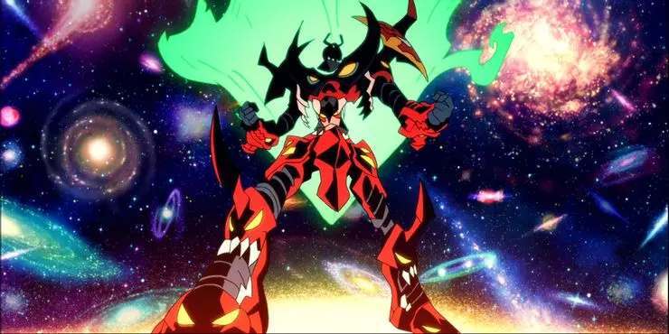

---
slug: 2019-08-29_Leviathan
authors: [weiji,]
tags: [learning note, philosophy ]
--- 

# 淺談「巨靈」 (Hobbes's Leviathan)

<head>
  <meta property="og:image" content="https://i.imgur.com/H1M00p9.png" />
</head>

關於「巨靈」，最直接的例子就是「國家」，最貼切的形象就是「巨人」，然而國家一詞對部份人而言過於抽象，或已經被不同的意義所佔據；而巨人又不夠正確，因為巨靈雖為人類造物卻又已經成為非人之物。所以讓我在將巨靈形容成更具體或更形象的比喻之前，先從構成的它的基礎說起吧！

## 原始自由狀態

有一個思想實驗是這樣的：

> 想像一個自然環境，物理法則乃最高且唯一的規則，然後這個環境中有兩個以上的人，每個人都具有從物理上摧毀另外一個人的自由，因為這是物理法則上容許的事實，也是所有人都各自持有傷害或消滅其他人的自由（權利）。
 
在這個階段，生命是無法被保障的，每個人時時刻刻都活在被傷害或摧毀的恐懼之中。

而這時其中一個人向另外一個人提出「我們不要互相攻擊」的提議，並且獲得同意了，假設雙方都願意遵守約定，這時契約成立，並且同時創造了權利與義務，對甲方（暫稱）而言，權利就是不受到乙方（暫稱）的攻擊，而義務就是不得攻擊乙方，反過來對乙方來說亦同。這時對雙方而言，都脫離了原始自由狀態，他們不再持有完全的自由，而背負了一定程度的限制（義務）。

## 社會契約

因為受到契約限制與保護的狀態遠比原始自由狀態來得更利於生存，於是人們傾向和彼此建立社會契約，最後塑造出一群人共同遵守的契約。如果一個人不履行契約的義務便會受到社會的唾棄，從而喪失契約部份或全部的權利。

對一個人言，有義務不能傷害的不是某個（些）人，而是所有在這社會之中的人；有權利不被傷害的不只是特定的某個（些）人，而是所有在這社會之中的人，在這個階段，個人履行契約的對象不再是單獨會特定的某些人，而是「社會」這一抽象的實體。沒錯，這個抽象實體就是「法人」，一個像人能夠與之立下契約並產生權利或義務的實體，但是卻不是個「人」。

這時這群人已經脫離了原始自由狀態，受到「社會」的約束。

## 權利與義務的另一端所指之處

從單純的「不為之」的權利與義務關係，到產生「為之」的權利與義務關係的過程並不複雜，也不用太久。

當從人們從採集狩獵轉向農耕，從投入到獲得回報的週期變得更長，失敗的代價也變得更大，狩獵採集是幾天的事，農耕卻是數個月的事，如果搞砸了可不是靠著毅力就能忍到下一次收成的小問題，因此能夠支撐數字與計算發展的基礎就在這樣的背景下醞釀而生，不過本文的重點並不是數學的發展，而是負責算術的那個人。

統計糧食，並且計算充不充足，大家不需要減糧來熬過下一次冬天，想必這樣的工作並不是「大家一起來做」的類型，自然而然的，這樣的工作就落在少數人身上了，他（們）的責任就是讓社會不會沒飯吃，出現異常也要告訴大家並擬定對策，而權利或許就是除了不用耕田之外還有更多的話語權吧。

可以發現到非對稱的契約開始出現在社會之中，契約的一端是一個人的權利與義務；另一端是許多的人權利與義務。許多人的義務累積到一個人身上時，累加權利就變成了更為強烈的權力，這樣的非對稱契約會自然而然的讓人產生特權，並使社會的成員分成了統治者與被統治者兩類。

非對稱契約賦予了代表社會的這個法人無比的權力，到這個階段，我們就能將這個與眾人構成契約的虛構實體視為巨靈了，因為它可以集合眾人的力量去在荒地中開闢道路、攻略城池、築起高牆，甚至能在敵對巨靈的身上點燃人造的太陽。

## 抽象化的巨靈意志

在軟體工程中，我們會將問題拆成不同的層級，然後分別處理。比如：「我想知道今天的天氣預報」，這是問題（或是需求）本身，是最抽象的描述。而這個需求會透過「實作」最後實現，以手機為例：

- 天氣預報有多雲、下雨、晴天三個圖示表示，並且顯示溫度和降雨率
- 用一種特殊的文字結構描述上述的內容（HTML、CSS）
- 把文字結構轉成電子訊號，這個電子訊號有開跟關之分
- 把這個電子訊號跟其他訊號以特定的方式組合（訊框）
- 電晶體用以特定的方式開開關關

越上方越接近問題或目的本身，但是越抽象；
越下方執行方式越具體，但是對問題本身的關聯性越低。

巨靈層級的問題涉及科技、法律、民生、工業、商業、地方勢力、外國勢力、既得利益勢力、國際局勢...等等，想用個人的視角去理解巨靈面對的問題，就像是電晶體要想理解 HTML 一樣。（不要試圖用誰棒棒、誰壞壞、什麼是正義、什麼是邪惡的方式去理解巨靈層級的問題）

然而就像人類發明工具來解決問題之後，工具本身帶來的問題又會多到要立一門學科去理解一樣，貨幣帶來了經濟學、電腦帶來了電腦科學...，而理解甚至操縱巨靈的技術就是所謂的政治。

## 巨靈，非人哉

當然，某種程度上巨靈的表現一定程度會受到它的掌權者所影響，但是在巨靈的尺度上，個人的思考與情感已經失去了意義。舉例來說，當一個工業高度發達的巨靈（已開發國家）遇上一個發展相較之下落後許多的巨靈（開發中國家），同樣是一個人一個小時的勞動代價，其產出卻必定有著巨量的差距，藉著自由貿易，造成弱勢國家的人民不斷在經濟上被霸凌，就像是一個滿懷惡意的巨靈不斷的剝削另外一個巨靈。但是對於發達國家的公民而言，他們只是如常的勞動生產與消費。（我不是在批評國際貿易，對他們而言選擇不貿易有著更糟糕的代價）

這便是巨靈的「非人性」的一面。

## 主流對巨靈的描述與本文的差異

Thomas Hobbes 在描述巨靈 (Leviathan) 時使用的對象是國家，但是受限於時代，那個時候並沒有富可敵國的企業體系，不過我認為以契約建構起來的「巨人」來說，並不受限於描述國家，企業自然也能代入巨靈這樣的概念。

並且以國家來說，他認為巨靈是受到一個人（君主）或是數個人（政府）所控制的，在這層意義上來說，他所描述的巨靈更為人性。

我其實還想談談「複合巨靈」與「超巨靈」，不過礙於篇幅以及本文定位在「淺談」，這些主題還是留給別篇文章吧。(°∀° ) 
