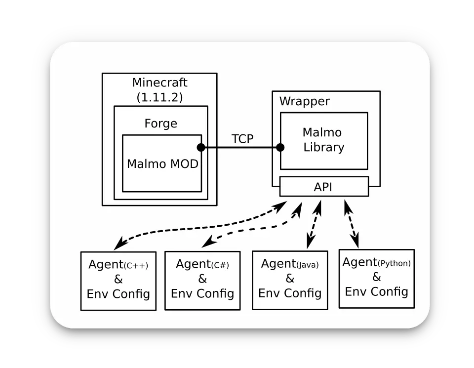
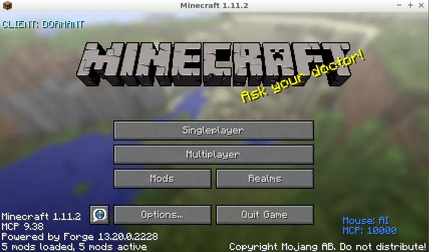
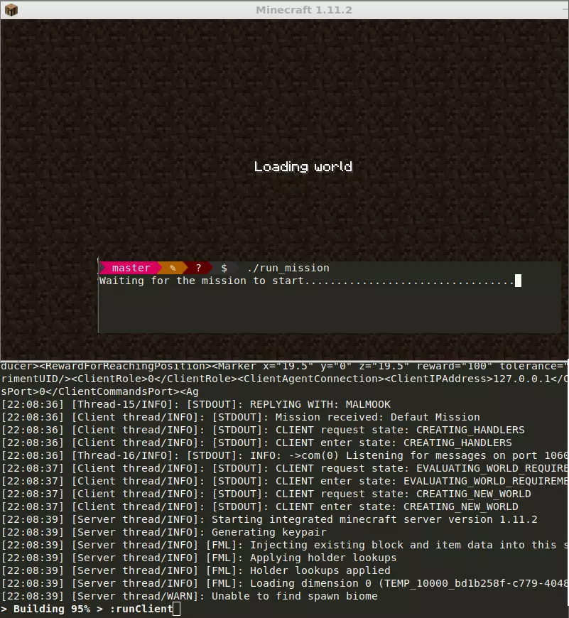

---
slug: 2021-07-18-Project_Malmo_Intro
authors: [weiji,]
tags: [learning note, malmo, machine learning ]
--- 

# Project Malmo 簡介

作為一個 Minecraft 玩家，同時也是對人工智慧有興趣的工程屍，最近發現了一個新玩具：Project Malmo。以 Minecraft 這種大眾化的遊戲與近幾年特別熱門的人工智慧而言；這個項目的曝光度和資料未免也太少了吧！？雖然不知道多久之後會棄坑，不過就把手邊掌握的資訊整理一下並分享出來吧！ᕕ ( ᐛ ) ᕗ

## 發展

源自於微軟內部一個名叫 Project AIX 的項目[^project-aix]，於 2016 年開源釋出；並被命名為 Project Malmo。

微軟分別於 2017 (Project Malmo Collaborative AI Challenge ) 和 2018 (MARLO 2018) 年舉辦的人工智慧競賽就是基於該框架進行的。

Carnegie Mellon 大學的研究團隊利用該框架開發了 MineRL 框架[^MineRL]，這促成了日後在 NeurIPS 2019 舉辦的 MineRL 鑽石挑戰 (MineRL Competition 2019)，而該競賽已經於今年 (2021) 進入了第三屆，並已經開始了第一階段的賽事。

## 架構

稍微瀏覽了 Malmo 的程式碼[^malmo-source]，了解到它的架構大致如下：

也就是 server-client 架構，只是在這裡的 server 端才是那個有視窗的一方（笑）。

當運行了 server 端的啟動腳本，它會透過 Gradle 下載一個修改過得 Minecraft 1.11.2，直到遊戲視窗開啟。

乍看之下就像一般的 Minecraft 遊戲，你甚至可以點開單人遊戲開一張生存模式的圖開始遊玩（進入遊戲後你會發現不能用滑鼠操作視角，然而這是可以切換的），但是實際上它已經透過指定的埠口作為 server 端在運作了，並且等待來自 client 端的指令。

接著運行使用 API 的程式，我們會發現遊戲主程式被「遙控」了，開始根據透過 API 提供的資訊建立場景，並且在遊戲開始後，外部程式能夠透過 API 操作遊戲內的人物在 Minecraft 的世界中活動（當然也可以透過 API 獲取遊戲內的資訊）。

[^project-aix]: Microsoft Project AIX is an open source Minecraft-based artificial intelligence solution. (Brian Fagioli). Retrieved 2021-07-18, from https://betanews.com/2016/03/14/microsoft-project-aix-open-source-minecraft-artificial-intelligence/

[^MineRL]: Project Malmo competition returns with student organizers and a new mission: To democratize reinforcement learning - Microsoft Research. (Microsoft). Retrieved 2021-07-18, from https://www.microsoft.com/en-us/research/blog/project-malmo-competition-returns-with-student-organizers-and-a-new-mission-to-democratize-reinforcement-learning/

[^malmo-source]: Malmö. (Microsoft). Retrieved 2021-07-18, from https://github.com/microsoft/malmo