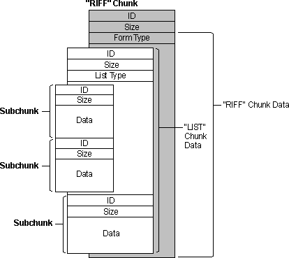

# 資源交換檔案格式 (RIFF) 介紹

資料的組成的基本結構是 "Chunk"，而 Chunk 分成三種：

- RIFF Chunk
- List Chunk
- Data Chunk

## 格式

### Chunk

RIFF 格式中最小的資料單元，Chunk 定義上包含了三個（或四個）部份：

- ID (Chunk Type)
  - 這個 Chunk 的類型，除了 "RIFF" 和 "List" 可以另外定義不同的類型。
- Size
  - 這個 Chunk 的資料長度（Data & Type 的長度，不包含填充字元）。
  - 以  little-endian 儲存。
  - 單位：位元組。
- Type
  - 只有 "RIFF" 和 "List" Chunk 有這個段落。
  - 用來描述檔案或列表的類型。
- Data
  - 資料本體。
  - 以 Word 為最小單元，也就是偶數個位元組。
  - 如果資料為奇數位元組，在最後補上 1 byte 的 NULL 填充字元。

### RIFF Chunk

一個 RIFF 檔案就是一個 RIFF Chunk 它可以包含零個或數個 Chunk。[^riff-zero-or-more]

- ID (Chunk Type)
  - 4 Bytes
  - 內容為 `RIFF`
- Size
  - 4 Bytes
  - 資料大小，即整個檔案的大小扣掉檔案頭 ("RIFF") 和這個欄位本身。
  - 內容為 $N-8$，N 為整個檔案的大小。
- Type
  - 4 Bytes
  - 用來描述檔案類型。
  - 例如：`AVI` 或 `WAVE`
- Data
  - 包含 Data Chunk 或是 List Chunk。

[^riff-zero-or-more]: Resource Interchange File Format (RIFF) - Win32 apps | Microsoft Docs.  Retrieved 2021-11-14, from https://docs.microsoft.com/en-us/windows/win32/xaudio2/resource-interchange-file-format--riff-

### List Chunk

- ID (Chunk Type)
  - 4 Bytes
  - 內容為 `List`
- Size
  - 同 Chunk 描述。
- Type
  - 4 Bytes
  - 用來描述列表類型。
  - 例如：`INFO`。
- Data
  - 包含 Data Chunk。

### Data Chunk

- ID (Chunk Type)
  - 4 Bytes
  - 自訂內容。
  - 例如：`fmt ` 或 `data`。
- Size
  - 同 Chunk 描述。
- Data
  - 同 Chunk 描述。

## RIFF Style

如果參考 RIFF 的 chunk 結構，但是沒有嚴謹的遵守規範，那麼這種檔案格式則稱為 "RIFF Style"。

## 小結

本文只是簡單的介紹 RIFF 的結構，具體的規格細節還是要依 spec 的為準。[^spec]

有一些技術細節就沒有照搬了，比如用 C 語言定義的資料類型跟結構；或是程式可以根據 ID 和 SIZE 欄，如果遇到不認識的 Chunk 類型可以直接跳過之類的。
~~（其實只是懶得把整個 spec 仔細的看過）~~

---

  
Wei Ji以[創用CC 姓名標示-相同方式分享 4.0 國際 授權條款](http://creativecommons.org/licenses/by-sa/4.0/)釋出。

[^spec]: Multimedia Programming Interface
and Data Specifications 1.0. (IBM Corporation and Microsoft Corporation). Retrieved 2021-11-14, from https://www.aelius.com/njh/wavemetatools/doc/riffmci.pdf
