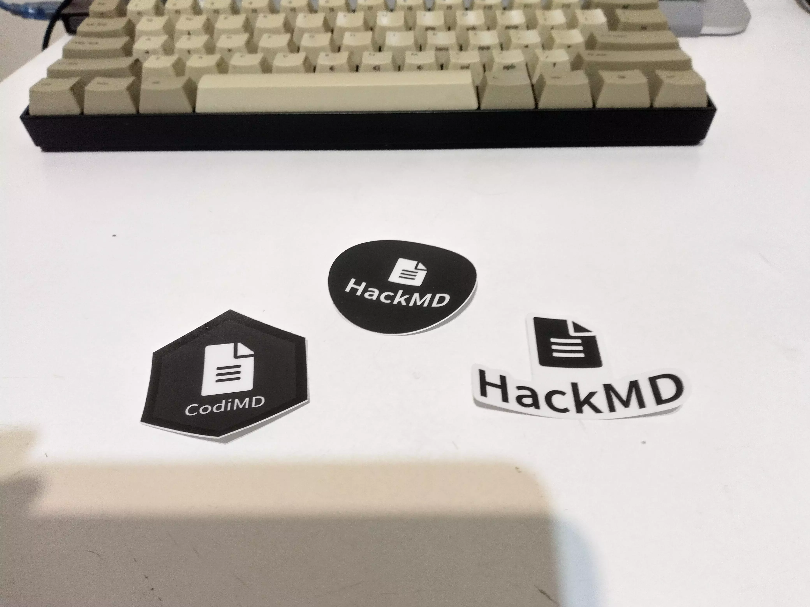

---
slug: 2021-11-21_the-feeling-been-hacked
authors: [weiji,]
tags: [learning note, life ]
--- 

# 前一晚參加 HackMD 小聚，隔天早上就發現公司伺服器被 hack

<head>
  <meta property="og:image" content="https://i.imgur.com/OmCA6cP.jpg" />
</head>

好吧，這兩件事完全是獨立事件，但是放在一起講就多了幾分戲劇性，而且 24 小時內解完兩個人生成就也是事實。

雖然稱不上資深、剋金或是忠實用戶，但是~~憑借著我對 Markdown 的信仰~~混入了 HackMD 的線下小聚。在自我介紹中，發現 16 個與會者包含我在內就有 3 個 Linux 使用者，這種同溫層空氣不禁讓我舒適了起來（？）

而在其他人自我介紹的過程中，發現有人提到用 Markdown 紀錄法規，這對我而言無疑是一個千載難逢的機會，在主議程結束後的自由時間我當然湊了過去聊天，並展示我寫的[簡易 Markdown 法規編輯器](https://github.com/FlySkyPie/markdown-regulation-editor)，現場反應熱烈的程度是出乎我意料之外的，連開發團隊的工程師都脫口而出「哇！好漂亮」；當然我知道這個轉換過程是基於十分有限的條件，也就是十分可控的，跟他實際上遇到的輸出條件有著巨大的落差，但是聽到稱讚還是很開心。那天晚上我因為基底現實的萍水相逢而獲得了 3 顆 Github 星星。

這個 Markdown 撰寫的法規轉換成 ODT 的實作我在 2020 年二月的時候就以 PHP [完成](https://github.com/FlySkyPie/regulation-odt)了，無奈當時並沒有能力架設一個穩定的伺服器與一個完整的服務來調用這項功能。到了 2021 年我用 Javascript 重寫了一遍、給它一個 GUI 並在五月份的時候用 Github Page 的服務架設靜態網站。後來也在網路上以及幾次線下的技術性質小聚介紹這個 side project，大多數的反應當然是不明覺厲。畢竟對法規與 Markdown 都有點了解的人，應該可以想像這兩個東西的圈子幾乎不存在交集。因為在場的都是 Markdown 使用者（與相關開發者 XD），一群看官讀懂這麼一個小魔術值得驚奇的地方，以及被一個相對資深的工程師在面前翻 source code ，真的是一段很愉快的經驗。

當晚我興奮的幾乎難以入眠，不過劇本似乎尚未就此結束，24 小時之內還有另一段故事等著我。

「I need your help.」一早老闆就晃到我的座位交待一個高優先級的任務：我們用來管理客戶程式碼的版控伺服器出了問題無法正常使用，要我排除故障，並提到他覺得是環境設定錯誤造成的。我對該服務有點陌生，又因為服務是由多個組件構成的，而老闆特別提到的錯誤訊息看起來是主服務無法和資料庫溝通，在簡單的閱讀入門文件之後就翻開資料庫相關的設定檔，不過乍看之下並沒有問題。

接著試著把包含伺服器和 service 在內的所有 status 都調出來看，發現系統資源被某個 process 佔用的異常，跟著關鍵字查到了一篇文章，是關於軟體漏洞的，文內也附上了被攻擊跡象的確認方式，於是我把伺服器的 logs 拉回本機，並寫了小腳本把關鍵的紀錄調出來。核對之後確認伺服器被攻擊的事實回報給老闆，但是他認為這只能證明有人嘗試攻擊，但是不見得是伺服器異常的原因。

於是我繼續試著找出製造 process 佔用系統資源的原因，最後發現伺服器各處都有病毒；從 Mirai、木馬到挖礦程式都有，最後回報是挖礦程式佔用系統資源，然後因為不知道攻擊者還動了什麼手腳，所以只能試著備份資料重灌系統。（畢竟不確定資料是不是也被感染了，相關 issue 中有苦主試過備份資料後還原系統問題並沒有消失）

從手上有限的資料、鎖定 CVE 編號、調閱 Log 排查、確認攻擊者手段到確認攻擊事實存在，對我而言是十分新鮮的體驗，並且就像冒險一般。

而這件事對我而言也有著特別的意義，如果 RPG 製作大師是引起我對程式設計興趣的火花的話，The Cuckoo's Egg 這本書就是引導我進入 Linux 世界的麵包屑。這是一本關於柏克萊大學電腦被駭，作者抽絲剝繭與駭客進行一系列捉迷藏的故事，發生在中央伺服器跑著 UNIX、科學家需要用程式跑學術運算才會使用電腦的年代。我今天不是成為一個單純的開發者（一部分程式開發者的光譜並不在開源的世界內），是因為我走入 Linux 與開源的世界；而我走入 Linux 與開源的世界最初的一大動機就是來自於這本書。它對我的意義重大到在公共圖書館閱讀；我連書名都不記得的多年之後，因為一些緣故得知了書名後立刻買下一本二手書（我連所有畢業紀念冊都沒有留下，這本書是我少有的收藏品）。並且在那天，我以小規模的形式親身體驗了一次「伺服器被駭的感覺」。