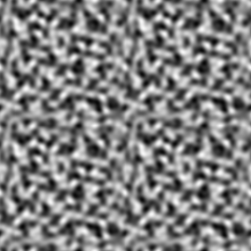

# 一種縫合 Gradient Noise 的技巧

> A Technique to Quilting Gradient Noise

<head>
  <meta property="og:image" content="https://i.imgur.com/3acFj1y.png" />
</head>

## 目的

我想在一個 torus 的空間中使用演算法生成地形 (Procedural generation)，因此演算法必須使地圖邊界無接縫 (Seamless)。

## 被排除的方案

### The image quilting 

該算法的原理是在兩張貼圖的交界處做重疊 (overlay)，並使用 error 值尋找最短路徑而達到縫合的目的。[^image-quilting-1] [^image-quilting-2]

但是該算法的目的是從原始貼圖中抽出拼貼塊 (patches)，並用拼貼塊重新製作圖片，並不適合用於兩個固定邊界的縫合。

當我試著用這個算法處理 noise map 的交界會變成這樣：

### Periodic Perlin Noise

Perlin Noise 的產生是透過在網格中指定隨機的向量來創造梯度，再透過內插來生成最終的 noise map。

因此只要兩個邊界使用同一組向量，就能生成無接縫的 noise map。[^seamless-perlin]

不過我個人不太想重新實做 noise 生成層級的演算法；加上雖然我的目標是生成無接縫的 noise map，但是很有可能實際上會需要縫合兩張算法完全不同的 noise map，再加上交界處很有可能不具有完整的網格（貼圖的大小不是 lattice 的整數倍），所以最終不考慮這個方案。

## 演算法

其實就是做線性內插：

$$
f(x) =
\begin{cases}
g(x),  & x < x_a \\
v(x),  & x_a \leq x \leq x_b \\
h(x),  & x_b < x
\end{cases} \\
v(x)=g(x) \cdot (1-r) + h(x) \cdot r \\
r(x)=\frac{x-x_a}{x_b-x_a}
$$

只是線性內插本質上就是加權平均數，這會使 noise map 變得模糊，因此加上一個修飾：

$$
v_s(x) = 
\text{smoothstep}(v) \cdot r_s + v(x) \cdot (1-r_s ) \\
r_s(x) = 
\begin{cases}
r, & r \leq 0.5 \\
(1-r),  & r > 0.5
\end{cases} 
$$

smoothstep 函數能夠增加 noise 的對比來修復部份因為線性插值造成銳利度降低（模糊）的區域。

沒有 smoothstep：

加上 smoothstep：

[^image-quilting-1]: Image Quilting for Texture Synthesis and Transfer. (Alexei A. Efros). Retrieved 2022-06-04, from https://people.eecs.berkeley.edu/~efros/research/quilting/quilting.pdf
[^image-quilting-2]: Image Quilting for Texture Synthesis & Transfer. (Alexei Efros). Retrieved 2022-06-04, from https://people.eecs.berkeley.edu/~efros/research/quilting/efros-siggraph01.ppt
[^seamless-perlin]: tiles - How do you generate tileable Perlin noise? (Boojum). Retrieved 2022-06-04, from  https://gamedev.stackexchange.com/questions/23625