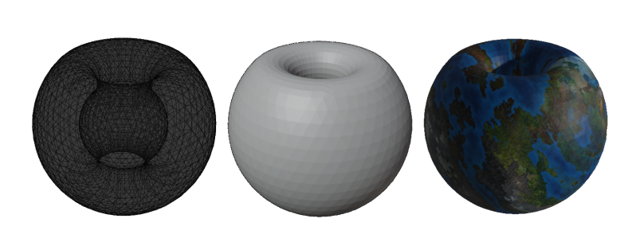
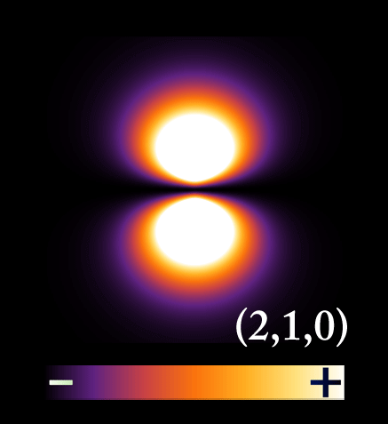
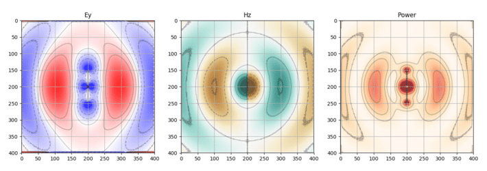
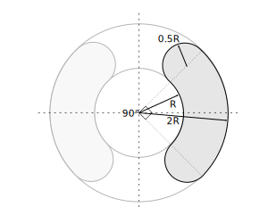
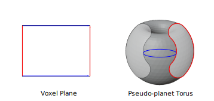

---
slug: 2022-06-05_parameter_of_Pseudo-planet_Torus
authors: [weiji,]
tags: [development note, Hakoniwa, The Key of Huanche, ]
--- 

# 仿星環的幾何參數

<head>
  <meta property="og:image" content="https://i.imgur.com/AKPhcgT.png" />
</head>

## 未採用的幾何方案

原本我打算從波函數中尋找用來描述仿星環的函數，比如電子軌域或是電磁波：

但是這些模型的產物都是張量，要另外設定條件把線（面）畫出來是很困難的。

摸索的過程中也有朋友建議一個接近的函數：[腎形線](https://en.wikipedia.org/wiki/Nephroid)，可惜它中間不是貫穿的。

## 幾何參數

最後採用尺規作圖直接刻的方式，簡單暴力。

接著計算 Voxel 平面的長度，也就是經度線H(紅)

$$
\begin{align}
H 
&= 0.5(2\pi \cdot 0.5R) + 2\pi R\cdot 0.25 + 2 \pi (2R) \cdot 0.25 + 0.5(2\pi \cdot 0.5R) \\
&= 2.5 \pi R
\end{align}
$$

與 Voxel 平面的寬度；緯度線W（藍），取小圓周與大園周的平均值：

$$
\begin{align}
W 
&= \frac{2 \pi (R) + 2 \pi (2R)}{2} \\
&=3 \pi R
\end{align}
$$

因此平面面積為

$$
A = H \cdot W = 7.5 \pi^2 R^2
$$

## 等效仿星環

一個球體行星的表面積為：

$$
S = 4\pi {R_s}^{2}
$$

若要將仿星環近似已知行星的表面積；如地球，則可透過下述關係達成：

$$
\begin{align}
S &= A \\
4\pi {R_s}^{2} &= 7.5 \pi^2 R^2 \\
\sqrt{\frac{1}{1.875 \pi}} R_s &= R
\end{align}
$$

地球的半徑為 6,371 km，因此等效仿星環的 R 為 2,625 km
