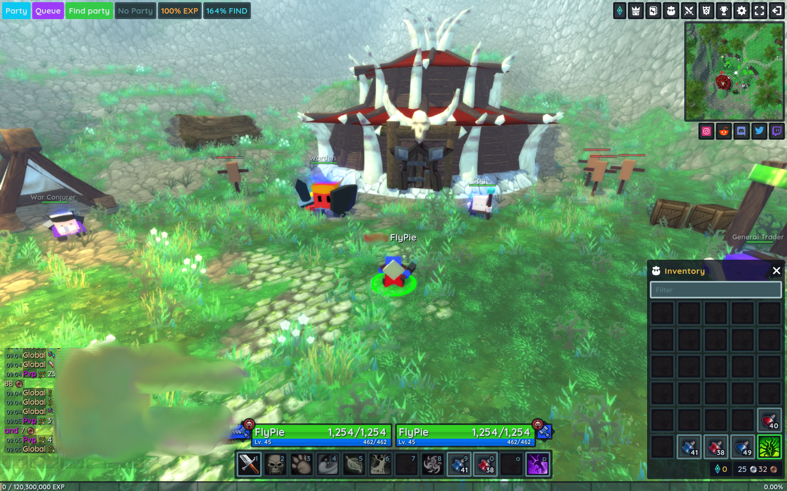
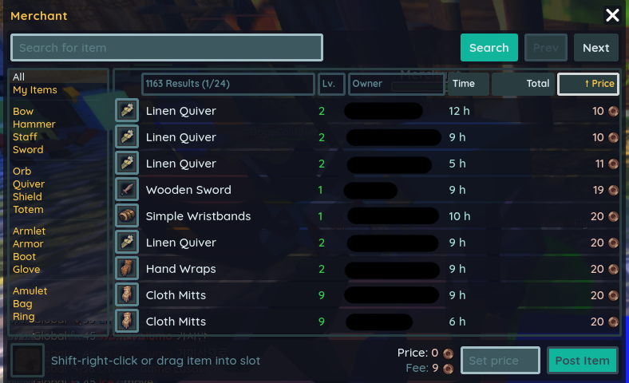
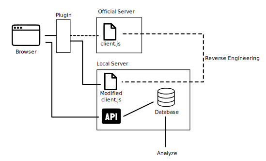
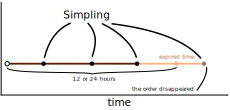
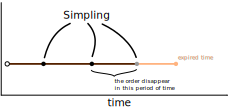

---
slug: 2022-06-18_hordes_auction_monitor
authors: [weiji,]
tags: [development note, Hordes.io ]
--- 

# 在 Hordes.io 實現市場監控 (Market Monitor)

<head>
  <meta property="og:image" content="https://i.imgur.com/hpa2wmG.png" />
</head>

說起來這已經是我快接近兩年前（2020年9月）做的 side project 了，最近想說把資料整理一下發個文。

## Hordes.io



先簡單介紹一下這個遊戲，它就是一個經典的 MMORPG，等級、技能、道具、職業、組隊、團戰...等基本的要素都有，但是沒有像一般 MMORPG 那般廣大的地圖、豐富的 NPC 跟細緻的模型，並且可以直接用網頁瀏覽器遊玩。

有一陣子我還蠻享受這個遊戲的，甚至有考慮剋金，不過營運方過於側重 PvP，不定期舉辦的活動也給我一種 Minecraft 伺服器那種娛樂 OP 吃力不討好的感覺，不過那又是另外一段故事了，總之最後就棄坑了。

## 動機

個人在 MMORPG 最享受兩種角色：補師跟生產者（偏偏正是主流遊戲較為不重視的兩種類型`_(:3」∠)_`），而在這遊戲確實滿足了我對補師職業的喜好，不過並沒有生產系統，所有道具與裝備都是透過打怪掉落，並且玩家與玩家之間的交易只能透過和重生點的商人對話開啟拍賣界面：



而且遊戲系統還會抽上架手續費，換句話說遊戲的經濟系統不夠強大，讓我「想對它做點什麼」，而這幾個前提成立下：

- 遊戲是以 Javascript 跑在網頁上的
- 有集中交易的拍賣功能

讓我「能對它做點什麼」，讓我手癢想把市場資料倒出來畫折線圖分析。

> 這世界上有兩樣東西能讓我開心：
> 1. Data
> 2. More data
> 
> by 我那特別喜歡 Data 的一部分靈魂
>

## 正文



一張圖解釋我做了什麼，流程大致上是：

1. 逆向工程遊戲的 Javascript
2. 在當中嵌入程式碼來獲取拍賣資訊
3. 執行遊戲時以修改過得 client.js 取代官方原本的版本
4. 修改過得腳本會把攔截到的拍賣資訊回傳到資料庫
5. 分析資料

### 逆向工程主程式

Javascript 是直譯語言，即便一般開發者會經過 minify, uglify 等步驟降低腳本的可讀性，但是獲得程式後仍然是明碼可讀的，而遊戲的主程式是放在這個路徑中：

`https://hordes.io/client.js?v=4305950`

把程式下載後經過 beautify 加上縮排，再透過 Javascript 的基本語法跟一些沒有被混淆的變數名稱加上一些技巧來試圖了解程式運作，具體怎麼做的我就不贅述了，任何會寫 Javascript 的人應該都知道這些方法（？）

透過逆向工程了解程式運作之後就能添加程式碼來達成我的目的，比如：把拍賣資料送到我的資料庫。

```javascript
fetch("/api/item/get", {
	method: "POST",
	body: JSON.stringify({
		auction: 1,
		ids: t
	})
}).then(async t => {
	const e = await t.json();
	let items = [];
	//edition
	//e: object from json string
	e.fail ? console.error(e) : (
		s(11, P.length = 0, P), r.forEach((t, s) => {
			const i = e.find(e => e.id === t.dbid);
			i && (i.store = C[s] || (C[s] = Wt()), i.store.temp = t, t.hydrate(i), P.push(i.store));
			let item = {
				item_id: i.id,
				price: i.auctionprice,
				amount: (i.stacks ===null)?1:i.stacks,
				tier: i.tier,
				type: i.type,
				upgrade: i.upgrade,
				attributes:Object.fromEntries(i.store.temp.stats),
				posted_by: i.name,
				posted_at: i.auction
			};
			items.push(item);
			//console.log(JSON.stringify(item));
		}),
		//console.log(JSON.stringify(items)),
		fetch("http://0.0.0.0:8989/stack", {
				method: 'POST', // *GET, POST, PUT, DELETE, etc.
				mode: 'cors', // no-cors, *cors, same-origin
				headers: {
				  'Content-Type': 'text/plain'
				  // 'Content-Type': 'application/x-www-form-urlencoded',
				},
				body: JSON.stringify(items) // body data type must match "Content-Type" header
			  }),
		 s(6, g = !0)
	)
})
```

比較麻煩的是每次他們改版我就要重新逆向工程一次，流程其實應該可以用透過程序化來自動完成，不過那需要更多心力，加上先前提過得，我對於這遊戲的熱情正在冷卻，加上逆向工程並不是什麼輕鬆愉快的過程，這算是我最後棄坑的原因之一。

### 瀏覽器插件

我使用 Tampermonkey 來載入腳本：

```javascript
var pattern = "https://hordes.io/client.js*";

function redirect(requestDetails) {
  console.log("Redirecting: " + requestDetails.url);
  let version = [...requestDetails.url.matchAll(/\?v=([\d]+)/g)];
  return {redirectUrl: "http://0.0.0.0:8123/"+ version[0][1] +"/client.js"};
  switch(requestDetails.url){
    case "https://hordes.io/client.js?v=4305950":
      return {redirectUrl: "http://0.0.0.0:8123/4305950/client.js"};
    case "https://hordes.io/client.js?v=4298202":
      return {redirectUrl: "http://0.0.0.0:8123/4298202/client.js"};
    case "https://hordes.io/client.js?v=4308820":
      return {redirectUrl: "http://0.0.0.0:8123/4308820/client.js"};
    default:
      console.warn("Version unmatch! using origin.");
      return {redirectUrl: requestDetails.url};
  }
}

browser.webRequest.onBeforeRequest.addListener(
  redirect,
  {urls:[pattern], types:["script"]},
  ["blocking"]
);
```

作用就是當遊戲網頁試圖載入主程式的時候，導向到我的 local server 取得修改過得版本。

### 資料庫

當時用 PHP + Slim 寫了個簡單的後端來接收資料。程式碼可以在[這裡](https://github.com/FlySkyPie/hordes-auction-monitor)找到。

### 分析

從遊戲中撈到的資料包含了賣單的創立時間，而遊戲機制讓賣單只會在拍賣系統中掛上 12 小時，而付費會員則是 24 小時，由此可推測出賣單的失效時間。

當掛單失效時就物品會從拍賣中消失回到賣家的倉庫，當然玩家也可以手動取消掛單，但是因為物品會凍結在倉庫中直到原本掛單失效的時間，相較之下發生的機率很低，因此推論皆以「掛單消失是因為逾時自動失效」為前提。

每次進行抽樣時，腳本會遍歷拍賣系統的所有頁面，並把資料送到資料庫，換句話說一次抽樣就代表一次掛單的快照。透過複數個抽樣就能推估掛單是逾時消失的，還是因為交易而消失的。

依據抽樣推測掛單逾時消失：



掛單在逾時之前消失，很高的可能性是因為完成交易：



透過這種方式把成交的掛單價格拉出來統計，就能知道物品的當前行情。

那個時候遊戲改版的蠻頻繁的，我又還沒完成腳本的程序化，每次改玩程式只能採個幾小時的資料，根據 `2020-08-27T15:54:49Z` 到 `2020-08-29T09:46:35Z` 這段時間的資料，我計算出 T0 符文石的交易情況為：

| 統計量 | 價格  |
| ------ | ----- |
| 最小值 | 40    |
| 最大值 | 808   |
| 平均值 | 360.7 |
| 標準差 | 92.3  |

如果完成腳本程序化，抽樣的時間跨度大一點，應該就能做成折線圖了（或是更棒的盒鬚圖）。不過這個如果應該是永遠不會發生的如果了。 `(=w=)`

## 後記

回去翻當時進行逆向工程寫的東西之後，發現我確實已經開始進行一些重構以利逆向工程能夠程序化，只是還沒完成，比如：fetch hook, auto clicker, data transform...