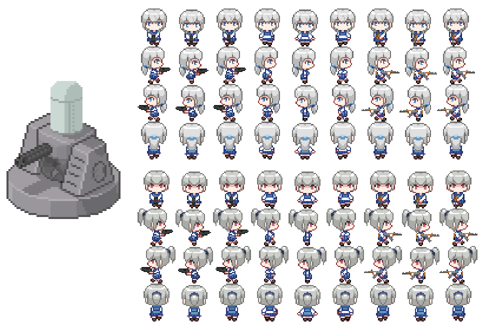

後來斷斷續續有畫一些素材也是為了這個專案：

## 名詞解釋

### Dental Defender: Saga of the Candy Horde

遊戲開發圈有一種活動叫做 [Game Jam](https://zh.wikipedia.org/wiki/Game_Jam)，就是聚集一群愛好者在數小時到數天之內完成一款遊戲。而這個小遊戲來自一場名為 candyjam 的 Game Jam，原因是一間名為 `King.com` 的公司（就是 Candy Crush 的那間公司）在 2014 年將 "candy" 一詞申請商標，並指控一些獨立開發公司侵犯他們的商標。這一舉動激怒了獨立開發圈，於是他們舉辦一場 Game Jam 專門製作 "Cahndy" 相關的遊戲來對 `King.com` 表示抗議。[^candy-crush]

### 蝴蝶

本人有嚴重的[閃亮事物症候群](https://en.wikipedia.org/wiki/Shiny_object_syndrome)，習慣將自己跑去玩其他 Side Project 比喻成追蝴蝶。

[^candy-crush]:  Indie Developers Troll King Games Hard With 'Candy Jam' | WIRED. Retrieved 2023-01-17, from https://www.wired.com/2014/02/candy-crush/

---

  
Wei Ji以[創用CC 姓名標示-相同方式分享 4.0 國際 授權條款](http://creativecommons.org/licenses/by-sa/4.0/)釋出。