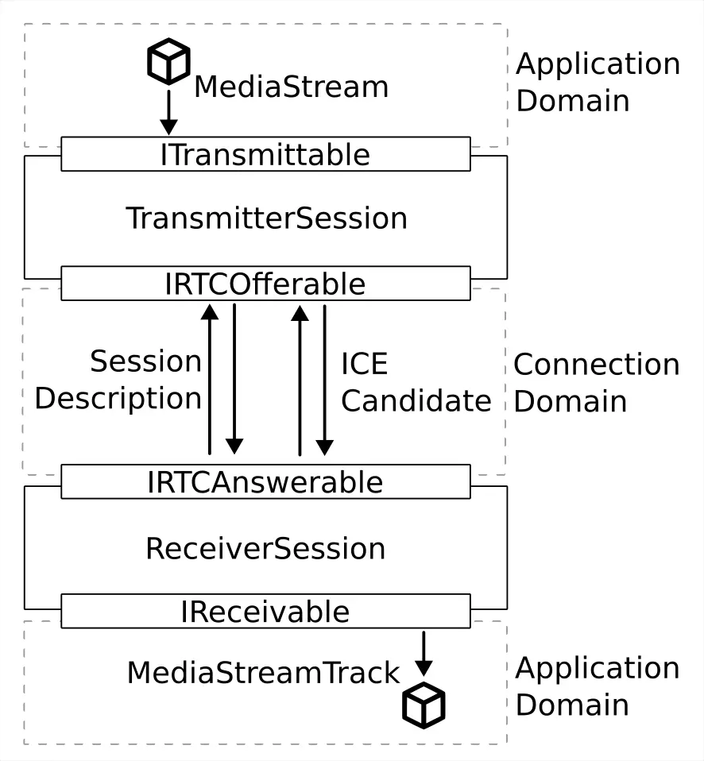

另外我練習[使用 WebRTC 的程式](https://github.com/FlySkyPie/canvas-webrtc-sample)試著用不同的界面分離職責：

- `ITransmittable`: 發送端應用領域對傳輸領域的界面，專住於「對外串流」的職責。
- `IReceivable`: 接收端應用領域對傳輸領域的界面，，專注於「接收串流」的職責。
- `IRTCOfferable`: 發送端對連線建立領域的界面，專注於「發送方的 WebRTC 構成要件」的職責上。
- `IRTCAnswerable`: 接收端對連線建立領域的界面，專注於「接收方的 WebRTC 構成要件」的職責上。

---

  
Wei Ji 以[創用CC 姓名標示-相同方式分享 4.0 國際 授權條款](http://creativecommons.org/licenses/by-sa/4.0/)釋出。