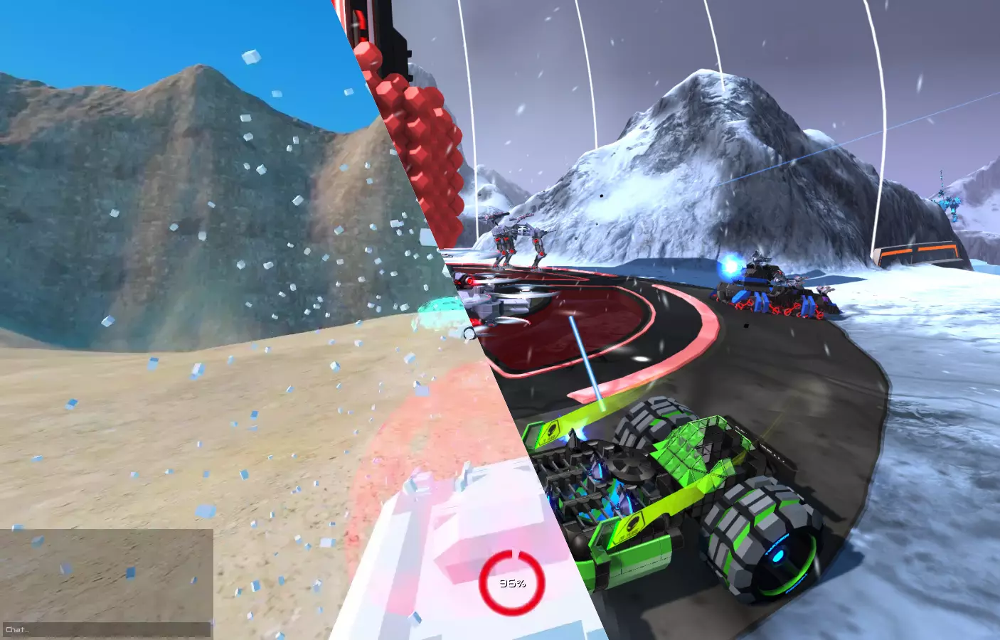
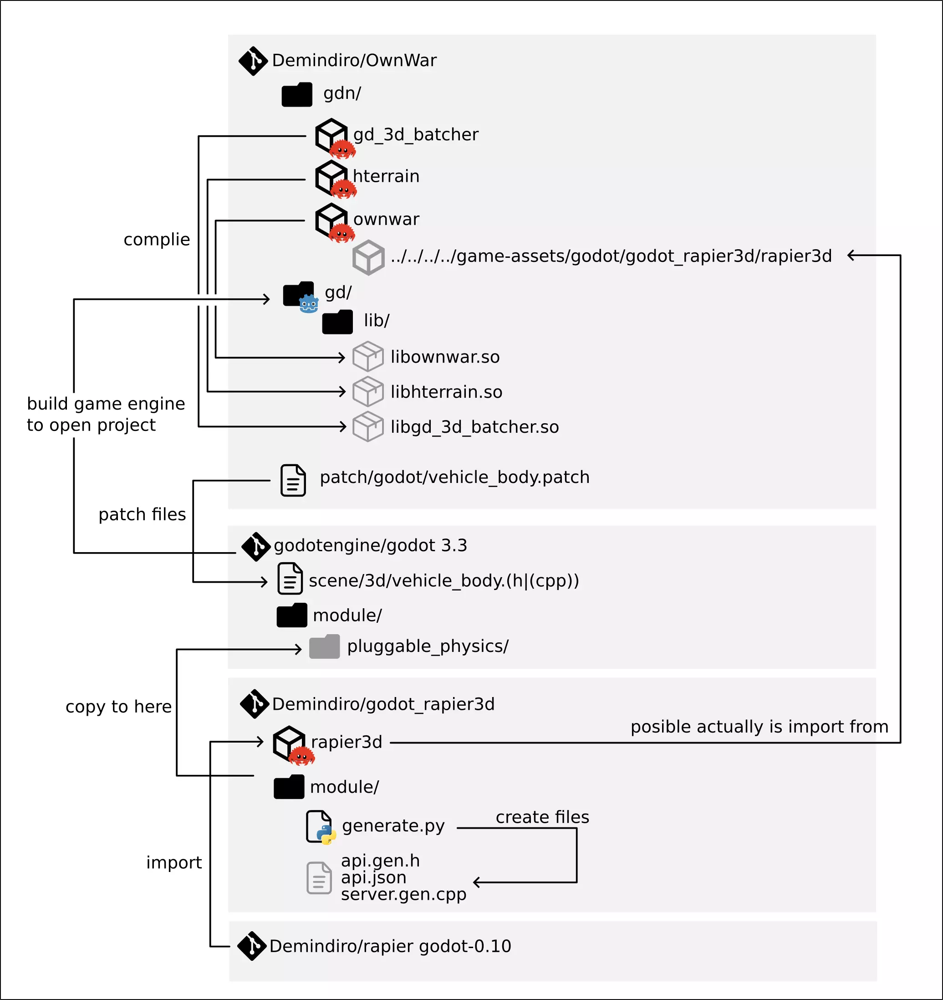

---
slug: 2023-08-27_opensource-robocraft
authors: [weiji,]
tags: [learning note, Godot, Robocraft, voxel ]
--- 

# 開源的 Robocraft Clone 專案 - Own War

<head>
  <meta property="og:image" content="https://raw.githubusercontent.com/FlySkyPie/flyskypie.github.io/main/blog/2023-08-27_opensource-robocraft/img/00_hero.webp" />
</head>



## 前情提要

[Robocraft](https://store.steampowered.com/app/301520/Robocraft/) 是一款載具建造戰鬥遊戲，屬於 ([Vehicular Combat](https://en.wikipedia.org/wiki/List_of_vehicular_combat_games)) 的衍生種類，玩家可以設計自己的載具然後投入遊戲中與其他玩家進行 PvP 競技，是能帶給我樂趣的遊戲之一。

在某次更新之後這個遊戲的開發商大幅度削減 (Nerf) 獎勵系統，讓遊戲資源的獲取變得十分困難，使得創作方面的遊玩體驗上受到限制，使我一度退坑。

2022 左右再次回鍋的時候，獎勵系統與遊戲資源的限制已經被消除，雖然遊戲機制已經和以前有所不同了，但至少可以肯定開發商在遊戲平衡性上的努力，不過玩家基數下降，造成自動批配系統中的野團高機率會碰到有組團的對手，遇到這種情況通常會被慘虐。後來我注意到這遊戲在較冷門的階級 (Tier) 中為了減少玩家在自動批配系統中的等待，會加入 BOT 來促成 5v5 的遊戲，於是我就很不解開發商為什麼不願意內建 PVE (Player Versus Environment) 模式。

「在 Robocraft 的遊玩體驗之上引入 PVE 模式」便是我尋找替代方案的動機之一。

## 替代方案的嘗試

然而遺憾的是，幾次搜尋下來，都沒有找到這種類型的開源專案，在 [AlternativeTo](https://alternativeto.net/software/robocraft/) 上沒有找到滿意的結果。評價似乎不錯的 Crossout 並不支援 Linux，而且在 Steam 上還鎖區了一陣子。在 Reddit 的[討論串](https://www.reddit.com/r/Robocraft/comments/87hoff/)中提到了 Procelio ，在早期（這專案剛啟動沒多久）有試著下載下來玩玩看，不過 Linux 版跑起來十分卡頓，而且我記得是用 Unity3D 做的。

直到上週 (2023-08-20)，我終於找到了 [OwnWar](https://github.com/Demindiro/OwnWar)，一眼就能看出它是衝著 Robocraft Clone 去的開源專案。

## Dpendency Chain

拿到開源專案的第一件事當然就是自己 Build 看看，然而事情並沒有這麼簡單，這個專案是用 Godot 引擎撰寫的，但是是有打過 Patch 的 Godot 引擎,因此我需要自己編譯 Godot 引擎，而 Patch 本身又仰賴另外一個物理運算的函式庫 Rapier3D。那個函式庫是用 Rust 寫的，而且必須使用特定版本的編譯器才能編譯。加上我明顯感受到原作者留下的文件有缺失，並沒有完整描述 Build 的所有步驟。

於是我翻閱了 Godot 的文件，試著搞懂這個專案如何跟外部函式庫做 Binding ，接著我發現了了這個[東西](https://github.com/Demindiro/OwnWar/blob/a2a500991b786aed95977051fe91ac06699ff25e/gdn/ownwar/Cargo.toml#L15)：

```toml
[dependencies]
gdnative = "*"
lazy_static = "*"
godot_rapier3d = { path = "../../../../game-assets/godot/godot_rapier3d/rapier3d" }
fxhash = "*"
```

那個相對路徑指向一個超出專案根目錄的位置，換句話說複數個專案的仰賴關係是隨意的擺在原作者的電腦內，無法根據留下的文件直接完成開發環境的準備，「原作者並沒有花太多心思考慮到接手的人，而是匆匆上傳專案」的假設基本上得到了驗證。

於是我花了一點時間從配置文件內的紀錄的外部仰賴路徑，推敲出數個庫之間的仰賴關係：



## 成功編譯只是修改專案程式碼的第一步

於是我 [Fork](https://github.com/FlySkyPie/OwnWar) 了這個專案並把編譯仰賴的 Godot 引擎和外部函式庫等等瑣碎的操作通通丟到 Docker 裡面。最後終於把這個專案編譯出來了。