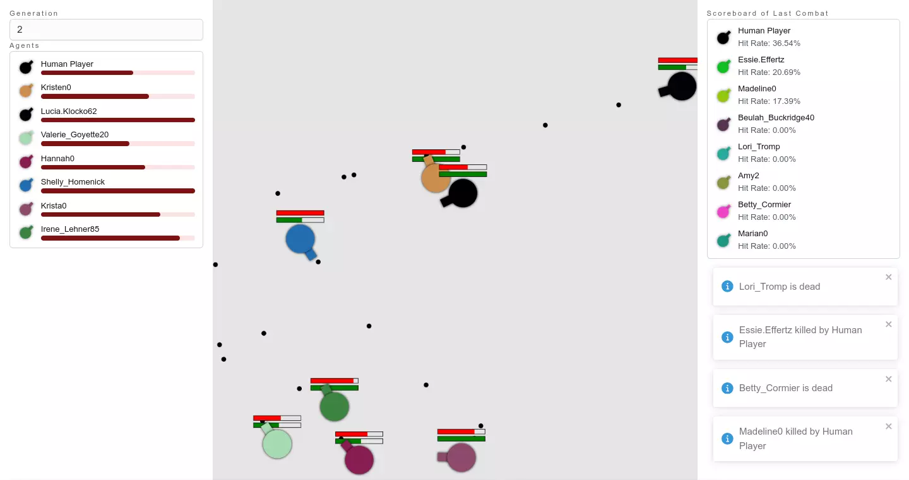
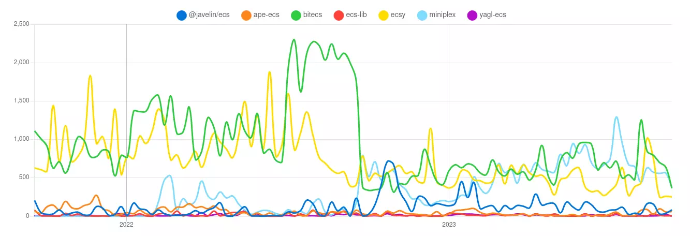

---
slug: 2023-09-24_a-journey-about-learning-ecs
authors: [weiji,]
tags: [learning note, ECS, Miniplex ]
--- 

# ECS 學習與 aimAndShoot 重構之旅

<head>
  <meta property="og:image" content="https://raw.githubusercontent.com/FlySkyPie/flyskypie.github.io/main/blog/2023-09-24_a-journey-about-learning-ecs/img/00_hero.webp" />
</head>



## 前情提要

隨著 Polis 專案的串流功能完成，開發開始往下一個階段發展，PoC 還剩下兩個功能需要實作：
- 基本遊戲系統
- P2P 連線

因為 P2P 連線還需要解決遊戲狀態同步的問題，因此它在某種程度上仰賴遊戲系統，所以遊戲系統的實作就是我下一個階段要處理的事情。而遊戲系統預計要使用 ECS (Entity Component System) 實作則是很早就決定的事。

### ECS (Entity Component System)

關於 ECS 的具體細節本文就不再贅述，簡言之就是使用 ECS 架構的遊戲在做職責分離的時候會跟物件導向 (OOP) 中抽象化的思考方式不相同，這對我而言是一個挑戰，因為我沒有真正用 ECS 架構去寫遊戲過。

最早會接觸 ECS 這個新鮮玩意兒是因為工作的關係接觸了 [React Game Engine](https://github.com/bberak/react-game-engine) 但是它只是 ECS 的弱實現 (loose implementation)，因此與實際 ECS 的思考方式之間還是存在落差，加上同事其實跟我提過我的寫法很大程度還是一般的 React 程式，並沒有發揮 ECS 的特性。

另外一個困擾我的點是，部分 Javascript/Typescript 實作的 ECS 函式庫著重於 ECS 中「資料緊湊」的特性，它們使用 TypedArray 定義的基本型態來儲存資料，這使得它們的原始設計與 Three.js 或 Rapier 這種有自己定義 class 的函式庫之間不好協調。

因此我認為在正式引入 ECS 這個技術棧 (Tech Stack) 到 Polis 以前應該先寫一個短期專案對選定函式庫的可行性做驗證，以及累積足夠的「ECS 思維」。

### aimAndShoot

[aimAndShoot](https://github.com/victorqribeiro/aimAndShoot) 便是我的實驗對象。在「[底火的芬芳 - 專案起源](/blog/2023-01-04_origin-of-gear-redolence/)」一文中有提到過這個 repository，它是一個有點像 `diep.io` 的簡單小遊戲，作為重構改寫的對象是再適合不過了。

### Miniplex



Javascript/Typescript 中有不少 [ECS 套件](https://npmtrends.com/@javelin/ecs-vs-ape-ecs-vs-bitecs-vs-ecs-lib-vs-ecsy-vs-miniplex-vs-yagl-ecs)，雖然跟一般的熱門套件相較之下都算是冷門套件。

正如我提過得，它們之中的大部分著重於資料緊湊的設計，或是有著不支援/不友善 Typescript 的問題，另外一點則是一些套件更預設了一套框架，開發者必須在這個架構下開發。

相較之下 [Miniplex](https://github.com/hmans/miniplex) 更深刻的體現了「一次做好一件事」的哲學，讓我們來看看它的介紹：
> A 👩‍💻 developer-friendly entity management system for 🕹 games and similarly demanding applications, based on 🛠 ECS architecture. 

是的，它只把自己定位在「Entity Management」的部份，既不管資料緊不僅湊，也不管開發者想怎麼實作 System，即便看著範例程式碼，我也不會浮現「這玩意兒到底要怎麼跟 Three.js 或 Rapier 整合？」的問題，我只需要煩惱如何把問題使用 ECS 的架構去實現就好。

## 重構

很快就完成了從 Javascript 轉換成 Typescript 的重構 (2023-09-13~2023-09-15)，這個部份應該算是整個重構中最簡單的，畢竟遷移 Legacy Code 我也不是第一次幹了，有一些工具可以協助完成這種事：
- AMD to es6
  - https://github.com/jonbretman/amd-to-as6
- Prototype to Class
  - https://github.com/lebab/lebab
- Javascript to Typescript
  - https://github.com/gregjacobs/js-to-ts-converter

### Web Component (Custom Element) 初體驗

微前端 (Micro frontends) 其實也不是什麼新鮮的玩意了，不過一直沒有機會或動機去使用它。第一次知道這個東西是為了解決客戶的（相對）大型專案而查資料查到的，只是客戶方面的技術相對落後（沒有 CI/CD、整合仰賴客戶的工程師手動複製程式碼、預計使用 iframe 作為大型專案的 solution...），而公司作為代工方並沒有技術決策的權限，自己本身也沒有 side project 有面臨類似的問題。

作為一個網頁前端工程師，UI 之類的問題我一律想用 React 解決，在 Canvas 上刻 UI 根本浪費時間效果又差。但是這個 ECS 的練習我並不想直接讓它跟 React App 耦合，發現這似乎是使用 Web Component 這個 [Web API](https://developer.mozilla.org/en-US/docs/Web/API/Web_components) 的好時機。

於是一開始 (2023-09-16) 我先根據我預想的排版用 React 實作，再把它包裝成 [Custom Element](https://developer.mozilla.org/en-US/docs/Web/API/Web_components/Using_custom_elements)，透過一個 callback (EventListener) 當 Canvas 被掛上 DOM 之後回傳 `HTMLCanvasElement` ，再用遊戲的實例去接收它來繪製遊戲內容。

當我把遊戲邏輯實作的差不多之後 (2023-09-20)，發現應該反過來操作：
> 把遊戲封裝成 Custom Element 給 React 使

因為整個遊戲其實只仰賴一塊 Canvas 作為 I/O，只要能夠恰當的完成初始化跟釋放資源，就能被封裝到 React 的 Cycle life 內才對。

另一方面也是因為我已經在 React 內寫過諸如 Three.js 和 MapBox GL JS 的東西，對於這種「非 React 原生的套件如何整合進 React App 內」已經很直覺的知道怎麼做了：用 `ref` 取得實例並搭配 `useEffect` 來把事件掛上去跟釋放 callback。

### ECS

Miniplex 的 Typescript 友善程度算是比我預期的的還好，關於 Entity 的型別如何聲明，Github 上面有一則討論算是給出了蠻明確的方向[^miniplex-entity-type]：

```typescript
type IPosition {
  position: Vector3
}

type IHealth {
  health: { current: number, max: number }
}

type Entity = Partial<IPosition & IHealth & ...>
```

我個人是使用類似但是有一點差異的方式：

```typescript
export type AgentEntity = {
  id: string;
  particle: ParticleComponent;
  health: HealthComponent;
  projectileEmitter: ProjectileEmitterComponent;
  warrior: WarriorMiscComponent;
  brain?: DejavuComponent;
  statistics: WarriorStatisticsComponent;
};

export type BulletEntity = {
  particle: ParticleComponent;
  attackEffect: AttackEffectComponent;
};

export type Entity = Partial<
  TimeEntity & EventEntity & AgentEntity & BulletEntity
>;
```

以 ECS 的思考模式，其實並不在乎 Entity 要多具體，而是以 Component 為操作單元，而 Component 在中 Miniplex 實質等於 Entity 的 properties，因此如果思考方式依然受到 OOP 影響，至少可以用這種方式輔助產生一種介於「依照物件設計邏輯的切割方式」與「依照 Component 邏輯的切割方之」之間的過渡狀態。

另外因為我是從一個既存專案做重構，因此我懶得重新用「The Component Way」的思考模式去重新設計資料結構，所以我把物件的屬性隨便包成 Component 丟進去。

[^miniplex-entity-type]: Does Entity need to know all possible components?. Retrieved 2023-09-24, from https://github.com/hmans/miniplex/discussions/295

### Joy UI 初體驗

工作上很常要寫一些 B2B 的後台 (Dashboard)，[Material UI](https://mui.com/material-ui/) 算是我最常使用的 React 套件之一，可以快速搭建出有模有樣的網頁，作用跟 [Bootstrap](https://getbootstrap.com/docs/5.2/getting-started/introduction/) 其實差不多。只是它內置了一套設計系統 (Design System)，對於沒有引入 Design System 的專案來說，反而要為了那些缺乏一致性的客製化 style 去覆蓋掉原本的設計而花費很多心力。並且對於個人使用的小專案來說又稍嫌笨重了一點。

直到前一陣子注意到這個套件出了一個衍生套件 [Joy UI](https://mui.com/joy-ui/getting-started/)，它的所有組件與 Material UI 幾乎是一對一對應的，只是少了 [Material Design](https://en.wikipedia.org/wiki/Material_Design) 的部份。看上去也還算順眼，於是便趁著這個機會來用用看。

於是在完成了遊戲本體之後，便用這個套件新增了一些 UI，包含：玩家列表、記分板。

### 小插曲

因為要重構成 ECS 架構的關係，所有的實作我都必須逐行閱讀了解其意義之後才能將邏輯從 class 內抽出然後丟到特定的 System 去，也因此讓我有了意外收穫。

幾年前 (2020)，我曾經改寫了同一個專案，移除了玩家、讓 Bot 分成兩隊互毆，但是成效不佳，跑了 300 多代依然蠢蠢的。

重構的過程我發現了有這麼一段程式：

```typescript
  private selectParent(queries: IQueries) {
    let total = 0;

    for (const bot of queries.botPlayer) {
      total += bot.statistics.fitness;
    }

    let prob = Math.random() * total;

    for (const bot of queries.botPlayer) {
      if (prob < bot.statistics.fitness) {
        return bot;
      }

      prob -= bot.statistics.fitness;
    }

    return null;
  }
```

原作者想用加權抽籤的方式抽出 AI 進行繁殖，其中的 `fitness` 是分數的意思，也就是這裡的權重值。然而這個實作會造成一個 AI 只要有一回合表現不好拿了 0 分，它被刷掉機率會達到 100%。並且只要有一回合大家運氣不好都拿了 0 分，就會整代被刷掉，演算法會直接 Random 一組 0 經驗的類神經網路來繁殖。

因此在不考慮評分標準的數學模型到底合理不合理的前提下，AI 被重置的機率其實很高，這也解釋了為什麼我之前跑了 300 多代 Bot 依然蠢蠢的原因。

### 收官 (Yose, ヨセ)

重構過程其實讓我對這個專案產生了不少額外的想像，比如說：利用 ECS 的特性，我其實可以把當前遊戲幀的所有資料 dump 出來，之後重開網頁再把資料倒回去理論上可以很輕易的實現「遊戲讀擋」的功能，畢竟關於遊戲的所有狀態都塞在一個由 Entity 填充的 Array 裡面；又或是寫一個視覺化的組件呈現 AI 當前類神經網路的激發狀態；甚至是製作另一個模式實現我曾經實現過得 Zero-player game，理論上只要置換 System 就能輕易實現。

然而我其實對這個專案的定位有立下一個明確的目標：
> 以 ECS 實現原專案的所有或大部份機能，藉此累積使用 Miniplex 的經驗

目的已經達成，該收官了，於是我藉著這個星期六 (2023-09-23) 進行最後打磨，讓它至少看起來有模有樣，然後把原本分散在兩個 repo 的 commit 用 subtree 和 rebase 整理到 fork 的 repo 去。

## 結論

- Demo
  - https://flyskypie.github.io/aimAndShoot/
- Source Code
  - https://github.com/FlySkyPie/aimAndShoot
