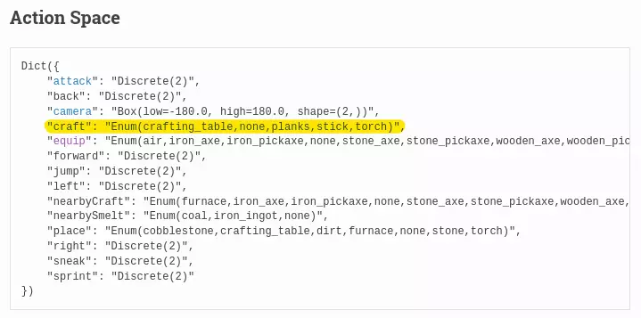

---
slug: about-ecs-distributed-minecraft-rl-rbnn-bar-code-language
authors: [weiji,]
tags: [The Key of Huanche ]
--- 

# 關於我想用 ECS 實作 Minecraft 以分散式架構運行並在其中用增強式學習訓練完全視覺化之遞迴布林類神經網路以產出二維條碼人造語言那檔事

<head>
  <meta property="og:image" content="https://raw.githubusercontent.com/FlySkyPie/flyskypie.github.io/main/blog/2023-10-07_about-ecs-distributed-minecraft-rl-rbnn-bar-code-language/img/00_hero.webp" />
</head>

## 前情提要

關於我的 Side Project 「環驅之鑰」其實是一個很複雜、很難三言兩語說清楚東西，試著用一些像是[條目](https://flyskypie.github.io/docs/the-key-of-huanche/)的東西來解釋它，作為我現場跟其他人解釋的參考資料算是蠻方便的輔助，但是讓人自行閱讀一目了然似乎還是稍嫌不足。

於是我決定試試用其他方式向一個可能沒什麼背景知識的解釋我想做的東西：先把其中一個主線用輕小說一般標題展開，再根據其中的內容慢慢解釋。

## ECS (Entity Component System)

> 關於我**想用 ECS 實作 Minecraft** 以分散式架構運行並在其中用增強式學習訓練完全視覺化之遞迴布林類神經網路以產出二維條碼人造語言那檔事

ECS 是種軟體架構，鬥陣特攻 (Overwatch) 的團隊在遊戲上使用並且在 GDC 2017 中介紹而遊戲開發圈廣為人知，Unity3D 更在 2018 將 ECS 框架引入遊戲引擎中。它的核心概念是不使用原本流行的物件導向 (OOP, Object-oriented programming) 的軟體抽象化方式轉而使用資料導向 (Data Oriented)。

OOP 的邏輯是：把程式邏輯抽象化成一個一個的「物件」，然後透過「方法」去操作物件，隨著專案越來越複雜，這些物件通常會一層包一層。而 ECS 的邏輯是：把資料跟運算邏輯分離，Component 只有資料、Entity 是 Component 的索引、System 則不儲存狀態專注於運算邏輯。

關於 ECS 的介紹我就點到這裡為止，至於我想在專案中使用這種架構的原因源自 2018 年我試著寫一個 Minecraft [插件](https://youtu.be/vH0KOeijNeQ?si=NnObrN-XhnVk9zFc)的時候經歷了非常痛苦的開發體驗，以我當時想修改的殭屍實體為例：

Minecraft 裡充滿了多層繼承 (Multilevel Inheritance)，這使得釐清物件之間如何交互作用的認知負荷變得非常高，雪上加霜的是 Minecraft 插件源自逆向工程的產物，並不是所有變數和方法都是人類可讀的。

雖然當時體驗的困難並不是所有都是軟體架構造成的，然而後來我才知道這種開發風格在遊戲開發圈也算是很有爭議的主題之一，在知道 Minecraft 的程式碼有多難除錯，看著它那滿坑滿谷的 [Bug 清單](https://bugs.mojang.com/projects/MC/issues)，當中不少還直接被標記「這個不會被修復」似乎也不奇怪了。

作為一個想開發類似於 Minecraft 這等高度複雜的沙盒開放世界遊戲的後進者，自然會想避免步上 Minecraft 的後塵，而 ECS 便是我目前優先考慮的架構。

## 分散式架構

> 關於我想用 ECS 實作 Minecraft **以分散式架構運行**並在其中用增強式學習訓練完全視覺化之遞迴布林類神經網路以產出二維條碼人造語言那檔事

Minecraft 大部分的運算是在同一個執行緒 (Thread) 上完成的，這在 Minecraft 的圈子也算是很有名的特性，因為你不能單純拿著多核心處理器去架遊戲伺服器就很神奇的可以容納更多的玩家。

這限制源自於它的遊戲運算不能簡單的被化為獨立的任務並分配成平行運算，作為一個寫網站的工程師，我並沒有足夠的知識與經驗去設計一個多執行緒的架構或系統，但是作為一個 Web 工程師我知道一種叫做微服務 (Microservices) 的東西，那麼我何不把遊戲拆成一組 Microservices 叢集，使其成為一個方便水平擴充的系統。

## 增強式學習 (RL, Reinforcement learning)

> 關於我想用 ECS 實作 Minecraft 以分散式架構運行並在其中**用增強式學習訓練**完全視覺化之遞迴布林類神經網路以產出二維條碼人造語言那檔事

增強式學習是機器學習 (Machine Learning) 領域的一個子集（分支），相較於其他著重資料分析、統計之類的機器學習主題，RL 著重於玩家 (Agent) 與環境 (Environment) 互動 (Action/Observe)，透過獎勵 (Reward) 來最佳化策略 (Policy)。RL 可以說是「遊戲感」最重的機器學習分支。

## 遞迴布林類神經網路 (RBNN, Recurrent Boolean Neural Network)

> 關於我想用 ECS 實作 Minecraft 以分散式架構運行並在其中用增強式學習訓練完全視覺化之**遞迴布林類神經網路**以產出二維條碼人造語言那檔事

人工智慧 (AI, Artificial Intelligence)與深度學習 (Deep Learning) 算是近幾年被用到爛大街的詞彙了，起因來自於一個被稱作類神經網路 (Neural Network) 的不新鮮的數學模型在晶片性能提昇以及算法改善的現代而終於獲得實用化，又因為 AlphaGo 在 2016 擊敗人類棋手等事件而形成話題才終於進入大眾的視野。

而布林類神經網路 (BNN)[^bnn] 則是參考了類神經網路的設計，但是不使用實數而是使用布林代數的一種算法，這個選擇並不是基於性能或實用性考量，老實說因為不是使用實數體系的代數，因此不能用微積分作弊（倒傳遞算法 Backpropagation），也不能直接以類神經模型主流的方式用顯示卡加速運算。

而是一種基於哲學上的選擇，私以為「因為類神經網路是對人類神經元的數學建模，因此類神經網路是通往『通用型人工**智慧**』的道路」是一種身為人類的傲慢。如果基於二進制的電腦能夠產生「通用智慧」，那它應該回歸二進制運算的本質，即布林代數本身，而不是透過浮點數 (IEEE 754) 運算去模仿神經元，這種模仿終究只能得到偽物。

根據奧卡姆剃刀 (Occam's razor)，簡單的解釋通常比較接近真理，因此我想嘗試這條用布林代數去探索的道路。

RBNN 單純是參考了遞迴類神經網路 (RNN) 加入了遞迴的要素使該演算法具備記憶性。

[^bnn]: https://www.semanticscholar.org/paper/Boolean-Neural-Networks-Kohut-Steinbach/1c472945ab2970a709efe97f81d9a5e7bf37baae

## 完全視覺化

> 關於我想用 ECS 實作 Minecraft 以分散式架構運行並在其中用增強式學習訓練**完全視覺化**之遞迴布林類神經網路以產出二維條碼人造語言那檔事

拿 Minecraft 來做機器學習訓練 AI 的專案不少，不過它們並不是沈浸式 (Immersive Experience) 的。在 Minecraft 之中除了第一人稱視角 (PFV, First-person view) 之外還有大量基於滑鼠操作的 UX。

對增強式學習而言，玩家與環境的互動來自操作 (Action) 與觀察 (Observe)，對人類而言可以觀察到 Minecraft 的兩個資訊：第一人稱 3D 渲染與 HUD/UI；而操作同樣有兩個：第一人稱控制器與滑鼠。

但是對大多數的 Minecraft AI 專案而言，AI 觀察與操作都與人類大相逕庭。以 [Baritone](https://github.com/cabaletta/baritone) （知名 Minecraft 自動外掛）為例，程式是直接讀取地圖上的方塊資料來規劃路徑，操作則是直接丟封包給伺服器，所以可以作到諸如隔著牆壁打開箱子之類的事情。

另外一個機器學習專案 [Voyager](https://github.com/MineDojo/Voyager)則是包了一層的 Minecraft Client，真正操作與觀察的程式是一個叫做 [Mineflayer](https://github.com/PrismarineJS/mineflayer) 的 Javascript 函式庫，與 Baritone 相同，直接讀取地圖資訊並呼叫函式來丟封包給伺服器完成操作。不同的是 Voyager 透過機器學習的 GPT-4 模型負責撰寫 Javascript 程式碼來控制玩家。

據我所知唯一使用視覺化資料的是一個名為 [MineRL](https://minerl.io/) 的專案，它其實是一個 AI 競賽，目標就是用 AI 玩 Minecraft 挖到鑽石，但是 AI 只能跟玩家一樣觀察到一張 3D 渲染的第一人稱畫面，即便如此，它的操作依然不是沈浸式的[^minerl-api]：

它直接提供一個函式，當玩家附近有工作台並且身上有足夠的原料，就直接完成合成，以人類可以理解的體驗就像是：
> 你桌上放著一排按鈕，只要附近有工作台，按下對應的按鈕自動完成合成，過程中於需操作遊戲中的那個操作界面用滑鼠拖拉材料。

因為 MineRL 設計上就是為了挖到鑽石，因此只需要提供部份必要的界面 (Interface) 供玩家操作即可。

「完全視覺化」意味著在這個專案中，視覺資料是 AI 唯一能夠獲得環境資訊的方式，FPV 控制器是 AI 唯一能和環境互動的手段，因此，沒有血量或體力值的變數、沒有額外的裝備欄變數、沒有任何基於滑鼠操作的彈出視窗、沒有快捷的 function call。

「完全視覺化」意味著必須重新設計一套完全基於 FPV 控制器的遊戲體驗。

[^minerl-api]: https://minerl.io/docs/environments/index.html#id20

## 二維條碼人造語言

> 關於我想用 ECS 實作 Minecraft 以分散式架構運行並在其中用增強式學習訓練完全視覺化之遞迴布林類神經網路以產出**二維條碼人造語言**那檔事

其實我還期望從這個專案中獲得其他產物，不過「二維條碼人造語言」算是這個專案的主線之一。

如果你看過或是知道異星入境 (Arrival) 這部電影，要理解這個概念就會顯得很容易，沒有沒有也沒關係。

:::spoiler 可能涉及「異星入境」的劇透，請斟酌點閱
劇中的外星人不具備基於聲音的「語言」，
它們透過操控懸浮的沙粒構成文字來傳達意思：

:::

我希望訓練 AI 在遊戲中表現出「部落」的特性，也就是複數個獨立的 AI 能夠溝通並且協調作業，在這個基礎上透過解析它們的溝通方式來實現「人類對某種數位智慧進行溝通」這件事。

一般玩家在 Minecraft 內使用文字頻道溝通，但是這有違前述的「完全視覺化」原則，因此我需要另外一種能夠讓玩家在遊戲內溝通的方式。在遊戲內重建聲學模型又過於複雜。

「基於**視覺化**的語言」這樣的概念便自然而然的被到這個專案之中，現實中其實也有這種東西：手語，而我所想像在 Minecraft 中的視覺化語言會像這個樣子：

後來想想，基於二進制的智能體，溝通用的語言是二維條碼好像也很合理？