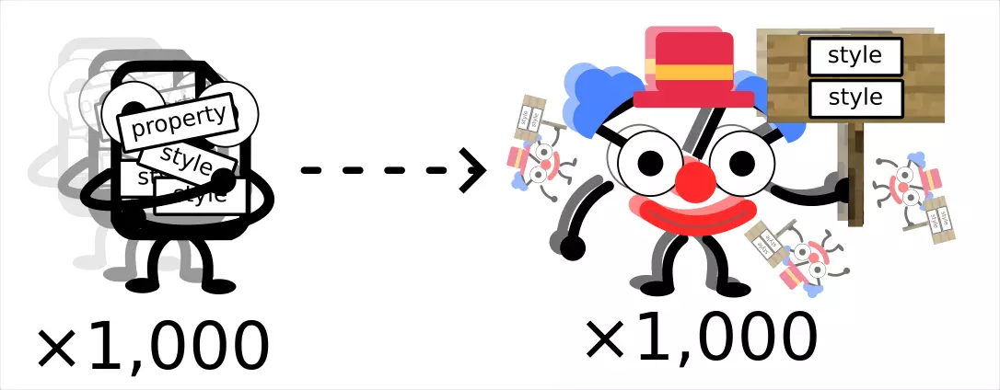
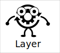
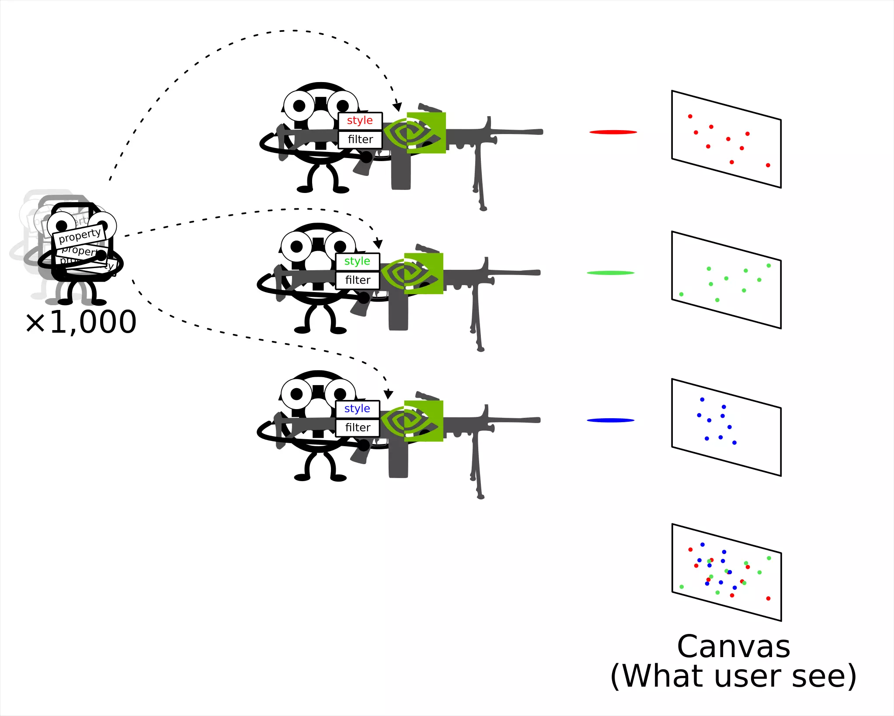

---
slug: 2024-01-02_mapbox-layer
authors: [weiji,]
tags: [Mapbox GL JS]
--- 

# 淺談 Mapbox GL JS 的渲染邏輯

<head>
  <meta property="og:image" content="https://raw.githubusercontent.com/FlySkyPie/flyskypie.github.io/main/blog/2024-01-02_mapbox-layer/img/02_data-properties-styles.webp" />
</head>

本人因為公司的專案而接觸 GIS (Geographic Information System)，並且在 Three.js 和 Mapbox GL JS 兩個函式庫都已經累積了基本的經驗。最近為了跟客戶的後端工程師解釋資料結構而寫了一些文件，個人感到十分滿意就整理一下發成一篇文章好了。

## 不是 Mapbox GL 的方式

這是資料和 [DOM](https://developer.mozilla.org/en-US/docs/Web/API/Document_Object_Model)：

一般來說，網頁前端的開發者會透過資料的屬性 (properties) 來決定渲染的樣式 (Style)：

如果不經過特殊的處理，當大量的資料進入程式，程式就會試圖渲染大量的 DOM：

因此基於 DOM 的 GIS 函式庫通常無法用來顯示巨量的資料點。

## Mapbox GL JS 的方式

Mapbox GL JS 預設是以 WebGL 模式處理資料的，並且額外支援 DOM 的渲染（部份 GIS 函式庫剛好相反，預設是 DOM，WebGL 的支援是附帶的）。

而這是 [圖層 (Layer)](https://docs.mapbox.com/help/glossary/layer/)：

你可以把 Layer 想像成這樣：

Layer 運作起來就像這樣：

可以注意到，它的運作方式和一般 (Data→Style) 的有所差異，要渲染成什麼樣子什麼不是資料決定的，而是 Layer 決定的，它喪失了對單一資料點進行 Style 客製化的彈性，但是獲得了大量渲染資料的能力。

關於如何設定 Layer，Mapbox 的[官方文件](https://docs.mapbox.com/style-spec/reference/layers/)提供了十分充足的資訊，即便是透過 Mapbox 官方的編輯器製作的「客製化地圖」也完全遵守這些 Style 的設定，只是官方提供的[樣式](https://www.mapbox.com/gallery) 一個大約有 200 層 Layer 左右。