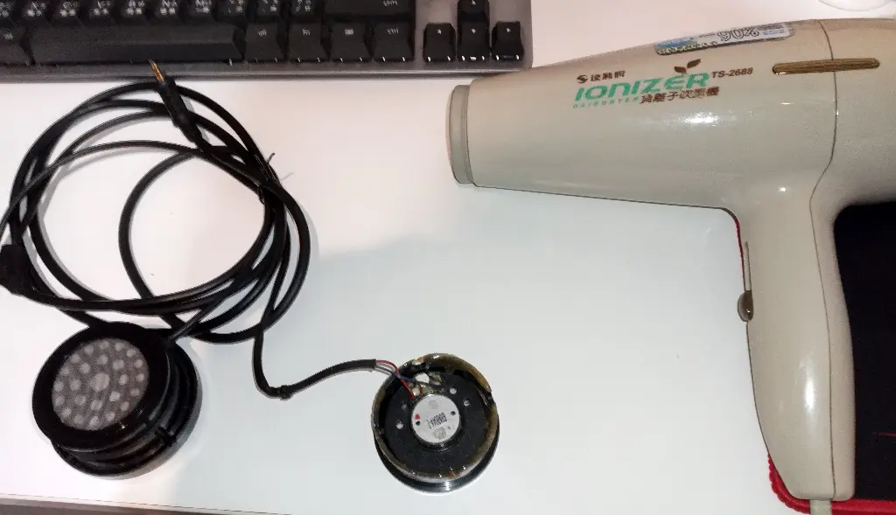
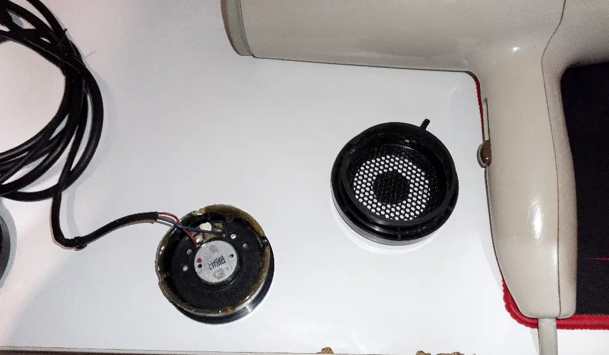
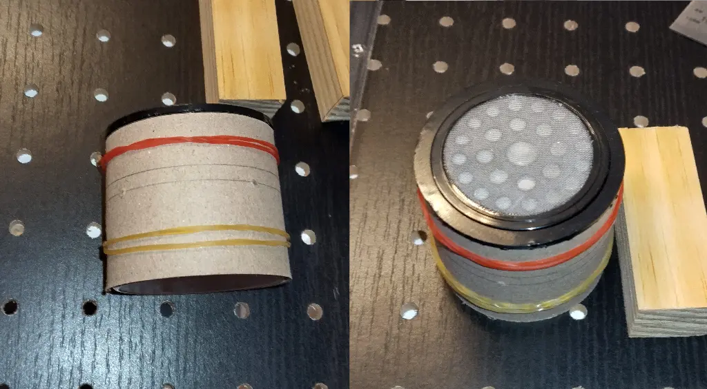
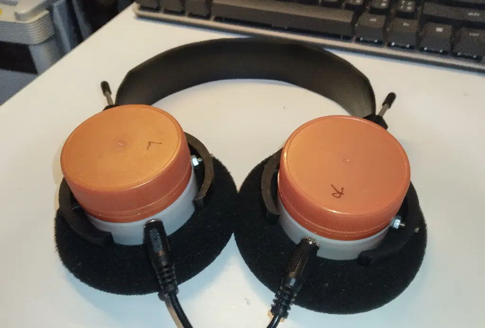

---
slug: 2024-03-24_headphone
authors: [weiji,]
tags: [DIY, life]
--- 

# 耳機與純粹喝

<head>
  <meta property="og:image" content="https://raw.githubusercontent.com/FlySkyPie/flyskypie.github.io/main/blog/2024-03-24_headphone/img/04_headphone.webp" />
</head>

:::info
實際作業時間是 2024-02-17, 2024-02-18 兩天，這篇文章算是補發的。
:::

## 前情提要

- 我[惡搞耳機](https://flyskypie.github.io/sideprojects-wiki/#FlyPie%20%E7%9A%84%E8%80%B3%E6%A9%9F)已經不是一天兩天的事情了。
- 在朋友的勸說之下我在 2021 年中購入了 Grado SR60e。
- 2023 年底開始出現音源線接觸不良的問題。

## 理解、分解

Grado SR60e 的耳罩部份是可以自由旋轉的，因此常常不知不覺的就會把耳機線轉個好幾圈，長期下來造成耳機線與耳罩連接的部份損壞，於是想趁著這次維修把音源線改成可拆卸式的。

在找了教學之後才發現這東西並不好拆，需要先用熱風槍或是吹風機加熱內部的熱熔膠才能把耳機殼打開[^headphone-detach]，好不容易打開之後想說試著裝回去，但是我沒注意到它在模型設計上並沒有加上極限的邊界，一不小心就壓過頭了，又花了好一番功夫才把壓過頭的零件挖出來。

經過這番折騰，於是我決定了；我要把整個殼換掉。我一點也不想要下次需要要重銲音源線的時候還得經歷一樣的事情。

## 再構築

不過要重做一個外殼可就麻煩了，畢竟目前手邊材料跟工具都十分有限，量一下外殼（有單體的那側）的外徑，5 公分！一個我再熟悉不過的尺寸之一！純粹喝咖啡的瓶子就是直徑 5 公分。

這副耳機有個有趣的設計，就是外框和外殼各有一公一母連接點，而連接桿的直徑剛好 3 mm，我手邊剛好有 M3 的螺絲和螺母。花了一點時間構思如何把外框、純粹喝、單體殼組合在一起就開工了。

透過直徑計算週長之後，用手邊的厚紙板製作治具，用來確定高度和定位連接點的位置：

接著把製具壓在純粹喝瓶身上劃線跟打定位孔，之後在照著線切割跟定位孔打洞，最後用螺絲與螺母將單體殼、外殼、外框組裝：

幸運的是單體殼和純粹喝非常貼合，雖然其中一邊顯得有點鬆（應該是瓶子的製程公差），塞個一層紙就緊了。

[^headphone-detach]: Grado SR-60i single side detachable cable mod. (1bpd). Retrieved 2024-03-24, from https://youtu.be/0JHGJqfM0wE?si=TtWqG6q4O7HzGTrg