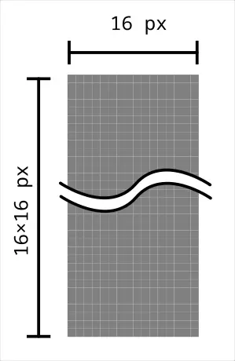
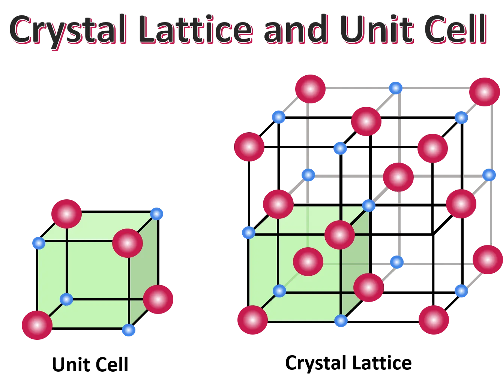
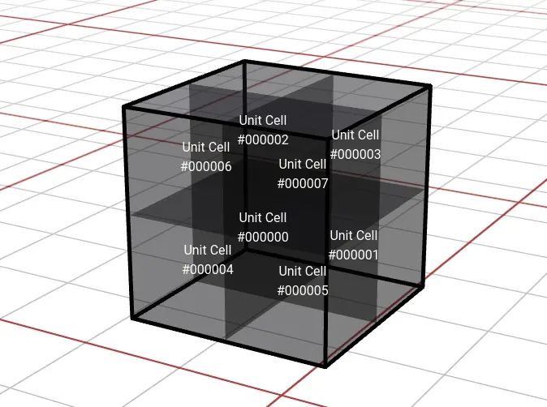
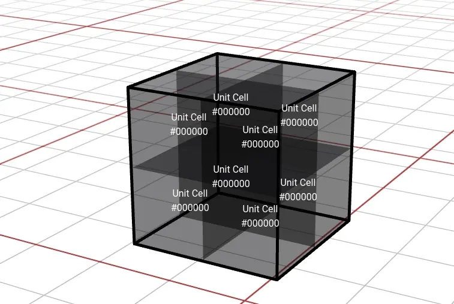
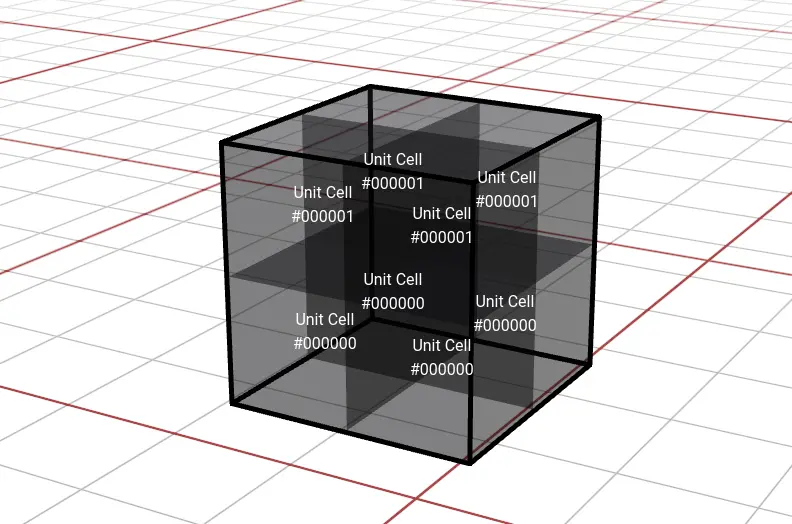
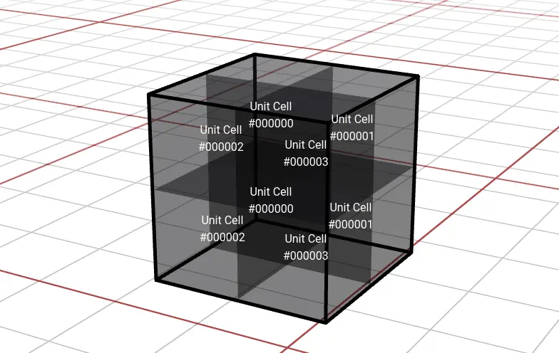

---
slug: 2024-03-24_24_tellus-voxel-test
authors: [weiji,]
tags: [Tellus, Hakoniwa, The Key of Huanche,]
--- 

# 一種包含旋轉資訊的 Voxel 資料格式 | Tellus Dev Log

## 前情提要

- [Tellus](https://flyskypie.github.io/sideprojects-wiki/#Project%3ATellus
) 是[環驅之鑰](https://flyskypie.github.io/sideprojects-wiki/#Project%3A%E7%92%B0%E9%A9%85%E4%B9%8B%E9%91%B0)下的子專案，專案目的為「建立儲存 Voxel 世界資料的系統」。
- 2021 年的時候，我受到 MBTiles 的啟發寫了一個基於 SQLite 檔案的 Voxel 儲存格式[^voxtt-spec]。

## 背景

最近 （2024 二月）買了 [TerraTech](https://store.steampowered.com/app/285920/TerraTech/) ，玩著玩著、在遊戲內轉著方塊，突然靈光一閃，想要處理旋轉方向的資料格式問題。

原本（2021 年寫的那份格式）我打算採取儲存 Voxel 的格式是用任意無損壓縮的點陣圖檔來儲存，舉例來說一個 16×16×16 Chunk 的資料會長得像這樣：

也就是一個 Pixel 等於一個 Voxel，但是這種方式單純是把一個 Voxel 當成一個像素點紀錄，無法支援像 Minecraft 那樣方塊有方向性的情況。

## 儲存的哲學

我無意針對儲存 Voxel 資料去創造一個二進制文件的定義，而是使用一般的點陣圖檔，其原因源自於 Unix 哲學[^UNIX_Philosophy]：

> Store data in flat text files.

二維點陣圖檔是一種常見且十分普及的資料格式，不論是透過圖形化界面的軟體還是函式庫，對其進行讀寫都是一件簡單的事情，我認為在這個意義上它與「純文字檔案」無異，而且具有更好的資料密度（壓縮率）。

在這個基礎上，我打算拿 8 個 Pixels 來描述一個 Block，令其中夾帶「方塊方向」的資訊，就結果而言可能過於浪費記憶體，不過作為一個（預計）遊戲的開發者，資料儲存的效率不是我當下最在意的事情，況且不少點陣圖片的檔案格式就有各自的無損壓縮演算法了，這個想法的基礎同樣來自  Unix 哲學[^UNIX_Philosophy]：

> Make each program do one thing well.

## 單位晶胞

單位晶胞 (Unit cell) 是固態物理學使用的一種概念，與之相對的是另外一個名為晶格 (Crystal Lattice) 的概念：

晶格是討論的結晶材料時候的最小單位，因為我們可以從它的結構與方向去探討這些參數如何影響宏觀特性，但是當我們把它切得更小會得到一個可以透過旋轉而構成晶格的最小不重複單元，那就是單位晶胞。

於是我把原本設計的資料格式再往下切割，用 8 個 Voxels 去構成一個 Block：

透過解析 8 個 Pixels 的排列模式就能定義出一個 Block 不同的旋轉方向。

## 次生 Voxel

接下來我會明確的區分這三個用語：

- Pixel
  - 二維空間的色點。
- Voxel
  - 三圍空間的色點，沒有方向性。
- Block
  - 由 8 個 Voxel 構成的方塊，有方向性。

對於一個 3 Bytes 的像素空間而言（RGB 三個頻道個佔 1 個 Byte），能夠表達的 Voxel 種類其實足夠可觀了，即便拿 8 個排列組合來描述一種 Block 也綽綽有餘：

$$
\frac{2^8 \times 2^8 \times 2^8 }{8} =
\frac{256 \times 256 \times 256}{8} =
2,097,152
$$

假定一個 Block 的基礎 Voxel 值為 `#000000`，為了描述其方向而衍生的 7 個 Voxel 則為次生 Voxel：

- `#000001`
- `#000002`
- `#000003`
- `#000004`
- `#000005`
- `#000006`
- `#000007`

## 旋轉模式

不同旋轉模式所需要的次生 Voxel 數量並不相同，目前我定義了幾種模式：

- 固體 (Solid)
- Y 軸對稱 (XZ-Reflection / Y-Symmetric)
- Y 軸旋轉
- Y 軸旋轉對稱 (Y-Symmetric-Rotation)

### 固體 (Solid)

只需要 1 個次生 Voxel，只有 1 種排列組合（方向性），類似 Minecraft 的[石頭 (Stone)](https://minecraft.fandom.com/wiki/Stone)。

### Y 軸對稱 (XZ-Reflection / Y-Symmetric)

我不確定稱它為「 Y 軸對稱」還是「XZ 平面對稱」比較精確。需要 2 個次生 Voxel，有 2 種排列組合（上與下），類似 Minecraft 的[半磚 (Slab)](https://minecraft.fandom.com/wiki/Slab)。

### Y 軸旋轉

需要 4 個次生 Voxel，有 4 種排列組合（東南西北），類似 Minecraft 的[儲物箱 (Chest)](https://minecraft.fandom.com/wiki/Chest)。

### Y 軸旋轉對稱 (Y-Symmetric-Rotation)

需要 8 個次生 Voxel，有 16 種排列組合（東南西北×上下），類似 Minecraft 的[階梯角 (Corner Stairs)](https://minecraft.fandom.com/wiki/Stairs)。

## Demo

為了呈現這個概念，我寫了一個編輯器，因為只是演示作用，不保證可靠性：

- [Live Demo](https://flyskypie.github.io/tellus-voxel-test/)
- [程式碼](https://github.com/FlySkyPie/tellus-voxel-test)

另外，在這個 Demo 中我試著嘗試了幾個之前沒用過得東西：

- Tailwind
  - 因為有幾個同事很喜歡用，所以我想試試看這東西建構 Prototype 的速度如何。
- PrimeReact
  - MUI 用習慣了，試試其他 Component 庫建構 Prototype 的速度如何。
- React Hook Form
  - 之前寫了一份 React 問卷，發現我沒有用過表單管理套件，趁著這個專案摸摸看。
- Dexie.js (React Hook)
  - 因為前一陣子研究 TiddlyWiki 的時候得知 PouchDB 這類東西，對前端儲存方案有些興趣就趁著這個專案摸摸看了。
- [Presite](https://github.com/egoist/presite)
  - 久違的想試試看預渲染 (pre-render)，不過 react-snap 貌似壞掉了（不支援 React 18），就找了個類似的替代品。

[^voxtt-spec]: Voxel Terrain Tiles Specification. (FlyPie).  Retrieved 2024-03-24, from https://github.com/FlySkyPie/voxtt-spec.

[^UNIX_Philosophy]: Mike Gancarz: The UNIX Philosophy. (n.d.). Retrieved 2024-03-24, from https://en.wikipedia.org/wiki/Unix_philosophy#Mike_Gancarz:_The_UNIX_Philosophy