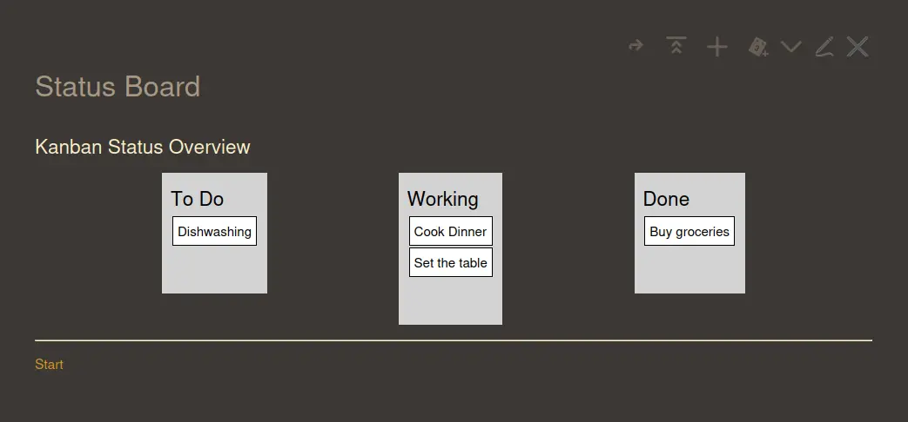
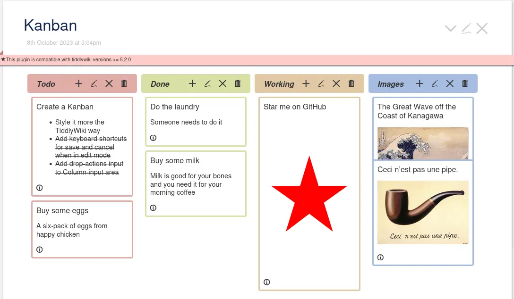
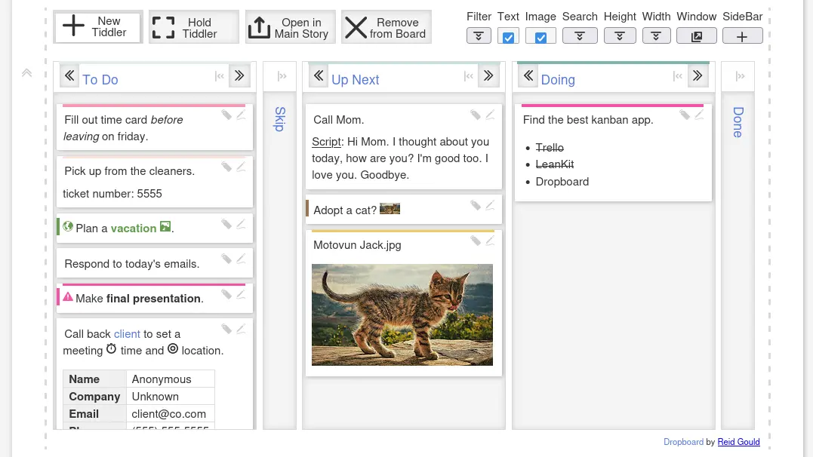
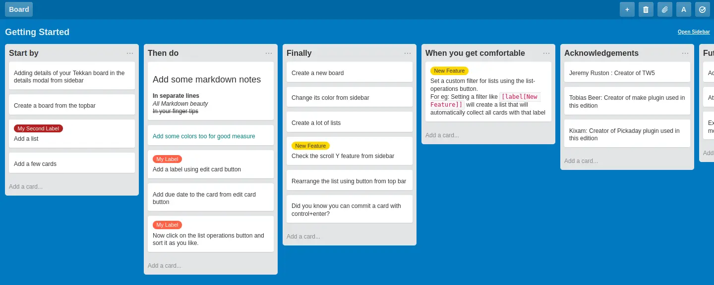
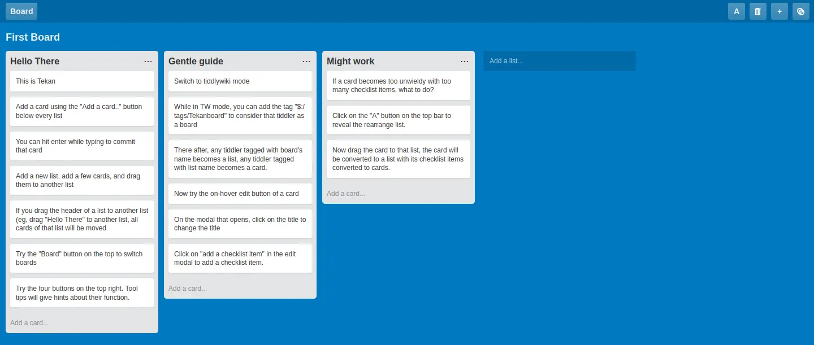

---
slug: 2024-04-03_tiddlywiki-journey-3
authors: [weiji,]
tags: [TiddlyWiki]
--- 

# 我的 Tiddlywiki 之旅 - Kanban

<head>
  <meta property="og:image" content="https://raw.githubusercontent.com/FlySkyPie/flyskypie.github.io/main/blog/2024-03-24_headphone/img/04_kanban-04.webp" />
</head>

## 前情提要

- 想對我那五花八門的 Side Project 們進行一點基本的專案管理，因此搜尋了幾個開源的 [Kanban](https://en.wikipedia.org/wiki/Kanban_(development)) 軟體之後 [fork 了 Planka](https://github.com/FlySkyPie/planka)，並把它改裝成以 SQLite 運作。

## Kanban

我本來就想要使用 Tiddlywiki 作為 Side Project 資料的儲存形式，直接在裡面做專案管理豈不是錦上添花？在抱持著這樣的想法之下，稍微搜尋了一下。

### [DoolPlex/TiddlyKanban](https://github.com/JoostvandenDool/TW-Plugins)

只是非常陽春的「拖拉」功能實做，完全未達到實用的標準。在 Tiddlywiki 官方論壇內發現的。[^TiddlyKanban]

[^TiddlyKanban]: Three plugins available - Plugins - Talk TW. https://talk.tiddlywiki.org/t/three-plugins-available/1999

### [BTC/Muuri-Kanban](https://github.com/BurningTreeC/tiddlywiki-muuri-kanban)

看起來很 Fancy，而且 Fancy 過頭了，加上對其他我不是很想要的插件有仰賴關係。

### [reidgould/Dropboard](https://github.com/reidgould/tiddlywiki-dropboard)

不必要的功能太多了，而且 UI 不太對我的胃口。

### [Tekkan One](https://github.com/ibnishak/Tekkan)

直接把整個 Tiddlywiki 變成 Kanban，wiki 的部份直接消失了。

### [Tekkan](https://ibnishak.github.io/Tesseract/projects/tekan/Tekan.html)

雖然完成度不及 Tekkan One 那麼高，但是熟悉的 Trello 界面、單純的功能與 UI 加上 Wiki/Kanban 切換的設計是所有 Kanban 類插件中最令我滿意的。

## 問題

上面這些插件都有幾個共同的問題：

### Card ID

Card （或是在 Jira 稱作 Ticket，GitHub 中稱為 Issue） 是 Kanban 上的小卡片，在 Jira 中會是一個類似 `JIRA-123` 之類由專案代碼和編號構成的唯一 ID；GitHub 中則是 issue 號碼，這些 ID 將會成為追蹤 Card 的識別依據。另一方面，Trello 比較不重視人類可讀，Card ID 由雪花 ID 表示。

而這些 Kanban 插件都是使用 Tiddler 來實做 Card，而 ID 理所當然的就是標題，在這樣的設計下無法達到「兩個 Kanban 有一樣名稱的 Card/Action Item」這樣的使用情境。

### Tiddlywiki Macro

為了滿足這樣的使用情境，勢必需要對插件進行修改，但是這些插件主要是以 Tiddlywiki 特有的巨集 (Macro) 語法撰寫而成，學習成本對我而言是一件有點麻煩的事情，考量這是一個非常冷門且使用受限的語法，花時間在上面似乎不是這麼值得。

## 結論

就像我在前一篇說的：

> 讓我越陷越深的兔子洞

我的 Tiddlywiki 之旅並沒有到此為止。
