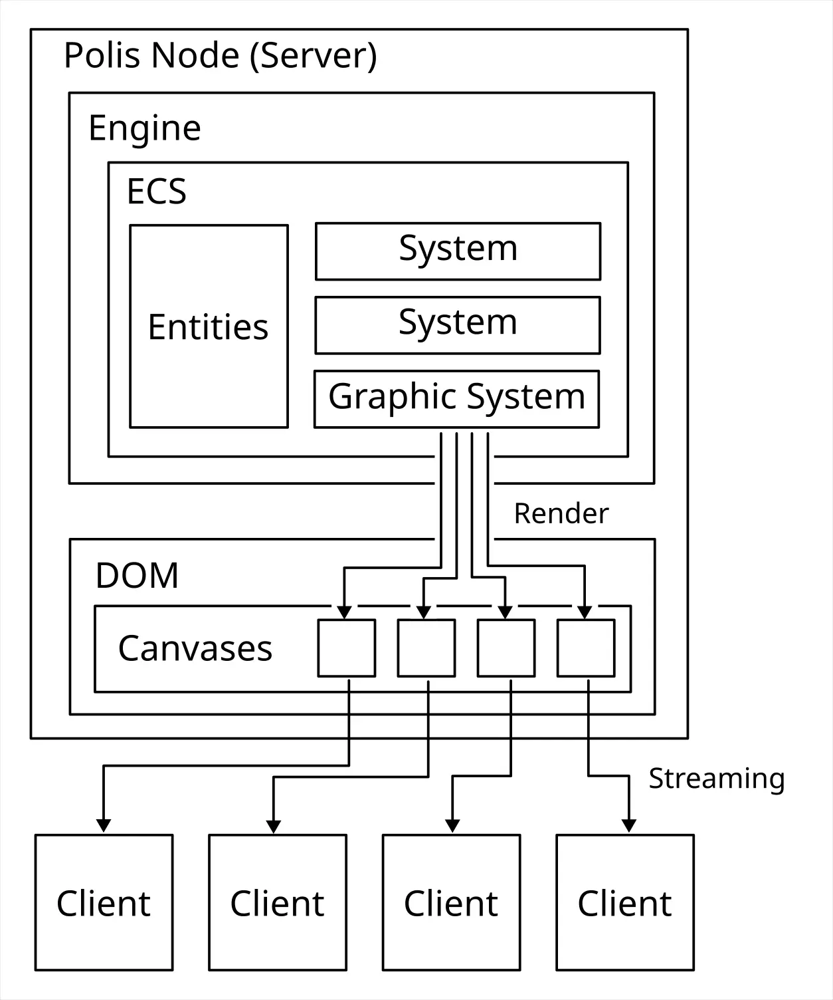

---
slug: 2024-05-26_polis-gpu-context-issue
authors: [weiji,]
tags: [Polis, Hakoniwa, The Key of Huanche, ]
--- 

# 關於 Polis 的 GPU Context 問題

<head>
  <meta property="og:image" content="https://raw.githubusercontent.com/FlySkyPie/flyskypie.github.io/main/blog/2024-05-26_polis-gpu-context-issue/img/01_architecture.webp" />
</head>

這個問題一直佔用我的大腦資源，然而目前我正在忙於其他 Side Project，無心處理這個問題，所以我想寫一篇文章先把這堆東西倒出去，讓腦根子清靜一點，日後再回頭來處理。

這是 Polis 預計使用的架構：

因為 Canvas 提供一個 `captureStream()` 方法允許把 Canvas 的畫面轉換成 `MediaStream` 物件，而 `MediaStream`  又能夠抽出 `MediaStreamTrack` 透過 WebRTC 的 API 串流出去。

但是最近我發現一個問題，就是 WebGL (Three.js) 存在一些限制：

> 一個 WebGLRenderingContext 被綁定到一個 Canvas

而 GL context 之間是無法互通的，因此複數個 Canvas 無法共用同一組 GPU Context。
