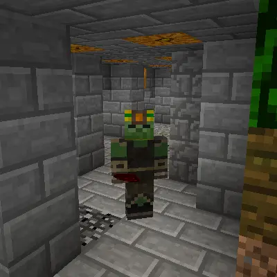
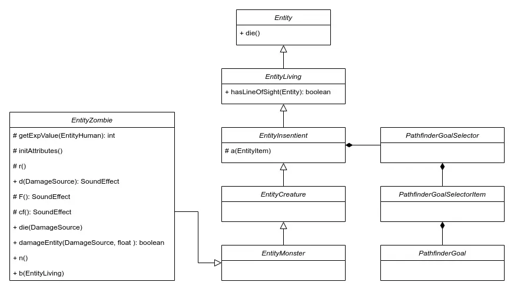

---
slug: 2024-05-29_I-like-minecraft-but-its-might-no-the-way-you-think
authors: [weiji,]
tags: [The Key of Huanche, Minecraft]
--- 

# 我喜歡 Minecraft，不過可能不是一般人認知的那種

<head>
  <meta property="og:image" content="http://img.youtube.com/vi/fjZAgoxFKiQ/0.jpg" />
</head>

:::info
稍微盤點一下我所知道的 Minecraft
:::

## The Minecraft 時期 (2012)

Minecraft 這款遊戲本身我已經很久沒有點開遊玩它了。實際上呢，我最熟悉的版本是 Beta 1.8，釀造系統（包含）以後的所有更新我其實都不是那麼的熟悉。比較熱衷玩 Minecraft 的日子大概是這樣的：

- 在 [Yami Odymel](https://home.gamer.com.tw/homeindex.php?owner=mac00178) 開的伺服器活動
- 因為耍白痴被 BAN 了
- 自己試著開了跑酷伺服器
- 自己試著開了 [Solar Apocalypse](https://dev.bukkit.org/projects/splated-solar-apocalypse) 伺服器

### 一種人類玩家與 AI 對抗的構想 (2013)

當時 Minecraft 伺服器的架設者為了提高遊戲的趣味程度，通常透過插件加入一些常見的功能：

- 經濟系統：允許玩家持有遊戲內的虛擬貨幣。
- RPG： 賦予玩家等級制的成長系統。
- 更強的怪物： 提高怪物的血量、速度、集體行動；甚至賦予特殊技能，創造類似小 BOSS 一般的存在。

但是怪物不論在數值上有多強，只要有固定的行動模式就能被玩家破解。Minecraft 內最令人敬畏的敵人是誰？人類玩家。

> 透過創造與人類玩家別無二致的 NPC 敵人

這樣的想法在我腦海油然而生。

我試著學習撰寫插件來生成結構化的建築物，2013-04-06 的截圖，我與插件的生成物（背景）：

:::info
具體的實做方式就是透過插件的 hook 取得指令事件、讀取玩家座標、使用預先儲存的三維矩陣把周遭的方塊填入遊戲世界中。
:::

在我的構想中，人類玩家是破壞者，這些「敵對 NPC」是創造者，它們以蟲群意識行動，並不斷的建造巨構建築吞噬地圖，就像 [BLAME!](https://en.wikipedia.org/wiki/Blame!) 中的[建造者](https://blame.fandom.com/wiki/Builders)一樣。

## SyntheticEmpire (2018)

五年後我重拾這個被我放置的概念，這次我從「實做 NPC」開始。經過對函式庫的調查，我理解到 Minecraft 處理「玩家實體」的方式是放置一個虛假的幻影，然後透過一些方式來操作這些幻影，使得「玩家實體」與其他遊戲中的「生物實體」截然不同。

於是當時我選中了殭屍作為 NPC 的基礎類別，因為它是少數人形的怪物，而且服裝最接近 Steve。

關於實體的操作這種類型的函式庫屬於 NMS (net.minecraft.serve) 的部份，並不是插件的函式庫特別關照的區塊，因此仍然殘留大量反編譯留下的非語意化變數名稱，當時花了好一番功夫去讀懂這些函數與變數的功能。最後[成功](https://www.youtube.com/watch?v=vH0KOeijNeQ)附加一些玩家的特性到特製的殭屍實體去了。

遺憾的是當時撰寫的專案並沒有保留程式碼，只有一個輸出的 `.jar` [檔案](https://github.com/FlySkyPie/SyntheticEmpire)。

（點圖開啟影片）

## 那些跟 Minecraft 有關的 YouTuber

- [FitMC](https://www.youtube.com/@FitMC)
  - 主要在講 2b2t 伺服器故事的人。
  - [The Fall of Minecraft's 2b2t](https://www.youtube.com/watch?v=elqAh3GWRpA)
      - 一個「資訊時代誰掌握了資料 (Data)，誰就掌握了力量」的故事
- [AntVenom](https://www.youtube.com/@AntVenom)
  - 一個對 Far Lands 莫名著迷的人。
  - 挖掘各種把 Minecraft 搞壞的方法。
- [SalC1](https://www.youtube.com/@SalC1/)
    - 專題式介紹（歷史、涉及軟體工程的重大事件等等） Minecraft 的人。
    - [Playing Minecraft 1.16 on Windows 98](https://www.youtube.com/watch?v=EyRPUT4fXh4)
        - 在 Windows 98 上執行現代版本 (1.16) 的 Minecraft
    - [I DIDN’T Migrate my Minecraft Account - Here’s What Happened](https://www.youtube.com/watch?v=rUFDRAEducI)
        - 如果不遷移原始帳號到微軟帳號去會發生什麼事？
- [TheMisterEpic](https://www.youtube.com/@TheMisterEpic)
    - 同樣是專題式介紹 Minecraft 的人。
    - [Minecrafts Oldest BUGS That Mojang CAN'T Fix…](https://www.youtube.com/watch?v=17vabTy82Iw)
        - 盤點那些古老的而且存在至今的 Minecraft bug

:::info
2b2t: 一個無政府主義 (Anarchism) 伺服器。有別於一般的 Minecraft 伺服器會透過規則、區分世界、權限插件等機制約束玩家並限制玩家破壞，Anarchy  伺服器沒有規則：開外掛是基本配件、終界水晶互炸很常見、把 bug 武器化（舉例來說在地圖物件上堆疊大量的箭頭來耗盡玩家的顯示卡資源）來攻擊敵對陣營也是再正常不過的事情。
:::

:::info
Far Lands: Minecraft 地形生產演算法在座標的浮點數逼近特定數值時的浮點數誤差會使算法受到破壞性的影響而不再能生成正常的地形。
:::

## 那些跟 Minecraft 有關的 AI 專案

- [Baritone](https://github.com/cabaletta/baritone)
    - Minecraft 的機器人外掛
- [MineDojo/Voyager](https://github.com/MineDojo/Voyager)
    - 一個訓練 GPT (OpenAI) 玩 Minecraft 的專案
- [Mineflayer](https://github.com/PrismarineJS/mineflayer)
    - 跟 AI 沒有直接關係，它是 Voyager 專案中 AI 操作 Minecraft 的界面
    - 它是以 Javascript 實做的無頭 (headless) Minecraft 客戶端，換句話說你可以透過撰寫程式碼來連線到 Minecraft 伺服器「遊玩」，而伺服器會以為你是用 Minecraft 連線過來的。
- [minerkasbs/minerl](https://github.com/minerllabs/minerl)
    - Minecraft 鑽石挑戰 (MineRL Competition) 的套件包
    - 關於鑽石挑戰我翻譯過兩篇 2021 年度的比賽規則：
        - [競賽流程](https://flyskypie.github.io/blog/2021-06-11_minerl-competition-structure/)
        - [比賽規則](https://flyskypie.github.io/blog/2021-06-10_minerl-challenge_rules/)
- [Malmo](https://github.com/microsoft/malmo)
    - MineRL 的前身，由微軟釋出並主辦了幾場沒有創意的比賽，然後就沒有然後了。
    - 我有寫一篇介紹 [Project Malmo](https://flyskypie.github.io/blog/2021-07-18-Project_Malmo_Intro/) 的文章。

## The Master Pieces

以遊戲軟體工程的角度來說 Minecraft 是個巨作，它身上有很多值得學習的東西，這裡有個影片點出其中幾個比較知名的要點（點圖開啟影片）：

- 用 Greedy Meshing 減少三角面
- 用 Perlin Noise 實現程序化生成地形
- 用 Perlin Worm 生成洞穴
- 用參數表定義生態系
- 用基於 Voxel 的算法處理光源

Minecraft 也有一些軟體設計上的缺陷值得借鏡，諸如：

- 原生的伺服器程式基本上是單執行緒的
- OOP 的程式架構造成錯綜複雜的 Side Effect 造成難以除錯 (Debugging)

## 「真正的 Minecraft」

Beta 1.7 是一個特別的 Minecraft 版本，Minecraft 圈子有一群懷舊的玩家堅持這是最後一個真正的 Minecraft。原因在於 Beta 1.8 的更新中加入了諸如飢餓系統與奔跑等遊戲機制，大幅度改變遊戲體驗。

- [Better Than Adventure! - 1.7.6 Trailer (Minecraft Beta 1.7.3 mod)](https://www.youtube.com/watch?v=PLf1gm37erw)
  - 一個把現代 Minecraft 的一些遊戲內容移植到 Beta 1.7 的模組
- [TrueCraft](https://github.com/ddevault/TrueCraft)
  - 一個號稱使用靜室開發重新以 C# 實做 Beta 1.7 的開源專案
  - 我個人沒有成功執行過，雖然可以編譯成功但是遊戲無法正常遊玩。

## 那些跟 Minecraft 有關的野生專案

- [ClassiCube](https://github.com/ClassiCube/ClassiCube)
  - 以 C 語言復刻 Minecraft Classic
- [Eaglercraft](https://minecraftforfreex.com/eaglercraft/)
  - 盜版 Minecraft 的網頁移植版
  - 使用 [TeaVM](https://teavm.org/) 在網頁上執行 Java 生態的程式

## 那些「啟發自」Minecraft 的開源專案

- [fogleman/Craft](https://github.com/fogleman/Craft)
  - 總共只有大約 3k 行 C 語言實做「Voxel 遊戲的基本功能」。
- [satoshinm/NetCraft](https://github.com/satoshinm/NetCraft)
  - fogleman/Craft 的 fork
  - 透過 emscripten 移植到網頁上
- [Minetest](https://github.com/minetest/minetest)
  - C++ 實做的「Voxel 遊戲引擎」
  - 支援 Lua 插件
  - 可以透過插件來逼近 Minecraft 的遊戲內容
  - 市面上流通不少「山寨版 Minecraft」都是這專案的 fork
- [Voxel.js](https://github.com/voxel)
  - 一個作者從 WebGL 開始刻的網頁 Voxel 專案。

## 那些跟 Minecraft 有關的開源專案

- [Cuberite](https://github.com/cuberite/cuberite)
  - 輕量級的 Minecraft 伺服端
  - 以 C++ 實做
  - 使用 Lua 作為插件腳本語言
- [Mineflayer](https://github.com/PrismarineJS/mineflayer)
  - Headless Client 端，在前面 AI 專案的段落有提過。
- [Minecraft: Pi Edition: Reborn](https://github.com/MCPI-Revival/minecraft-pi-reborn)
  - 讓不是 ARM 架構的電腦執行 Minecraft: Pi Edition
- [其他兼容 Minecraft 的開源 Client 端](https://wiki.vg/Client_List)
- [其他兼容 Minecraft 的開源 Server 端](https://wiki.vg/Server_List)

## 特修斯的 Minecraft

當使用完全開源的 Client 端實做，例如：Mineflayer；
搭配上完全開源的 Server 端實做，例如：Cuberite；
Minecraft 就昇華成純粹的協定，整個過程不涉及原本的 Minecraft 了。