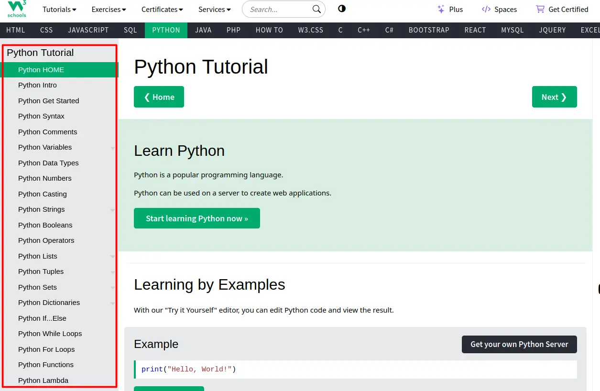
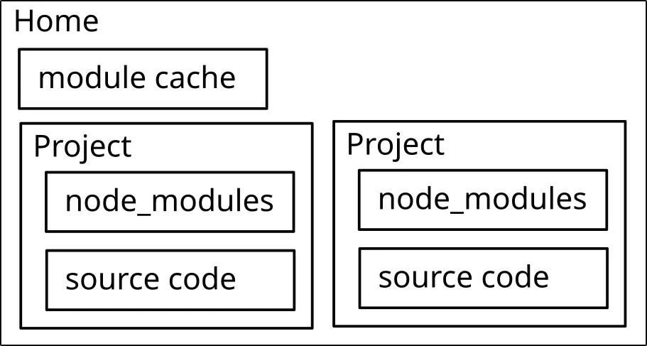
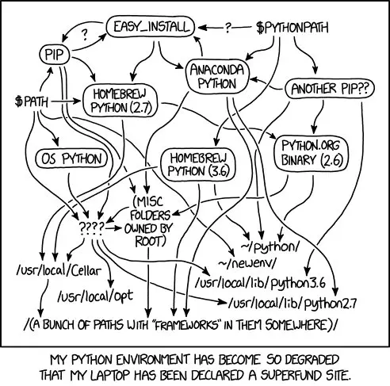
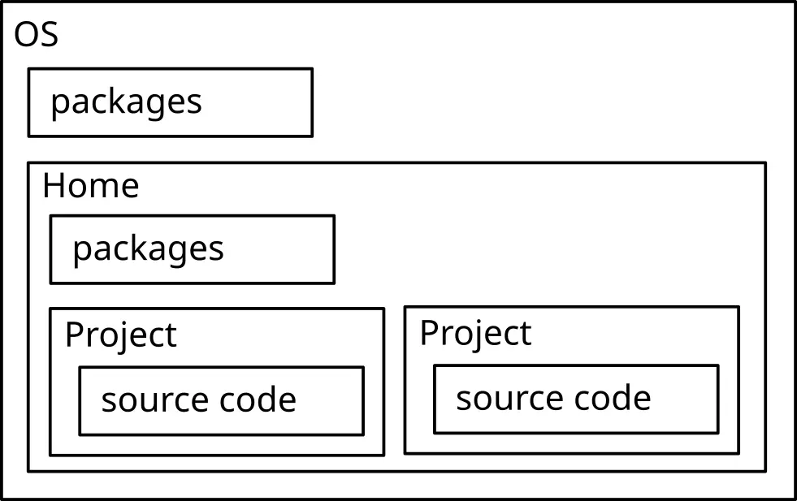

---
slug: 2024-06-09_from-javascript-to-python-paradigm-migration
authors: [weiji,]
tags: [javascript, python]
--- 

# 從 Javascript 到 Python 的範式遷移 (Paradigm Migration)

<head>
  <meta property="og:image" content="https://raw.githubusercontent.com/FlySkyPie/flyskypie.github.io/main/blog/2024-06-09_from-javascript-to-python-paradigm-migration/img/03_python-meme.webp" />
</head>

:::info
範式沒有不見，範式只是變成其他形狀了。
:::

## 緣由

最近因為工作的關係需要學習使用 Python，不過作為一個有三年前端開發經驗的工程師，加上沒吃過 Python 也看過 Python 走路（？），因此學習的角度難免脫離一般沒有背景的人入門 Python 的方式，與其說是從頭學習一門程式語言，不如說是遷移我在 Javascript 上累積的經驗。

[W3School](https://www.w3schools.com/python/) 的教學安排我覺得就已經很清楚了：



不過對於我這樣一個有開發經驗的人而言，語法反而不是最重要的。

## 執行環境

:::info
Javascript::NVM + Javascript::NPM → Python::Poetry
:::

### Javascript

相較於其他程式語言，Javascript 的生態系除了它那容易令人誤解的名稱之外，還有規範 (Specification) 與實做 (Implementation) 分離的奇怪現象。

Javascript 本身是一團抽象規範，真正能夠執行的是實做，而開發者主要需要區分的實做分別是網頁瀏覽器 (Web Browser) 與 Node.js。

其中 Node.js 有著非常多的版本[^node-releases]，而這個版本也是開發者需要留意的對象，當程式碼與直譯器版本不批配時就會出現問題。

因此 Javascript 開發者通常不會直接安裝 Node.js，而是透過 [NVM](https://github.com/nvm-sh/nvm) (Node Version Manager) 去決定與切換當前的 Node.js 版本。

接著是 Javascript 作為現代語言如何處理模組 (Module)，每個專案資料夾都有各自儲存模組的路徑，並且為了減少複數個專案之間下載相同模組的時間，會在使用者的 home 留下快取。



主流的工具有 [npm](https://www.npmjs.com/)、 [Yarn](https://yarnpkg.com/)、 [pnpm](https://pnpm.io/)...，技術層面各有差異，不過在 Javascript 專案中擔任的角色是相同的。

值得一提的是，在 Javascript 的生態系中，「套件管理器」就不只一種，因此 Node.js 考慮引入 「套件管理器管理器」：[Corepack](https://nodejs.org/api/corepack.html)。

[^node-releases]: Node.js — Node.js Releases. Retrieved 2024-06-09, from https://nodejs.org/en/about/previous-releases

### Python

相較於 Node.js 直譯器版本一路從 4.0 演化到 22.0，Python 要煩惱的版本幾乎只剩 2 跟 3 了（？），不過 Python 有其他問題需要煩惱：



除了 Python 直譯器的安裝路徑外，套件的管理是另外一個問題：



因為專案之間直接使用相同的套件來源，當仰賴的套件版本衝突時就會發生[相依性地獄](https://zh.wikipedia.org/zh-tw/相依性地獄)，於是有一系列的工具為了解決這個問題而生：

- `venv`
- `pipenv`
  - https://github.com/pypa/pipenv
  - 24.7k ⭐
- `virtualenv`
  - https://github.com/pypa/virtualenv
  - 4.7k ⭐
- `pyenv-virtualenv`
  - https://github.com/pyenv/pyenv-virtualenv
  - 6.1k ⭐
- `conda`
  - https://github.com/conda/conda
  - 6.2k ⭐
- `poetry`
  - https://github.com/python-poetry/poetry
  - 29.9k ⭐

目前 Poetry 看起來是最好方案，安裝 Poetry：

```shell
curl -sSL https://install.python-poetry.org | python3 -
```

於是建立一個 Python 專案就變成像這樣了：

```shell
poetry new poetry-demo  # 新增專案

cd peotry-demo

poetry env use python3 # 新增虛擬環境

poetry shell  # 進入虛擬環境

git init

curl https://raw.githubusercontent.com/github/gitignore/main/Python.gitignore > .gitignore
```

關於 Poetry 的介紹與使用這裡有一篇文章講的蠻完整的：

[Python 套件管理器——Poetry 完全入門指南 ](https://blog.kyomind.tw/python-poetry/)

## 型別檢查

:::info
Javascript::Typescript → Python::Mypy
Javascript::tsconfig.json → Python::mypy.ini
:::

### Javascript

JavaScript 本身是一種動態型別/弱型別語言，這種特性給予了開發者極高的彈性，但容易造成很多基本的錯誤需要在執行期間 (runtime) 才能被發現。

[Typescript](https://www.typescriptlang.org/) 就是為了解決這個問題而誕生的。Typescript 的另外一個特性是「Javascript 的超集 (superset)」，不過在 ES6 已經普及的今天 (2024 年)，這個特性已經不是最有價值的部份了。

透過 Typescript 定義的型別語法，加上 Linter （語法檢查器）與 IDE Hint （編輯器提示）等機制，可以在開發階段就避免或挑出低級錯誤而減少在執行期間除錯 (Debug) 的成本。

型別檢查的規則可以透過 [tsconfig.json](https://www.typescriptlang.org/docs/handbook/tsconfig-json.html) 來調整。

### Python

Python 的動態型別特性是筆者一直以來對 Python 保有排斥心裡的原因之一，因此解決型別問題是筆者重返 Python 最高優先解決的問題。

值得慶幸的是 Python 確實陸續將型別標記之類的功能引入自己的標準之中，諸如：PEP3107、PEP484、PEP526、PEP561...。[^python-type-PEP]

> 型別註釋能夠提供團隊成員對於變數型別的了解，不過仍不能真正解決型別誤用的情況，畢竟 Python 的型別註釋也只是註釋，並無法偵測誤用/錯用型別的情況。[^python-typing]:
> 

雖然 Python 支援型別標記，卻仍然缺少型別檢查的實做，為了解決這個問題確實有不少型別檢查的工具：

- `mypy`
  - https://github.com/python/mypy
  - 17k ⭐
- `pytype`
  - https://github.com/google/pytype
  - 4.6k ⭐
- `pyre`
  - https://github.com/facebook/pyre-check
  - 6.7k ⭐
- `pyright`
  - https://github.com/microsoft/pyright
  - 12.3k ⭐

Mypy，就決定是你了！

```shell
# Install type check tool
poetry add mypy

# Run type check
mypy .
```

如同 Typescript 的 tsconfig.json 一般，Mypy 可以透過 [mypy.ini](https://mypy.readthedocs.io/en/stable/config_file.html) 來設定型別檢查的強度與規則。

更多關於型別的寫法見[官方文件](https://docs.python.org/3/library/typing.html)。

[^python-type-PEP]: 新的型態提示PEP. (林信良). Retrieved 2024-06-09, from https://www.ithome.com.tw/voice/140338
[^python-typing]: 使用 Python typing 模組對你的同事好一點. (Amo Chen). Retrieved 2024-06-09, from https://myapollo.com.tw/blog/python-typing-module/

## VSCode (Visual Studio Code)

### Javascript

VSCode 因為自己本身就是 Typescript 寫的，所以對 Javascript/Typescript 可以說是原生支援，不需要額外掛擴充插件就能有不錯的開發體驗，不過可能需要調整一些設定之類的，例如：[顯示參照](https://stackoverflow.com/questions/45490475/how-do-i-show-reference-count-in-visual-studio-code)。

### Python

- 讓 VSCode 認得 `pyproject.toml`
  - https://marketplace.visualstudio.com/items?itemName=tamasfe.even-better-toml
- 讓 VSCode 認得 Python
  - https://open-vsx.org/extension/ms-python/python
    - https://marketplace.visualstudio.com/items?itemName=ms-python.python

## 基本語法

基本語法照著 w3school 的清單一個一個看過去大概清楚 Python 的基本語法了，我只會挑一些語法或名稱差異比較大的出來。

- 註解 (Comment)
  - https://www.w3schools.com/python/python_comments.asp
- 變數 (Variables)
  - https://www.w3schools.com/python/python_variables.asp
  - 變數命名
    - https://www.w3schools.com/python/python_variables_names.asp
  - 多變數賦值
    - https://www.w3schools.com/python/python_variables_multiple.asp
- 變數類型 (Data Types)
  - https://www.w3schools.com/python/python_datatypes.asp
  - Text Type: `str` 
  - Numeric Types: `int`, `float`, `complex` 
  - Sequence Types: `list`, `tuple`, `range` 
  - Mapping Type: `dict` 
  - Set Types: `set`, `frozenset` 
  - Boolean Type: `bool` 
  - Binary Types: `bytes`, `bytearray`, `memoryview` 
  - None Type: `NoneType`
- 字串 (String)
  - https://www.w3schools.com/python/python_strings.asp
- 布林值 (Boolean)
  - https://www.w3schools.com/python/python_booleans.asp
- 運算子 (Operators)
  - https://www.w3schools.com/python/python_operators.asp
- 判斷式 (If ... Else)
  - https://www.w3schools.com/python/python_conditions.asp
- 迴圈 (While/For Loop)
  - https://www.w3schools.com/python/python_while_loops.asp
  - https://www.w3schools.com/python/python_for_loops.asp
- 函式 (Function)
  - https://www.w3schools.com/python/python_functions.asp
- 作用域 (Scope)
  - https://www.w3schools.com/python/python_scope.asp
- 資料容器
  - Tuples
    - https://www.w3schools.com/python/python_tuples.asp
  - 集合 (Set)
    - https://www.w3schools.com/python/python_sets.asp

### 模板文字

:::info
Javascript
```
`My name is John, I am ${age}`
```
→ Python
```
f"My name is John, I am {age}"
```
:::

在 Javascript 被稱作 Template literals 的東西，在 Python 則是透過 f-strings 達到類似的效果。

### 匿名函式

:::info
Javascript::Arrow Function → Python::Lambda Function
:::

### 解構賦值

:::info
Javascript::Destructuring Assignment → Python:Unpack
Javascript::Rest Parameters → Python::Arbitrary Arguments
:::

W3 是把這個概念放在 Tuples 下講，但是我覺得既然是 List 和 Tuples 共用的特性應該分出來講，畢竟在 Javascript 這是一種叫做解構賦值 (Destructuring assignment) 的語法。

#### Javascript

```javascript
let a, b;
[a, b] = [10, 20];

let t = [0, 1, 2, 3, 4];
[a, b, ...c] = t;

const func = (...args) =>
  console.log(args)
```

#### Python

```python
a, b = 10, 20

t = (0, 1, 2, 3, 4)
a, b, *c = t

def my_function(*args):
  print(args)
```

這裡有一篇文章舉了更多 unpack 的例子[^python-tuple-list-unpack]。

[^python-tuple-list-unpack]: Unpack a tuple and list in Python. (nkmk). Retrieved 2024-06-09, from https://note.nkmk.me/en/python-tuple-list-unpack/

### 字典

:::info
Javascript::Map → Python::Dictionary
:::

### 陣列

:::info
Javascript::Array → Python::List
Javascript::TypedArray → Python::Array (NumPy)
:::

和 Javascript 一樣，Python 的陣列不是「真的陣列」，而是一個可以變大變小的資料容器，並且這樣的容器在 Python 中被稱作 List。

在 Javascript 中可以透過 TypedArray 來創造真正意義上資料密集的陣列，但是在 Python 中這件事並不是內建在語言中的：

> Python does not have built-in support for Arrays, but Python Lists can be used instead. To work with arrays in Python you will have to import a library, like the NumPy library.[^python-array]
>

而是需要透過諸如 NumPy 之類的函式庫來達成。

[^python-array]: Python Arrays. (w3school). Retrieved 2024-06-09, from https://www.w3schools.com/python/python_arrays.asp

## 進階語法

- 類別 (Class)
  - https://www.w3schools.com/python/python_classes.asp
- 繼承 (Inheritance)
  - https://www.w3schools.com/python/python_inheritance.asp
- 迭代器 (Iterators)
  - https://www.w3schools.com/python/python_iterators.asp
- Try Except
  - https://www.w3schools.com/python/python_try_except.asp
- User Input
  - https://www.w3schools.com/python/python_user_input.asp
- 檔案讀寫
  - https://www.w3schools.com/python/python_file_handling.asp
  - https://www.w3schools.com/python/python_file_open.asp
  - https://www.w3schools.com/python/python_file_write.asp
  - https://www.w3schools.com/python/python_file_remove.asp
- Generator Expressions as list comprehensions
  - https://www.pythontutorial.net/advanced-python/python-generator-expressions/
  - https://www.w3schools.com/python/python_lists_comprehension.asp

### 模組 (Modules)

從模組引入特定的函式或物件：

:::info
Javascript
```javascript
import { name1, name2 } from "module"
```
→ Python
```python
from module import name1, name2
```
:::

引入整個模組：

:::info
Javascript
```javascript
import * as new_name from "module"
```
→ Python
```python
import module as new_name
import module
```
:::

在 Node.js 中可以在資料夾加入進入點來表達「這個資料夾是模組」，Python 也有類似的機制：

:::info
Node.js::`index.js` → Python::`__init__.py`
:::

Node.js 之父後悔 `index.js` 這個設計又是另外一個故事了[^10-things-i-regret-about-nodejs]。

[^10-things-i-regret-about-nodejs]: Node.js 開發之父：「十個Node.js 的設計錯誤」－ 以及其終極解決辦法. (David Ng). Retrieved 2024-06-09, from https://m.oursky.com/f0db0afb496e

#### 全域匯入

:::info
Javascript
```javascript
import "module"
```
→ Python
```python
from module import *
```
:::

Javascript 在模組機制還不發達的時期，引入函式庫的方式往往就是一團丟到全域變數去的東西，而這種方式很容易造成函式庫之間的命名衝突，對於這段歷史有興趣的同學可以了解一下一個名為 UMD (Universal Module Definition) 的工具，它身上有著 Javascript 模組大亂鬥的歷史。

在 Python 中有著類似匯入方式：

```python
from random import *

print(randint(0, 5)) # It's random.randint
```

不過正如早期的 Javacsript 全域模組的問題一樣，這種語法在有成熟模組匯入機制的現在應該避免使用。

這裡有一篇講解更多關於 Python 匯入模組的文章：

[Python 的 Import 陷阱](https://medium.com/pyladies-taiwan/3538e74f57e3)


### 內建模組

在 Node.js 中，「內建模組」的概念並不陌生，`fs`, `path`, `os` 都是 Node.js 的內建模組，這樣的設計可以避免過度膨脹原生的語法，而讓一些實做以模組的形式存在。

- Datetime
  - https://www.w3schools.com/python/python_datetime.asp
- Math
  - https://www.w3schools.com/python/python_math.asp
- JSON
  - https://www.w3schools.com/python/python_json.asp
- 正規表達式 (RegEx)
  - https://www.w3schools.com/python/python_regex.asp
- Random
  - https://www.w3schools.com/python/module_random.asp
- asyncio
  - https://docs.python.org/3/library/asyncio.html
- Statistics
  - https://www.w3schools.com/python/module_statistics.asp
- cmath
  - https://www.w3schools.com/python/module_cmath.asp
