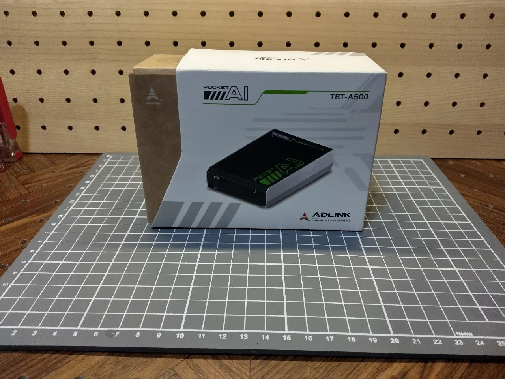
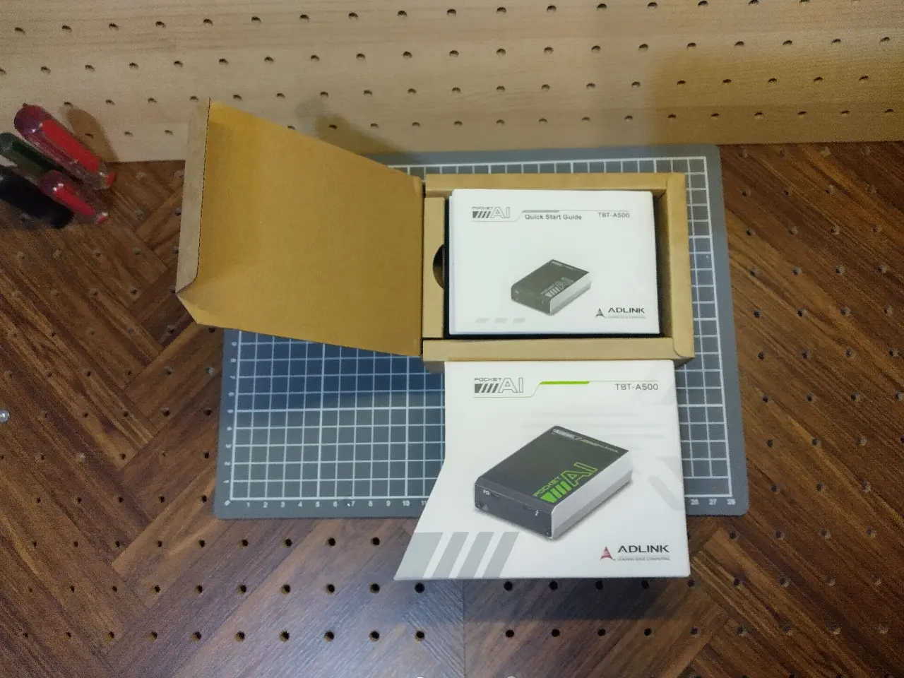
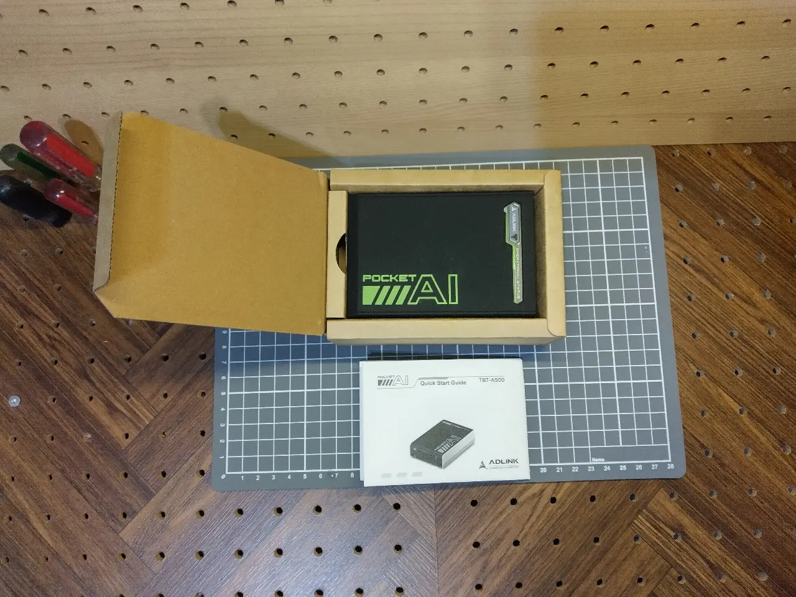
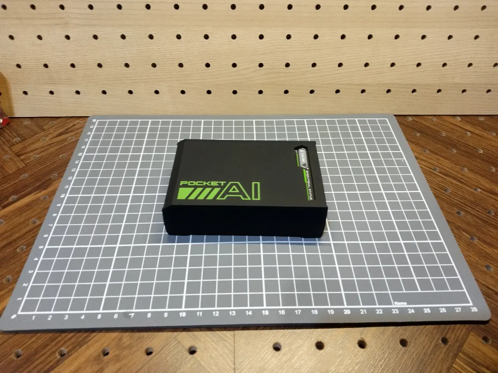
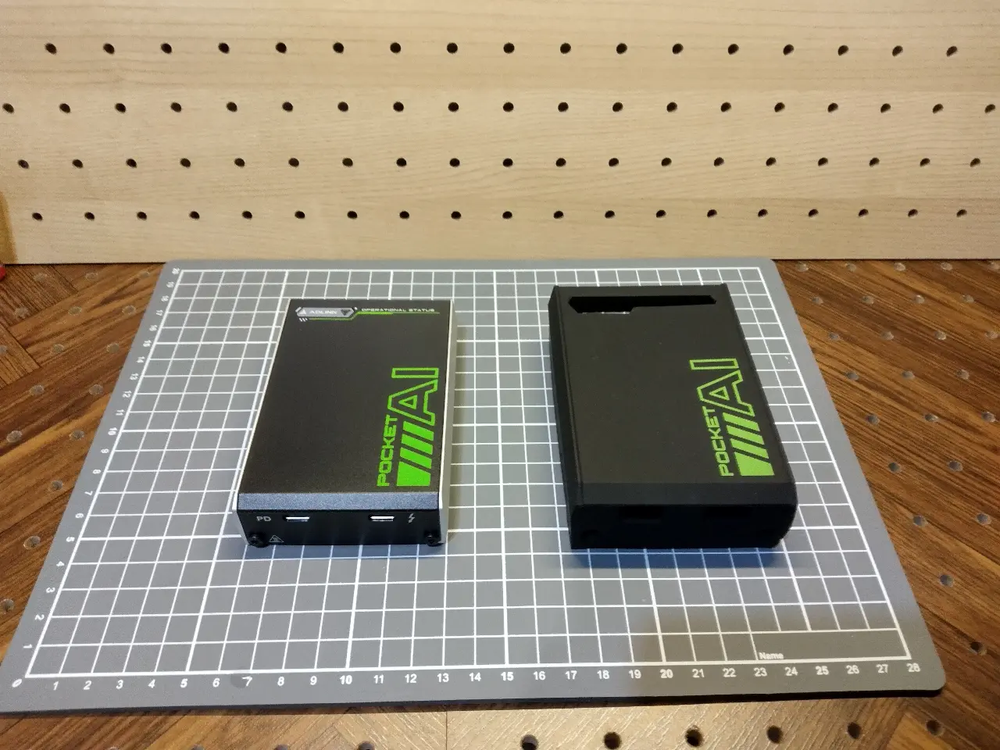
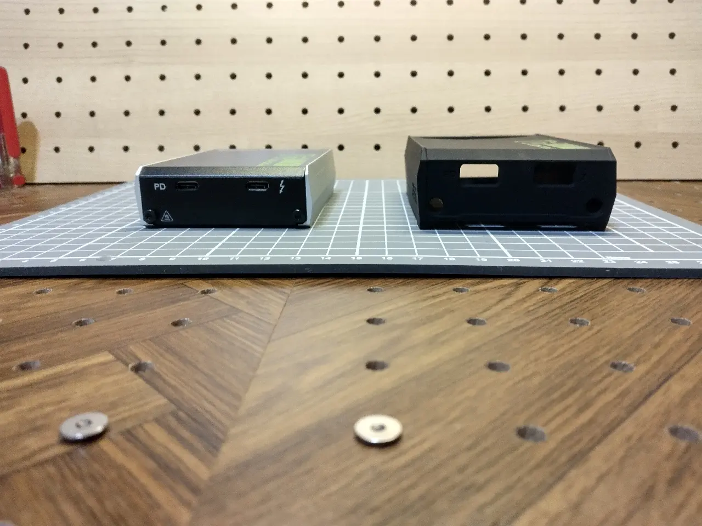
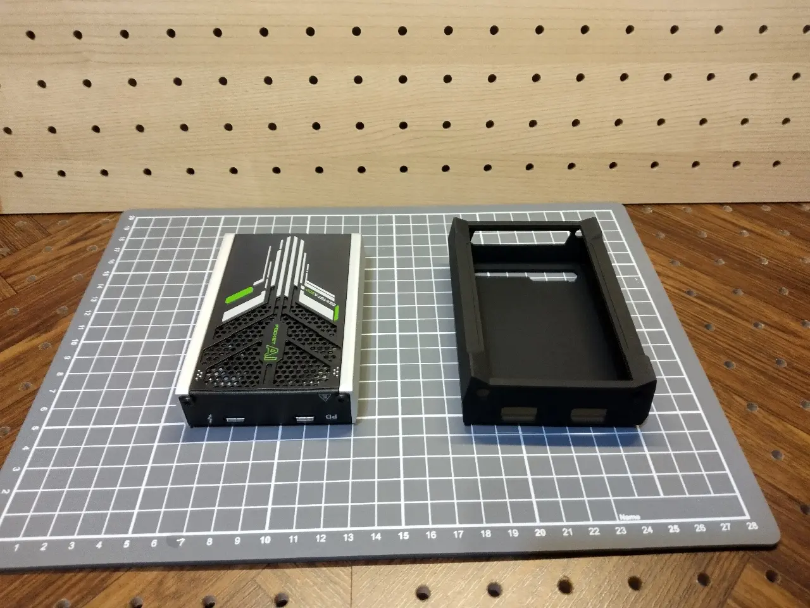
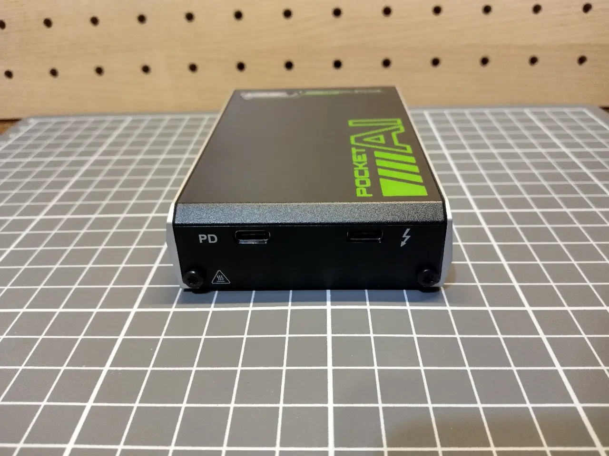
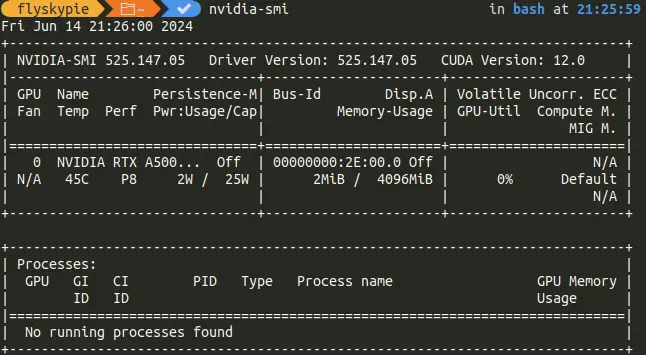

---
slug: 2024-06-15_pocket-ai
authors: [weiji,]
tags: [gpu]
--- 

# Pocket AI 開箱

<head>
  <meta property="og:image" content="https://raw.githubusercontent.com/FlySkyPie/flyskypie.github.io/main/blog/2024-06-15_pocket-ai/img/01_pocket-ai.webp" />
</head>

:::info
先講結論，Pocket AI 在以下條件正常運作：
- Hardware: Framework 13 (13th Gen i7-1360P)
- OS: Ubuntu 23.04 (Kernal 6.2.0-39-generic)
- Driver: `nvidia-driver-525`
:::

## 緣由

老闆想要搞 AI，然後研究的過程中我試著在筆電上跑一個名為 [zero123plus](https://github.com/SUDO-AI-3D/zero123plus) 的模型，結果使用 CPU 運算完成一張圖片需要 28 分鐘，於是我想我應該要搞個（有 CUDA 的） GPU 來用。

:::warning
後來我發現 zero123plus 需要 5 G 的 VRAM，所以只有 4G 的 Pocket AI 並沒有直接解決這個問題。
:::

我大致上有這幾個選擇：

- eGPU
- 雲端
- NVIDIA Jetson

## 其他方案

稍微談一下我沒有選擇其他方案的理由。

### 雲端

是的，雲端方案是最便宜取得 CUDA 的手段[^cheap-cuda]，不過個人認為在開始使用雲端的方案之前還是先累計一些地端的經驗比較好，所以雲端方案不在本次的考量之中。

[^cheap-cuda]: Cheap way to get a CUDA capable computer?.  Retrieved 2024-06-16, from https://www.reddit.com/r/photogrammetry/comments/med5bm/

### NVIDIA Jetson

Jetson Nano 是老闆說要開始搞 AI 之後我腦袋裡第一個浮現的想法，我印象中幾千塊就能買到了。不過畢竟一分錢一分貨，雖然拿的到程式碼吵著要的 CUDA，但是規格算是少得可憐。

另外一個令我擔心的是開發板是使用 ARM 的 CPU，也就是在它上面作業伴隨著額外跨平台成本的風險，如此考量之下我更傾向走 eGPU 的方案。

### OCuLink

看起來是中國玩家比較常見的東西，普通筆電要玩的話需要土炮 DIY 把裡面的 PCIe 拉出來。跳過。

### 顯卡塢 DIY 套件

露天有一些 6k~7k 左右的外接盒套件，不過很明顯是淘寶進來的，顯卡又要另外買，在這個需求 (CUDA) 上目前不是很想承擔太多的 DIY 成本與風險。跳過。

### AKiTiO 外接盒

目前網路商店找得到的空箱子都需要 10k 以上，體積又大。不過真正讓我卻步的原因是它官方網站上的韌體安裝指南是：「請你去 Ubuntu 的 App Stores 找到我們的驅動按下安裝」，相較之下 Pocket AI 的手冊清楚多了，所以跳過。

## 開箱

















## 安裝驅動

我只是照著[官方手冊](https://www.adlinktech.com/Products/Download.ashx?type=MDownload&isManual=yes&file=2079%5CPocket_AI_-_User_Manual_202307.pdf)的指示操作。（[手冊的備份](./attachments/Pocket_AI_-_User_Manual_202307.pdf)）

### 設定 Kernel 參數

> GRUB_CMDLINE_LINUX
>    此行中的項目將新增到正常和復原模式之開機項目的末尾。使用它可以將核心參數新增至開機項目。 [^GRUB_CMDLINE_LINUX]

```shell
# /etc/default/grub
GRUB_CMDLINE_LINUX="pci=realloc=off"
```

關於以上參數的具體功能可以在 Linux Kernel 的官方文件找到[^kernel-parameters-documentation]：

> realloc=Enable/disable reallocating PCI bridge resources if allocations done by BIOS are too small to accommodate resources required by all child devices.
> - off: Turn realloc off
> - on: Turn realloc on
>

雖然我也不是很清楚，不過應該是為了避免 Linux 跟外顯斷開連接。

```shell
sudo update-grub2
sudo reboot
```

[^GRUB_CMDLINE_LINUX]: SLES 12 SP5 | 管理指南 | 開機載入程式 GRUB 2. Retrieved 2024-06-16, from https://documentation.suse.com/zh-tw/sles/12-SP5/html/SLES-all/cha-grub2.html

[^kernel-parameters-documentation]: The kernel’s command-line parameters — The Linux Kernel documentation. Retrieved 2024-06-16, from https://www.kernel.org/doc/html/v4.14/admin-guide/kernel-parameters.html

### 安裝顯示卡驅動

```shell
sudo add-apt-repository ppa:graphics-drivers/ppa -y
sudo apt update
sudo apt install nvidia-driver-525 -y

sudo apt install bolt
```

```shell
# Check Thunderbolt device
boltctl

# Check Graphic card
nvidia-smi
```


