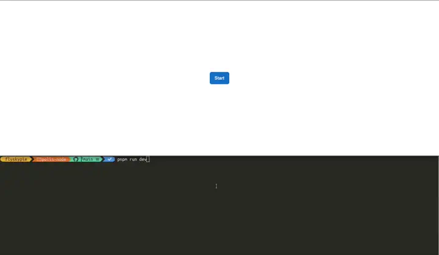
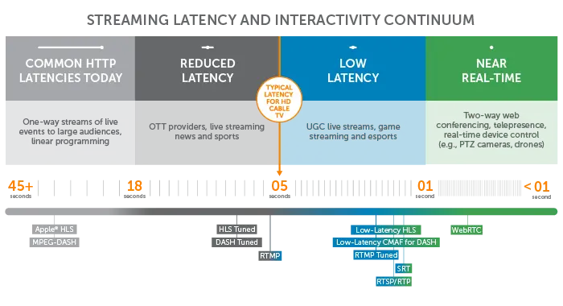

---
slug: 2024-08-31_polis-dev-log
authors: [weiji,]
tags: [Polis, Hakoniwa, The Key of Huanche, ]
--- 

# Polis 專案研究進度

<head>
  <meta property="og:image" content="https://raw.githubusercontent.com/FlySkyPie/flyskypie.github.io/main/blog/2024-08-31_polis-dev-log/img/00_hero.webp" />
</head>

## 前情提要

- TKOH (The Key Of Huanche) 是我的一個 side project
  - 目前最大的 side project
  - 更多細節請見：[文件](/docs/the-key-of-huanche/)或是 [Wiki](https://flyskypie.github.io/sideprojects-wiki/#Project%3A%E7%92%B0%E9%A9%85%E4%B9%8B%E9%91%B0)
- Hakoniwa  是我的一個 side project
  - TKOH 的子專案
  - 更多細節請見：[文件](/docs/the-key-of-huanche/hakoniwa/)或是 [Wiki](https://flyskypie.github.io/sideprojects-wiki/#Project%3AHakoniwa)
- Polis 是我的一個 side project
  - Hakoniwa 的子專案
  - 更多細節請見[之前發過的文章](/blog/2023-05-14_project-polis)
  - [上次的開發日誌（進度與回顧）](/blog/2023-08-05_polis-progress)

## 進度

先講結論，今天 (2024-08-31) 我終於把這幾個要素組裝在一起了：

- Three.js
- 後端渲染/無頭 (Headless) 渲染
- ECS (Entity Component System)
- 開發用瀏覽窗口

實作：https://github.com/FlySkyPie/polis-node/commit/aca8f24012848de30bef2b17cd07c1f2b32fc53b

## 技術選擇與技術堆疊的困難

### 3D x Javascript

不論是在工作上還是 side project，我其實經歷不少機會去使用不熟悉的語言，因此我意識到在原型開發 (Prototyping) 這一目標上，熟悉語言的經驗有時候能夠彌補語言特性帶來的缺陷，舉例來說：使用熟悉的語言因此知道某些需求需要使用特定的實作或是對於某些需求基於語言限制必須要使用某種 by pass；比起使用不熟悉的語言而在未知中摸索甚至踩到語言特性的坑。時間並沒有使用在開發上反而花在學習與試錯。

用 Javascript 來寫 3D 的東西聽起來很反直覺，但是我手上有的卡牌就是：

- 接近 4 年的前端 (Javascript/Typescript) 開發經驗
- 工作或業餘經手過超過 5 個以上的 Three.js 專案

比起重新學習另外一種技術棧 (Tech Stack)，使用熟悉的工具不只可以加速開發，更可以在過程中累積的經驗值回過來貢獻在工作上使用的技能。

不過這是基於我的手牌採取的遊戲策略，並不見得適合其他人。

### 後端 X 3D (Three.js)

很明顯的，WebGL 是為了網頁瀏覽器而生的東西，而 Three.js 更是建立在此之上的抽象層，本身並不支援在 Node.js 這樣的後端環境執行。舉例來說，在 Web API 的設計之中 `WebGLRenderingContext` 是和 `<canvas>` 元素榜定的，但是後端的環境中根本沒有 DOM 實做 `<canvas>`。

另外一個問題是後端環境是無頭 (headless) 的，在缺乏視覺反饋的情況下，很難對程式進行 debug，因此一個可以「窺見」程式內 3D 渲染結果的手段是十分必要的。

### 開發用瀏覽窗口

「如何窺見 3D 的後端程式」這件事情產生另外一個問題，就是如何實現快速（低延遲）的向外串流？

為了避免開發與維護另外一個讀取並顯示串流的 Client 端，基於 Web 的方案對我而言是相對合理的。於是就得出了「使用 WebRTC 來串流用於 debug 的畫面」這個結論。

### ECS x Three.js

ECS 是我計畫用來管理複雜遊戲環境的架構，不過當它需要跟其他函式庫組合使用就會產生一些問提，諸如：

- Three.js
- Rapier.js

原因在於大部分的 Javascript ECS 實現把重心放在「密集的資料」這個 ECS 特性，因此這些函式庫只能用來儲存諸如浮點數、整數之類的基本資料型別，並不能方便的和其他基於 OOP 邏輯的函式庫組合使用，使用那些 ECS 函式庫的邏輯再現其他函式庫的功能顯得不合乎成本。

## 回顧

### 串流

串流算是第一個急著解決的問題，畢竟就算我能在後端渲染的東西，只要不能把畫面丟出來我就不能 debug。

在考慮了 FLV (Flash Video), RTMP (Real-Time Messaging Protocol), HLS (HTTP Live Streaming) 和 MPEG-DASH (Dynamic Adaptive Streaming over HTTP) 等方案之後，我選擇使用 WebRTC。

考慮延遲以及瀏覽器支援兩個要素下，WebRTC 都是一個比較合理的方案。

瀏覽器上的 Javascript 並沒有能力建立 TCP Socket，大部分網路連線需求都是由 HTTP 完成，即便是 WebSocket 實際上也是建立在 HTTP 連線之上。而 WebRTC 則是會由瀏覽器實做，實際上會依情況使用 TCP 或 UDP 連線。在這先天特性之下，WebRTC 能夠比其他基於 HTTP 的手段來得低延遲。

去年 (2023) 在我短暫的學習串流相關技術之後，

- [Node-Media-Server-ts](https://github.com/FlySkyPie/Node-Media-Server-ts)
  - 學習 RTMP 的中間產物。

我使用 WebRTC 寫了一個小範例。

- [WebRTC 學習筆記](/blog/2023-08-07_webrtc-learning-note)

### 後端渲染

網路上關於如何在後端 (Node.js) 渲染 Three.js 的方案並沒有很多，其中還不乏用重新實做 WebGL 兼容界面然後用 CPU 算圖的方法。甚至一度考慮使用 Deno，不過最後也做罷了，這些細節在我[前一篇文章](/blog/2023-08-05_polis-progress)都有紀錄。

在 2023-08-16 的時候我試著用 Electron [實做伺服器](https://github.com/FlySkyPie/polis-node/tree/755be48e5180a6e56fd42969b06977a8f51c0678)，

- [Electron 學習筆記 - IPC](/blog/2023-08-08_electron-learning-note)

不過把資訊從 Browser 在 Node.js 之間轉發是一件很麻煩的事情，大大的提高了程式的複雜度。引此在完成測試之後就沒有什麼進展了。

之後 (~2024-08) 有試著嘗試了這裡提供的範例：

[SSR - Three.js Tutorials](https://sbcode.net/threejs/ssr-branch/)

它使用 [headless-gl](https://github.com/stackgl/headless-gl) 實現後端渲染，不過它的前置作業相對複雜，除了要用 [jsdom](https://github.com/jsdom/jsdom) 補足 DOM 的實作之外，光是安裝套件就要處理 `node-gyp` 帶來的一些問題，因此沒有完全說服我使用它。

我在網路上瞎逛的時候發現了 [node-3d/3d-core-raub](https://github.com/node-3d/3d-core-raub)，它提供另外一種簡單粗暴的解法：把 GLFW binding 到 Node.js 上去再加上 Three.js 的兼容實作。能夠在 Linux 開啟一個視窗顯示渲染結果更是大大的減少專案初期的阻礙。

跟線有的 WebRTC 實作整合之後，確發現畫面不太正常，起初我以為是延遲的問題，於是想在裡面 Three.js 裡面放個時鐘，沒想到卻是另外一個坑。

### Three.js x Text

在 Three.js 裡面渲染文字並不是一個被非常重視的功能，因為瀏覽器上已經有 HTML + CSS 這樣一個方便顯示文字的方法了。

在經過一番折騰之後，我得到了一個像這樣的問題清單：

- [three-bmfont-text](https://github.com/Experience-Monks/three-bmfont-text)
  - 沒有型別定義
  - `THREE is not defined`
- [troika-three-text](https://github.com/protectwise/troika)
  - 仰賴 `XMLHttpRequest` 和 `window.document`
- [TextGeometry](https://threejs.org/docs/#examples/en/geometries/TextGeometry)
  - 花費 60ms 建立新的 Geometry
- [three-spritetext](https://github.com/vasturiano/three-spritetext)
  - 仰賴 `ctx.measureText`
  - `TypeError: ctx.measureText is not a function`
- [three-text2d](https://github.com/gamestdio/three-text2d)
  - `TypeError: Class constructor Object3D cannot be invoked without 'new'`
  - build target 的語法過於老舊造成
  - 仰賴 `document`
- [three-mesh-ui](https://github.com/felixmariotto/three-mesh-ui)
  - `ctx.canvas.width = 1;`
  - `TypeError: Cannot set properties of undefined (setting 'width')`

在電腦圖學中（特別是 3D 遊戲領域），有一門叫做 Texture Atlas 的技術，就是把文字先烘培成貼圖與幾何資訊，在程式中再把這兩者組合起來在顯示卡的 context 中顯示文字。

這個過程需要仰賴額外的工具（例如：[Angelcode’s bmfont](https://www.angelcode.com/products/bmfont/)），或是由遊戲引擎內建的工具承擔（例如：Unity3D, Godot），因此在 Three.js 開發圈更常用的手段是在 runtime 時產生這些貼圖，而過程仰賴瀏覽器的渲染引擎對文字進行運算及排版，而使用這種手段的函式庫會無法在後端 (Node.js) 環境中使用。

這麼一看 `three-bmfont-text` 似乎是最有潛力的選擇，最後我透過：

- 使用 Typescript 重構
  - https://github.com/FlySkyPie/three-bmfont-text
- 使用 [SilenceLeo/snowb-bmf](https://github.com/SilenceLeo/snowb-bmf) 製作與輸出該 `three-bmfont-text` 要求的檔案格式（貼圖與幾何資訊）。

解決了問題並且完成一個數位時鐘的實作：

- https://github.com/FlySkyPie/three-digital-clock

### ECS

在正式開始之前，我選擇了一個小題目來練手：

- [ECS 學習與 aimAndShoot 重構之旅](/blog/2023-09-24_a-journey-about-learning-ecs)

其實原本想再練一個題目的，

- https://github.com/FlySkyPie/three-fps-ts

只是從 [mohsenheydari/three-fps](https://github.com/mohsenheydari/three-fps) fork 之後用 Typescript 重構、更新 Ammo.js 之後，發現它的實作邏輯有點複雜（物件互相呼叫的時序），就暫時放棄嘗試把它轉成 ECS 了。

### Monorepo

試著使用 pnpm 提供的 monorepo 功能來整合前後端的專案，大大的提高了開發體驗。沒有使用 nx 的原因是它看起來配置較為複雜，學習成本是一個阻礙。

## 下一步

### Logger 系統的改善

在目前的程式碼之中有一些我為了 debug WebRTC 保留下來的 log 點，我想把它們移到 [winston](https://github.com/winstonjs/winston) 或 [pino](https://github.com/pinojs/pino) 之類的專門函式庫去。

畢竟在後端環境中，未來還要面對更複雜的遊戲實作，這樣的機制來紀錄並整理 log 是非常必要的。

### 自由的觀戰者

目前觀戰者並沒有移動能力，需要透過 [requestPointerLock](https://developer.mozilla.org/en-US/docs/Web/API/Element/requestPointerLock) 之類的手段錨定滑鼠來提供 FPV (First Person View) 的瀏覽體驗。

### 整合 Voxel 實作

既然前置作業已經完成，我就可以把我之前 Fork 的 Voxel 實作整合過來了：

- https://github.com/FlySkyPie/MC.js-Alpha
