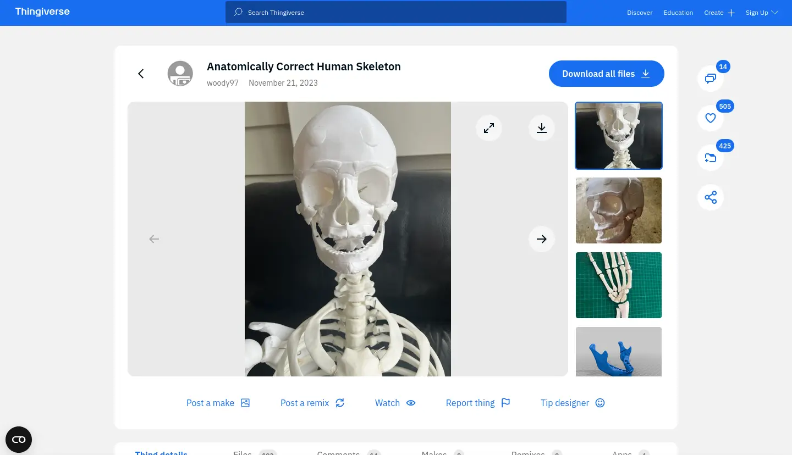
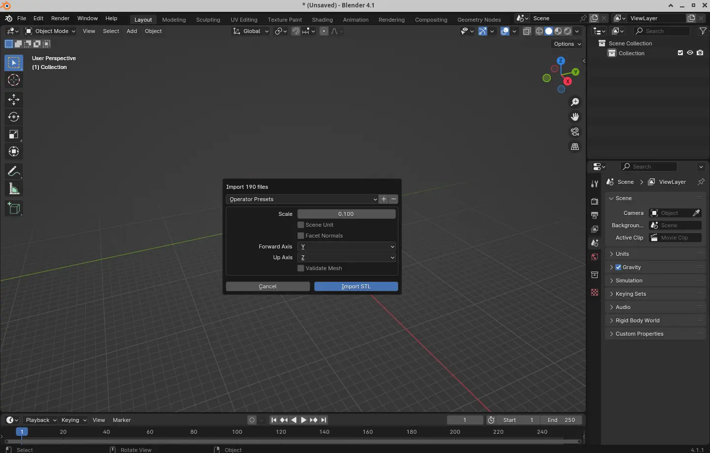
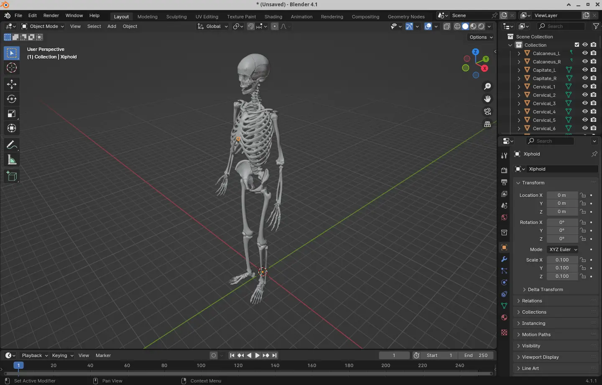
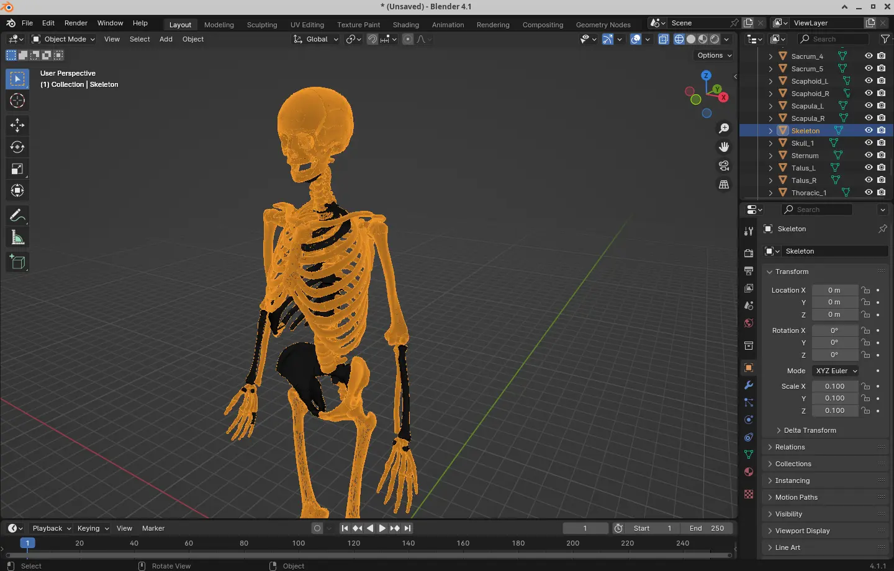
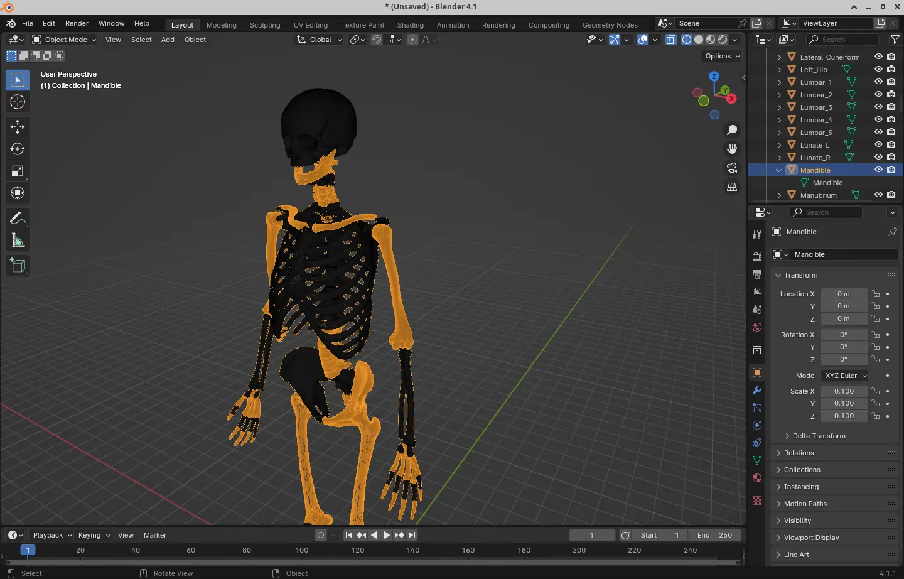

---
slug: 2024-11-04_blender-anatomy
authors: [weiji,]
tags: [blender]
--- 

# 從 Blender 開始的解剖學筆記 - 骨骼篇 - 啟程

## 背景

說來話長，總之我突然想印一個人體骨骼模型，然後就在 Thingiverse 找到了這個：

[Anatomically Correct Human Skeleton](https://www.thingiverse.com/thing:6326069)

## 準備

下載之後解壓縮把 `files/` 資料夾下的 `.stl` 全部拉進去 Blender，接著把尺寸改成 `0.1`：

噹啷～這樣我們就有一個接近真實解剖學條件的人體骨骼在 Blender 內了：

除了幾個 (如： `Mandible`, `Skeleton`) 模型狀況不是很好或是覆蓋全身，其他骨頭幾乎都可以選擇之後在列表中看到它的名稱：

