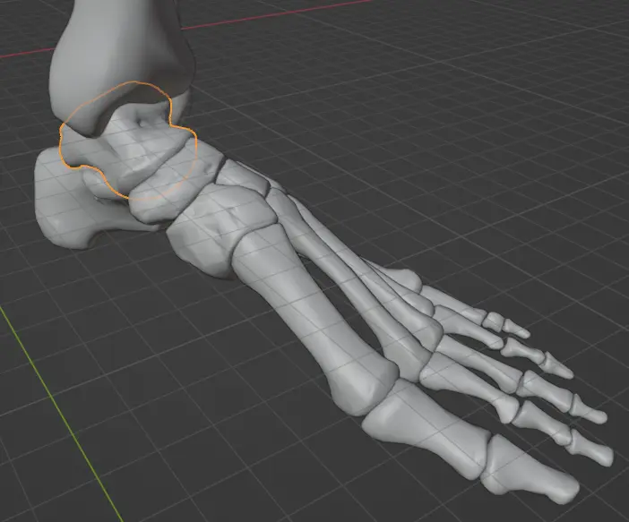
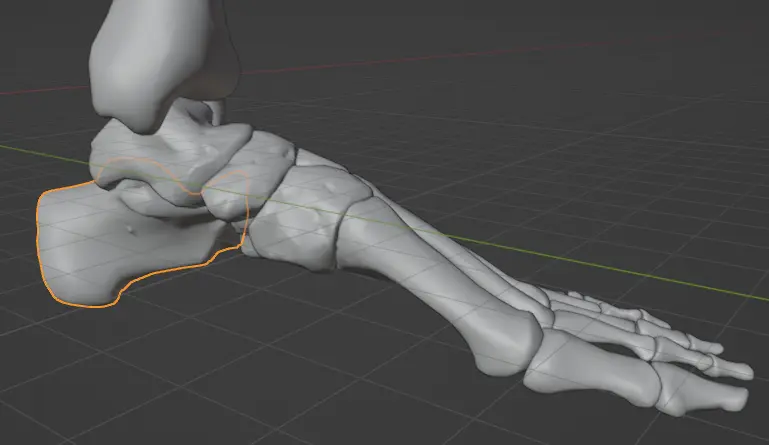
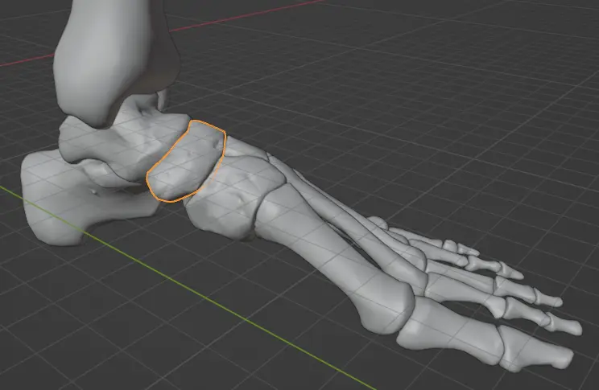
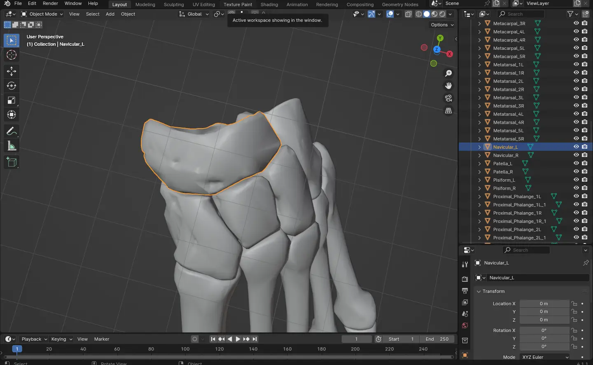
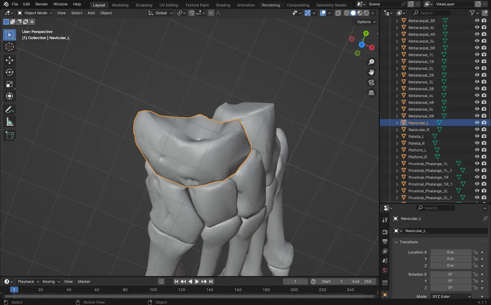
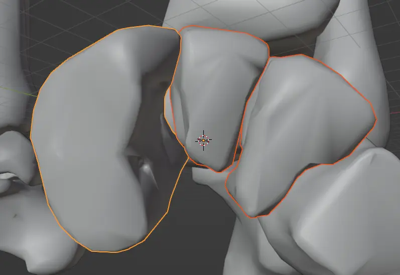
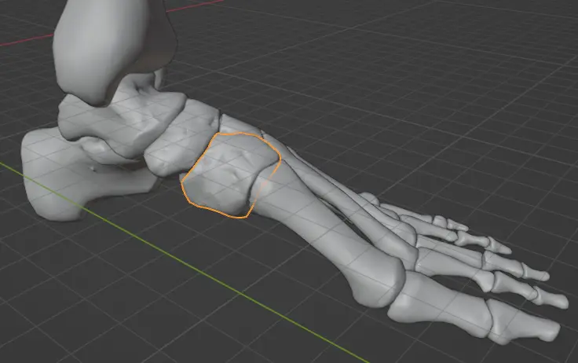
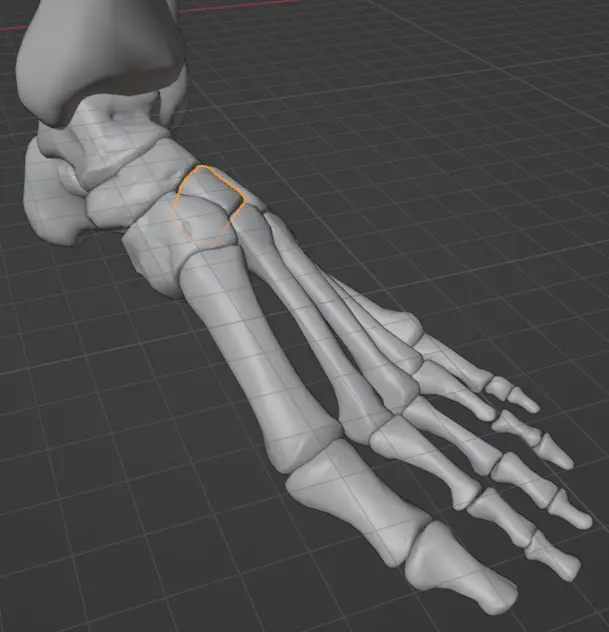
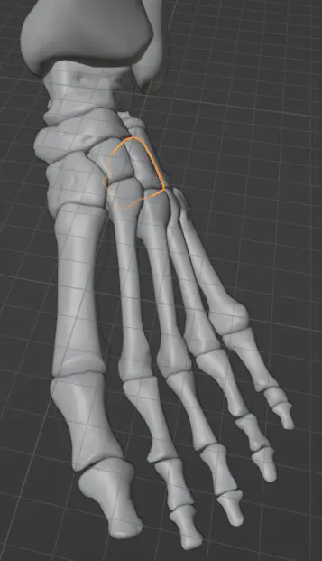

---
slug: 2024-11-05_blender-anatomy-foot
authors: [weiji,]
tags: [blender]
--- 

# (Draft) 從 Blender 開始的解剖學筆記 - 骨骼篇 - 足部

~~本文足控福利~~

## 距骨 (Talus)

足部遊上而下往下數的第一塊骨頭，連接小腿與腳掌。

> "anklebone," 1690s, from Latin talus "ankle, anklebone, knucklebone" (plural tali), [^anklebone]
>

[^anklebone]: talus | Etymology of talus by etymonline. Retrieved 2024-11-04, from https://www.etymonline.com/word/talus

## 跟骨 (Calcaneus)

> "heel-bone," 1751, from Latin (os) calcaneum "bone of the heel," from calcem (nominative calx (1)) "heel," [^heel-bone]
>

[^heel-bone]: calcaneus | Etymology of calcaneus by etymonline. Retrieved 2024-11-04, from https://www.etymonline.com/word/calcaneus

## 足舟骨 (Navicular Bone)

這塊骨頭因為跟距骨 (Talus) 接觸的地方有一個凹陷，形狀乍看有點像個小船：

> "boat-shaped," early 15c., in reference to the navicular bone of the foot, from Late Latin navicularis "pertaining to a boat," from navicula, diminutive of navis "ship" (from PIE root *nau- "boat"). The classical sense of "relating to small ships or boats" (1650s) is rare in English.[^boat-shaped]
>

[^boat-shaped]: navicular | Etymology of navicular by etymonline. Retrieved 2024-11-04, from https://www.etymonline.com/word/navicular

## 楔形骨 (Cuneiform)

從前方往後看，有三根骨頭像[楔子](https://zh.wikipedia.org/zh-tw/楔子)插入一般，它們是楔形骨 (Cuneiform)。

### Medial Cuneiform

### Intermediate Cuneiform

### Lateral Cuneiform

