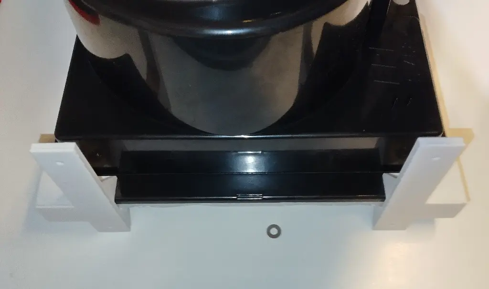

---
slug: 2025-03-15_opensource-3d-workflow
authors: [weiji,]
tags: [freecad, model, opensource]
--- 

# 一種開源工具鏈嘗試，以最近幫風機製作角座為例

<head>
  <meta property="og:image" content="https://raw.githubusercontent.com/FlySkyPie/flyskypie.github.io/main/blog/2025-03-15_opensource-3d-workflow/img/00_cover.webp" />
</head>

先講結論，整個工作流程大致如下：

1. 待辦事項與專案管理
    - 在 [WeKan](https://github.com/wekan/wekan) 新增卡片（待辦事項）
2. 測量
    - 在 [Inkscape](https://gitlab.com/inkscape/inkscape) 簡單繪製風機尺寸、鎖點跟鋁擠鎖點的相對位置。
3. 建模/製圖
    - 用 [FreeCAD](https://github.com/FreeCAD/FreeCAD) 建模，輸出 STEP 檔。
4. 切片
    - 用 [PrusaSlicer](https://github.com/prusa3d/PrusaSlicer) 匯入 STEP 切片後輸出 G-code 再拿給 3D 列印機列印。
5. 物料管理
    - 在 [Part-DB](https://github.com/Part-DB/Part-DB-server) 對該物件建檔，上傳實物縮圖以及 FreeCAD 原始檔（`FCStd`）。

接著再來談整件事情的來龍去脈。

## 背景 (Context)

我的置物架基礎結構是由鋁擠型、鎖管與洞洞板構成的，因此我可以很輕易的外掛東西上去。去年末入手了一台 3D 列印機（熔融沉積），為了避免列印的時候吸毒氣就放了一台（浴室用）抽風機，臨時草草安裝上去就變成這樣：

至於抽風機外面的防塵網我是怎麼做的，那又是另外一個故事了。

最近 (2025-03-09) 心血來潮想說把它整頓一下。

## 待辦事項與專案管理

其實開 card 這件事在整個流程裡面根本算不上什麼值得一提的事情，只是因為最近開始搞所謂的 homelab，並且在上面跑了一堆服務，WeKan 也是其中之一。主要目的是為了更有組織的管理我那為數眾多的 Side Project 、待辦事項與因為閃亮事物症候群許的新願望。

[Kanban](https://en.wikipedia.org/wiki/Kanban_(development)) 類型的軟體在軟體開發上是一種十分常見的工具，是工作流程中十分重要的一環，因此我覺得值得稍微提一下。

WeKan 對我而言也只是嘗試的階段，在這之前在工作上使用過 Jira, OpenProject 和 GitLab Board；個人則是嘗試過 Trello 和 Planka，並沒有特別推薦哪一款的意思。

不過讓我願意嘗試 WeKan 而不是使用之前有過用過得 Planka 主要原因是讓[卡片顯示人類可讀的連續編號](https://github.com/wekan/wekan/pull/3935)，Trello 和 Planka 的定位比較接近「電子化的 KanBan （便條紙）」，個人使用或是對於比較不是嚴謹的用例已經十分足夠，但是對於工程管理或商業使用就有管理工單（訂單、Ticket, Issue）的需求，因此每一個卡片必須要有方便人類辨識的 ID。

Jira, OpenProject 和 GitLab Board 的卡片都有數字編號，仔細觀察 Trello 和 Planka 的話會則發現它們則都是使用類似雪花 ID 的方式來區分卡片，細節就不在此多提，因為那又是另外一個故事了。

## 測量

其實就只是拿尺量東西然後寫下來而已，只是這幾年有在訓練自己盡量把書寫的動作電子化降低對傳統紙筆的依賴，來讓自己的工作流程更一致。Inkscape 雖然作為向量繪圖軟體，不過這幾年我更常把它當成整理思緒的電子白板/紙使用。

將工作流程的要素統一成電子媒介，最具體的例子如下圖所示：

迭代過程在 FreeCAD 畫的內容可以截圖後放進原本的「筆記」內，如此一來把複數來源的資訊展開在同一個視覺空間內。我在工作上經歷的 UI 開發也一樣，從一開始溝通用的線稿、第一個實做的版本到後續修改的規格與需求都可以用類似的方法在 Inkscape 內的視覺空間中展開來幫助思考或與其他人溝通。

## 建模/製圖

FreeCAD 也算是我的老朋友了，作為工程繪圖/參數化建模軟體，大學時使用 Solidworks 的一部分經驗可以轉移過來，使用的細節就不在此多提了。

話說回來，[STEP](https://en.wikipedia.org/wiki/ISO_10303-21) 格式反而是我畢業之後才接觸的，有別於 STL 儲存三角面資訊，STEP 檔案能夠儲存參數資訊。用平面圖檔比喻的話，STEP 和 STL 的差異就像是 SVG 和 PNG 的差異。

## 切片

切片軟體顧名思義就是把 3D 模型切成一層層的指令交給 3D 列印機作業。大學的時候比較常使用 Cura，但是畢業之後就沒有在使用 3D 列印了，直到最近重返 3D 列印使用者的身份便花點時間做功課，最後選擇 GitHub 星星數最高的 PrusaSlicer，這裡放個當時做的筆記供參考：

- https://github.com/prusa3d/PrusaSlicer
  - 7.7k ⭐
- https://github.com/SoftFever/OrcaSlicer
  - 7.1k ⭐
- https://github.com/Ultimaker/Cura/
  - 6.1k ⭐
- https://github.com/supermerill/SuperSlicer
  - 4.1k ⭐
- https://github.com/slic3r/Slic3r
  - 3.3k ⭐
- https://github.com/bambulab/BambuStudio
  - 2.1k ⭐
- https://github.com/MatterHackers/MatterControl
  - 458 ⭐

請留意星星數與現在實際值可能有落差。

## 迭代

> 工程第一守則，不要第一次就用真才實料，永遠先做小規模測試或模擬。
> 
> Fredi Cameron from 拼湊夢想 (Spare Parts)

畢竟我不清楚整個過程的測量誤差與製造誤差為何，因此我並沒有一次就把整個模型畫出來，而是先印一些確定相對位置與尺寸的樣品出來。並且不出意外得出意外了，樣品的孔位有一點點落差，只好把整顆風機從架子上拆下來仔細量一次。

透過把鎖點放在厚紙板上再用筆作記號的方式，把孔位複製到紙上再測量方式取得中心孔與邊界間距。過去 DIY 的經驗告訴我永遠不要吝嗇製作治具，剛好我手邊有很多卡片大小的厚紙板沒什麼好吝嗇的。至於那一疊厚紙板是哪裡來的則又是另外一段故事了。

## 物料管理

PartDB 不只允許對物品建檔並以及紀錄位置與數量等資訊，還有附件功能上傳規格書、使用者手冊...等檔案，同時也是個適合放置 CAD 檔案與藍圖的地方。

## 產出

## 結論

正如標題所說的，以上只是一個基於個人使用情境的「嘗試」，不能說是什麼經過審慎考慮或是實務考驗的流程。加上工具的選擇除了一點隨便之外還帶有個人偏好的成份，比如說有些人就是喜歡 Jira 那種整套還跟一堆東西整合的平台，但是我個人就是喜歡能夠自己架設而且不會太吃重的軟體。

另外一方面算是當作開源軟體的火力展示，大部分軟體其實都能在開源領域找到對標的替代方案，只是商業軟體通常會提供一些高度整合的使用體驗來讓消費者使用起來比較流暢，再加上增加對競品摩擦力的一些巧思來把消費者圈養在自家產品生態系的舒適圈內...喔，離題了。

總之我最近的策略就是，比起單純用檔案系統管理檔案與資料，不如用各種自架服務，把檔案或資料放在最適合的服務上，專案管理視角的就丟 [Kanban](https://github.com/topics/kanban)、物料管理就找 [WMS (Warehouse Management System)](https://github.com/topics/inventory-management-system) 相關的...

喔，關於我最近在玩的 Homelab，那又是另外一個故事了。

## ~~到底有多少故事~~

其實過去幾個月也有斷斷續續花時間在幾個主題上，不過都還不到足夠完整寫文章的程度，不然就是這篇文章寫到一半才發現有些事情我之前沒有在 Blog 上提過，就變成這樣了。ლ(́´・ω・`ლ)