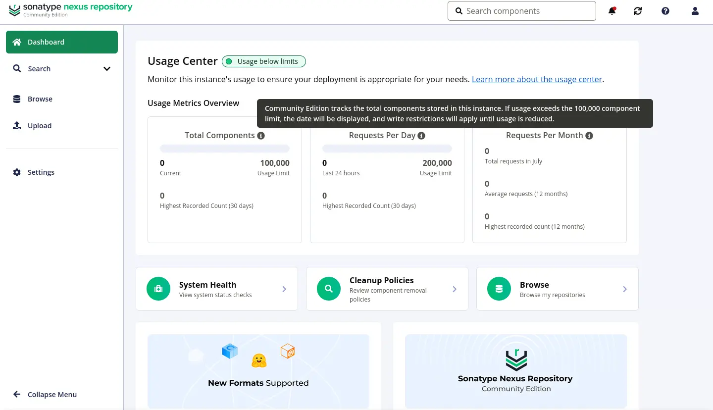
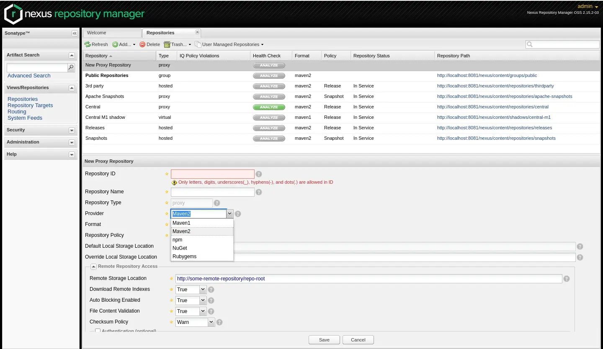
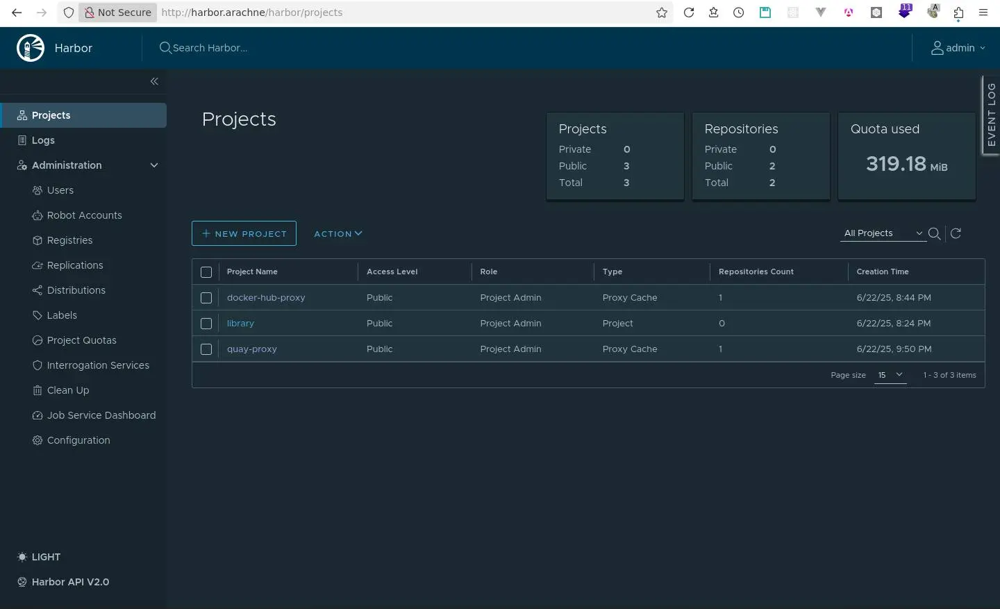
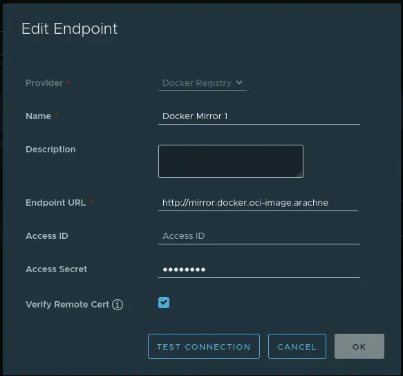
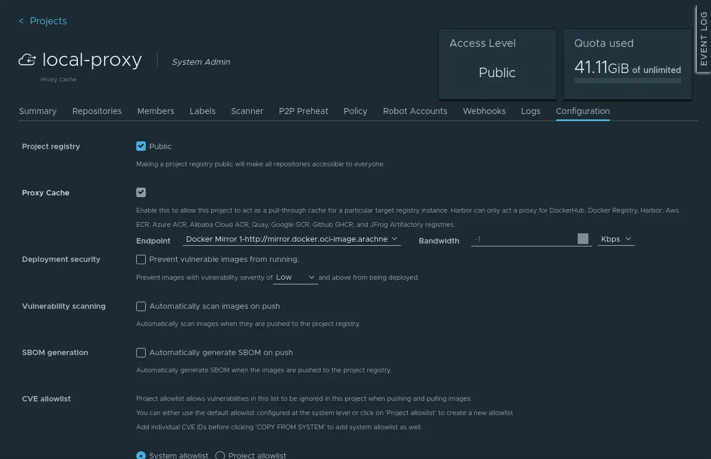

# OCI Image 本地鏡像站遷移之旅

<head>
  <meta property="og:image" content="https://raw.githubusercontent.com/FlySkyPie/flyskypie.github.io/main/blog/2025-07-05_harbor/img/00_cover.webp" />
</head>

:::info
OCI Image 實際上不是單一檔案，而是一層一層的 layer 構成的，但是為了簡化描述，本文使用 image 一詞時可能是在描述 layer(s)。
:::

## 背景

我在 Homelab 中架設了簡易的 [Docker Registry](https://github.com/distribution/distribution) 作為鏡像/代理，來節省我工作筆電的硬碟空間和下載時間，更具體的細節請見另外一篇文章：[我的 Homelab](https://flyskypie.github.io/blog/2025-04-23_my-homelab/#oci-registry)。

## 起因

一切都源自於上班的時候需要用到這個 image: `quay.io/keycloak/keycloak`，拉了幾次卻發現我的鏡像站沒有快取這個 image。

下班之後在 homelab 開了另外一個 service：

```yaml
registry-server-2:
  image: registry:2.8.2
  environment:
    - REGISTRY_PROXY_REMOTEURL="https://quay.io/v2"
  volumes:
    - quay-data:/var/lib/registry
  networks:
    - default
    - traefik-public
  deploy:
    labels:
      - traefik.enable=true
      - traefik.docker.network=traefik-public
      - traefik.http.routers.registry-quay-mirror.entrypoints=web
      - traefik.http.routers.registry-quay-mirror.rule=Host(`mirror.quay.oci-image.arachne`)
      - "traefik.http.services.registry-quay-mirror.loadbalancer.server.port=5000"
```

發現依然不會快取。

> No, this is a limitation of the docker engine, `registry-mirrors` is only for Docker Hub. You can follow [issue 18818](https://github.com/moby/moby/issues/18818) for more details.[^docker-limit-1]

> Unfortunately and infuriatingly, it is not possible.
> This is a most desired feature, by me, and by many others.
> However, Docker, on purpose, does not implement this feature.[^docker-limit-2]

這似乎是 Docker 本身的設計所致，不過在我發現這個限制以前，以為是 `distribution/distribution` 的限制因此做了一些嘗試。

[^docker-limit-1]: mirroring - docker registry-mirrors is not used for fqdn images - Server Fault. Retrieved 2025-07-05 from https://serverfault.com/a/1125577
[^docker-limit-2]: Configure dockerd to use a regsitry mirror for a private registry - General - Docker Community Forums. Retrieved 2025-07-05 from https://forums.docker.com/t/configure-dockerd-to-use-a-regsitry-mirror-for-a-private-registry/135180/2

## Sonatype Nexus Repository

我先是嘗試 `sonatype/nexus3`，然後看到了這個：



蛤？為什麼我用自架的開源軟體還要有額度限制？下一個。下一個。

接著試了 `sonatype/nexus:oss`：



不支援 Docker？好吧。

## Harbor

當我在考慮自架 OCI Registry 時，Harbor 不在考慮範圍的原因是我在官方網站只找得到兩種安裝方式：

- [Helm Chart](https://github.com/goharbor/harbor-helm)
- [安裝精靈](https://goharbor.io/docs/2.13.0/install-config/download-installer/)

我目前不是使用 K8s，Helm Chart 自然是不考慮。安裝精靈又可能導向裸機 (baremetal) 安裝，讓我沒辦法用 Docker 管理叢集。

後來經過調查才發現安裝精靈最後是產生 Docker Compose 的組態來執行的，可以在原始碼中發現 Docker Compose YAML 的樣板：`harbor/make/photon/prepare/templates/docker_compose/docker-compose.yml.jinja`。

不過很遺憾，我使用 Docker Swarm 來編排 homelab 的服務，Compose 的 YAML 沒辦法直接拿來使用。

### 分而治之

Harbor 由八個微服務構成：

- proxy (`goharbor/nginx-photon:v2.13.1`)
- core (`goharbor/harbor-core:v2.13.1`)
- registry (`goharbor/registry-photon:v2.13.1`)
- redis (`goharbor/redis-photon:v2.13.1`)
- postgresql (`goharbor/harbor-db:v2.13.1`)
- portal (`goharbor/harbor-portal:v2.13.1`)
- jobservice (`goharbor/harbor-jobservice:v2.13.1`)
- registryctl (`goharbor/harbor-registryctl:v2.13.1`)

我試著以最小仰賴的方式，一個一個服務跑起來試試看，然後用自己寫的腳本完成必要的配置，而不是使用 Harbor 安裝精靈。細節就不在本文贅述，最後建起來 Docker Compose YAML 在這裡：

https://github.com/FlySkyPie/harbor-docker-compose

在 Harbor 官方的版本中，所有組態都是仰賴 `volumes` 或是 `env_file` 完成的，這在 Swarm 模式是行不通得。在 Compose 模式下可以用本地的相對路徑來組織檔案或是資料夾，而 Swarm 模式必須抱持著「一切都發生在遠端」的思路：機敏資訊由 `secrets` 實例儲存、設定檔以 `configs` 實例儲存...。完成 Compose 版本後再轉成 Swarm 的版本：

https://github.com/FlySkyPie/harbor-docker-swarm

最後有些密碼還是用 `environment` 傳遞，因為服務本身可能沒有設計支援 Secret File，我也不想花太多時間在這件事上折騰，就先這樣將就著用吧。

另外，安裝精靈建立的當中其實還有一個 log 容器用來從其他微服務蒐集 log，我的版本並沒有包含它，一來是它不是執行服務必要的功能，二來是如果我有蒐集 log 的需求會再搭配 Promtail 和 Grafana Loki 之類專門用來做這檔事的工具。

附上成果圖：



## 資料轉移

為了把舊的鏡像資料遷移到 Harbor，我做了一些措施，雖然整體而言稱不上完美。

### 建立 image 清單

首先要建立鏡像站快取過得清單：

1. `GET /v2/_catalog` 取得 N 個 repositories 的資料。
2. `GET/v2/${repository}/tags/list` 取得每一個 repository 的 tag 資料，要注意的是 `distribution/distribution` 鏡像站可能快取了 tag 但是還沒有快取映像檔本身。
3. `GET /v2/${repo}/manifests/${tag}` 取得 manifest 資訊
4. `HEAD /v2/${repository}/blobs/${digest}` 根據 manifest 判斷 layers 有沒有被快取。
   - 這裡要注意，必須暫時關閉 `REGISTRY_PROXY_REMOTEURL` 的設定，不然會直接觸發代理鏡像機制，關閉代理之後，沒有被快取過得檔案會直接 404 作為判斷有沒有被快取過得機制。

關於更多 API 操作的細節可以閱讀官方的文件[^distribution-api]。

整個過程完成會得到類似這樣的清單：

```
goharbor/nginx-photon:v2.13.1
goharbor/redis-photon:v2.11.0
goharbor/registry-photon:v2.13.1
grafana/loki:latest
grafana/loki:2.7.1
...
```

[^distribution-api]: HTTP API V2 | CNCF Distribution. Retrieved 2025-07-05 from https://distribution.github.io/distribution/spec/api/

### 設定 Harbor

接著在 Harbor 設定 `registries` 和 `projects` 指向舊的鏡像站。





要注意的是，設定 Proxy Cache 之後既不能關閉也不能修改。

### 從 Harbor 鏡像本地鏡像站

接著使用腳本從 Harbor 新設定的 Project 依照清單拉取 image

```shell
docker pull harbor.arachne/docker-hub-proxy/getpinry/pinry:latest
```

這樣就可以把一部分 image 從舊的鏡像站轉移到 Harbor 去了，雖然在其他 Project 不會顯示 image 的存在，但是 image 的檔案在 Harbor 是跨 Project 儲存的，之後如果從其他 Project 拉取 image 時有已經快取過的檔案，Harbor 會直接使用已經存在的檔案。

### 限制

我這個作法是 「不完美」而且只能遷移「一部分」的原因在於，像 `docker.io/library/mysql` 這種 image，因為安全性的問題，同一個 tag 其實會一直更新，因此有些 image 在我的鏡像站上是過期的，所以當腳本拿著最新的 `manifest` 去檢查快取的時候，是有可能全部 404 的。

## Podman

還記得我前面提到的「Docker 本身的設計就不允許設定 `docker.io` 以外的鏡像站」嗎？於是我試著使用 Podman，發現很輕易的就設定好本地鏡像站了（`/etc/containers/registries.conf`）：

```toml
[[registry]]
location = "quay.io"
[[registry.mirror]]
location = "harbor.arachne/quay-proxy"
insecure = false

[[registry]]
location = "docker.io"
[[registry.mirror]]
location = "harbor.arachne/docker-hub-proxy"
insecure = false
```

當然，「使用 Podman 解決非 `docker.io` 本地鏡像站問題」與「使用 Harbor 取代 `distribution/distribution`」變成兩個獨立事件了，不過既然我都已經折騰完 Harbor 了，那就乾脆直接當作非預期的升級計畫換過去吧。
