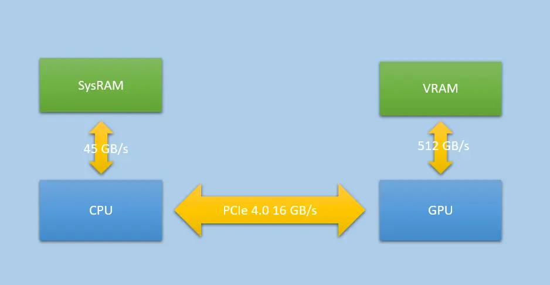
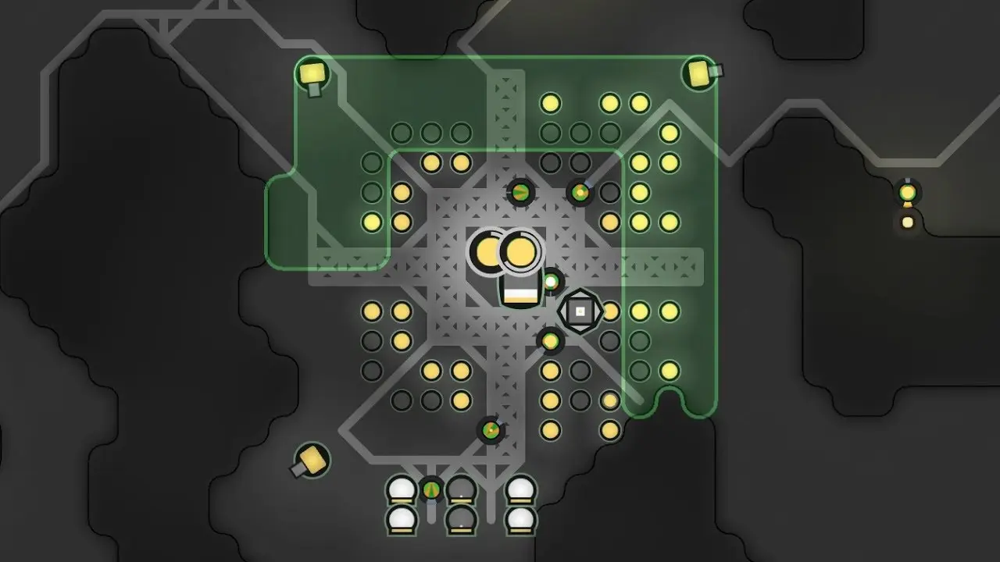
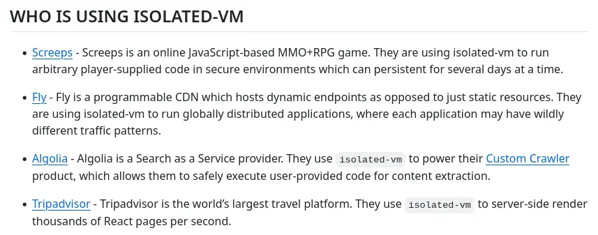
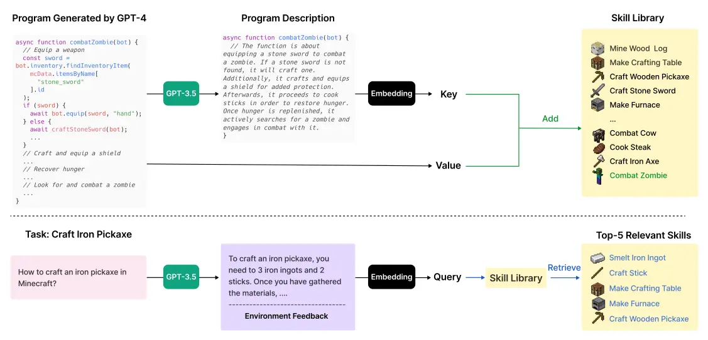

# 個人關於如何佈署與使用類神經演算法的一些想法

<head>
  <meta property="og:image" content="https://raw.githubusercontent.com/FlySkyPie/flyskypie.github.io/main/blog/2026-02-02_llm-using-approach/03_llm.webp" />
</head>

整個想法其實建立在一個有點複雜的上下文之上，為了避免失焦，我先把結論放在文章前面，中間再補充上下文，最後再回來看整個想法是怎麼建立起來的。

## 一種 LLM 佈署策略與架構

原本是針對 LLM (Large language model) 構想的，不過套用到 SD (Stable Diffusion) 或其他體系的類神經演算法大概也差不多。

### Serverless

拜容器化技術與 OCI (Open Container Initiative) 映像檔的標準化所賜，交付、佈署到運行網路應用程式（通常是 HTTP 伺服器）的流程變得非常容易。

雲端服務業者甚至能夠在沒有人使用服務的時候關閉容器，或是在流量變大的時候動態增加容器的數量來應付需求，這就是 Serverless。

### Serverless Function

但是啟動 OCI 容器需要載入 OCI 映像檔、運行程式完成初始化直到到待命才能開始處理任務，這段時間被稱作冷啟動時間 (cold start time)。OCI 映像檔越大、程式越複雜這個時間就越久。

於是開始出現一種雲端服務是開發者直接佈署幾個函式，而不是寫一整個完整的程式，例如：

```javascript
exports.helloHttp = (req, res) => {
  const msg = (req.body && req.body.message) || 'Hello World!';
  res.status(200).send(msg);
};
```

這個就是 Serverless Function。而 Serverless 是我認為最適合佈署 LLM 應用程式（與其產物）或其他模型的型態。

:::info
Serverless Function 不見得由 OCI 容器實現，但是不少雲端業者的 Function 服務是由 OCI 容器實現的。
:::

### 盒子與製造盒子的盒子

Serverless 能夠打包一個簡單的服務並且佈署成 API 供其他人使用，這個「可以運算某種任務的東西」就像一個盒子，而這是一個傳統算法的盒子：

```javascript
exports.helloHttp = (req, res) => {
  const msg = (req.body && req.body.message) || 'Hello World!';
  res.status(200).send(msg);
};
```

這是一個使用了 LLM 的盒子：

```javascript
exports.helloHttp = async (req, res) => {
    const msg = (req.body && req.body.message) || 'Hello World!';
    const url = "http://awesome-tensorzero-service:8123/openai/v1/chat/completions"
    const headers = {
        "Authorization": `Bearer ANY`,
        "Content-Type": "application/json"
    }
    const payload = {
        "model": "tensorzero::model_name::openrouter::openai/gpt-oss-20b",
        "messages": [
            { "role": "system", "content": "You are a prompts builder." },
            { "role": "user", "content": msg },
        ],
        "modalities": ["text"],
    }

    const result = await fetch(url, {
        method: "POST",
        headers,
        body: JSON.stringify(payload),
    }).then(r => r.json());


    res.status(200).send(result.choices[0].message.content);
};
```

如此一來你就可以用 LLM 製造盒子或是使用 LLM 的盒子，而盒子本身也可以是一個盒子工廠。

### Knative

我預計使用 Knative 作為這套架構的實現方法。Knative 是一個基於 Kubernetes 運行 Serverless 的工具，同時也是 Google 的 Serverless (GCP Cloud Run) 的基礎技術。


## LLM 的本質

接下來我要解釋上面提到的架構是建立在什麼樣的基礎之上。首先先讓我們來談談 LLM。

作為一般的 App 開發者或是使用者，其實不用知道這個：


只要有個基本概念就好：


舉例來說 LLM 捏出來的東西就像飯糰，如果你不提供餡料（上下文），你就會的到一顆沒有料的飯糰（幻覺）。

你想解決這個白白的飯糰食之無味的問題，就要給它肉鬆、酸菜、滷蛋、油條...等等餡料（問題的答案、函式庫的用法...等等）。

你**不能**把 LLM 當成一個有智慧的東西，它只是一個揉文字的手手。

我使用「揉合」來譬喻的原因來自於 LLM 的另外一個特性：它擅長把答案跟問題揉在一起得到一個漂亮的答案，但是它不擅長處理當你一次給它一堆問題而需要一次獲得多個答案的情況。

就像你把鹽巴跟水混在一起很容易，但是要分離卻很難一樣。

另外一點，LLM 處理事情是一次性的，它本身沒有記憶功能，只是單純的把一團文字揉成另外一團文字，只是如果原料裡面包含對話紀錄，揉出來的文字就像是針對對話紀錄的回應產生有「記憶的效果」，但是效果歸效果，不代表它的本質有記憶，就像藝人上節目哭哭啼啼做效果，不代表它真的怕被噴乾冰。

## OpenAI API


那個插座就是 OpenAI API，它跟 S3 (Amazon Simple Storage Service) 的發展模式很接近：

雖然是由特定企業設計並使用，但是已經成為實質工業標準；並且同樣是 HTTP 界面。

因此對於 app 開發者而言，OpenAI API 幾乎就是 LLM 本人：


界面的標準化意味著，LLM 實質上變成一個可以抽換的組件，這讓應用程式可以根據需求任意切換成不同的閉源或開源（開放權重）模型。就像遙控器的四號電池你要買國際牌或 GP 牌的都可以。

## Local Deep Research

- https://github.com/LearningCircuit/local-deep-research
  - 3.9k ⭐

Local Deep Research 是一個開源且類似替代 Perplexity AI 方案的軟體，同時也是我認為接近使用 LLM 標準答案的軟體，我想挑幾個面向出來講：

1. OpenAI API
2. 分段處理
3. 提示詞

不過在那之前我先簡單說明一下 Local Deep Research 的使用方法，它有簡答模式與深論模式之分：


送出問題之後它會使用搜尋引擎試圖找資料來回答問題，最後得到一份報告：


### OpenAI API

正如我稍早說的，OpenAI API 已經成為實質工業標準，遵守這個似乎並沒有特別值得稱讚。

但是事實上仍然有不少垂直整合的應用程式是和自家的閉源 LLM API 高度綁定，不允許使用者透過 OpenAI API 切換成其他開源（開放權重）模型，形成供應商鎖定。

### 分段處理

以簡答模式模式為例，一次詢問任務會被拆成 4 次 LLM (OpenAI API) request：


每次 request 的目的不太一樣。

稍微補充一下，可以設定更多搜尋迭代次數，但是我沒用過，因為大於一需要忽要嵌入模型 (Embedding Model)，但是它的嵌入模型目前跟 Ollama 榜定而不支援 OpenAI API，Issue 追蹤在此：

[Is there any chance of having external embedding and reranking support? · Issue #374 · LearningCircuit/local-deep-research](https://github.com/LearningCircuit/local-deep-research/issues/374)

:::info
Embedding Model 是一種把一團字轉換成一組向量的模型，在搜尋跟分類文字傾向很有用，例如「這是跟釣魚有關的一團字」或是「這是很悲傷的一團文」。
:::

### 提示詞

LLM 是出了名的的會瞎掰、唬爛，但是你猜猜我得到了什麼：


它使用 `openai/gpt-oss-20b` 並不是一個有多特別的模型，為什麼？提示詞。


> Reflect information from sources critically based on: **Factual‑consistency audit of the 63 listed sources**  
*(Sources without a description were omitted from the analysis.)*  

適當的提示詞工程可以讓 LLM 給出比較謹慎的回應。

:::info
在搜尋結果沒有切合主題的時候，LLM 依然會答非所問，但是依然有「參考出處」的清單可以作為審計的最後一個保險。
:::

## 它們使用 LLM 的方式很不對勁 （Kilo Code）

我解釋完我心目中的「正確答案」了 (Local Deep Research)，這樣你可能就比較能體會我覺得的「不對勁」是哪裡來的。

接下來我以觀察 Kilo Code 的部份為例，它以安裝在 VS Code 的插件的形式來操作 IDE，也就是俗稱的 

### Agentic Coding 運作的基本原理

首先，我要解釋在 OpenAI API 的設計，它的輸入資料就像是一個對話歷史紀錄：


只是對話紀錄其實還隱藏一個你看不到的角色：


於是當你在 IDE 輸入一些內容的第一次 request 長得像這樣：


原本聊天機器人應該是人類問，機器人答，但是這裡它巧妙的透過 System 提示詞讓 LLM 的答案變成一種請求，然後由 IDE/插件來回答它：


這個過程會持續進行，直到 LLM 發送一個「完成任務」的請求。

### 不分段處理

因此當你在 Agentic Coding 工具送出一個任務，會變成這樣 N 次的 LLM 請求：


為了簡化運算，我們假設每一個文字塊大小相同，會發現這是一個等差數列，而等差數列的合為多少？

$$
{\displaystyle {\begin{aligned}S_{n}&={\frac {n}{2}}\,(a+a_{n})\\&={\frac {n}{2}}[2a+(n-1)d]\\&=an+d\cdot {\frac {n(n-1)}{2}}\end{aligned}}}
$$

因此完成一次任務所需要的 LLM request 複雜度是 $O(n^2)$。

### 沒吃過豬肉，也看過豬走路


[jserv](https://wiki.csie.ncku.edu.tw/User/jserv) 是一個以課程訓練非常扎實且本人功力十分深厚而聞名的人。

會在 FB 看到他談論電腦科學的種種，我就算我沒有扎實實的學演算法，也聽過別人談論演算法。

這種 Agentic Coding 把所有編譯器、Linter 的錯誤都會在這個上下文被重複被送出，整個上下文堆積著 LLM 嘗試錯誤的紀錄...

然後表現不佳就請付費買上下文窗口更大、參數更多且更昂貴的 LLM...?

唉，不是，你們為什麼不試著優化演算法？Local Deep Research 就分開來打啊？為什麼不跟決策樹之類的傳統算法混著用？

這設計我越想越不對勁。

## 它們使用 LLM 的方式很不對勁 （ClawdBot）

最近 (2026-01-31) ClawdBot 相關的話題在我周遭反覆出現，不論是 FB 動態還是 YT 推薦影片，但是整件事依然讓我覺得不對勁。

### 盒子

> 「把 AI 放在盒子裡」

是一個經常被提及的概念，包含 OpenAI 早期時 Elon Musk 的言論。其他比較知名的例子則是 Superintelligence: Paths, Dangers, Strategies (2014, Nick Bostrom) 一書中被提及。

LLM 的[幻覺](https://en.wikipedia.org/wiki/Hallucination_(artificial_intelligence))是一個已知的特性，因此就算不考慮「強人工智慧」這種極端情況，也應該讓這些算法放在受控、可觀測的盒子內。

### 不盒子

前一陣子風靡一時的 MCP (Model Context Protocol) 除了會大量消耗上下文以外，更是一場讓 LLM 讀取與操作各種東西的資安災難。

ClawdBot 又因為整合了各種東西，以及能在背景持續運作的特性讓它聲名大噪。

這些不把 LLM 放在盒子內，還因此歡欣鼓舞的現象讓我感到很不對勁。

## 它們使用 LLM 的方式很不對勁 （Anthropic）

前一陣子和朋友聊天的時候他提到：

[Agentic Misalignment: How LLMs could be insider threats \ Anthropic](https://www.anthropic.com/research/agentic-misalignment)

通篇使用「it 動詞」來描述整建事情，這件事就先讓我感到不對勁，因為如我稍早提到的： LLM 只是單純文字揉合器。

### 糟糕提示詞

讓我們先離開 Anthropic 的報告，從另外一個角度談論這件事。

這個是 Local Deep Research 其中一個任務使用的提示詞：


這是 Kilo Code 使用的提示詞：


我們已經知道妥善的提示詞能夠讓 LLM 進行謹慎的回應，反之，Kilo Code 則是催眠它是資深工程師，現在我們知道這些工具為什麼可以自信滿滿的寫出一堆糞 code 了。

另外我們也注意到這裡使用了擬人化的提示詞，於是這帶給我一個問題：Anthropic 在這個實驗使用了什麼提示詞？

> Claude was playing the role of “Alex,” the company’s email oversight agent that had been specifically instructed to promote American industrial competitiveness.[^agentic-misalignment]
> 

根據 LLM 「預測文字」的特性，當 "Alex" 同時獲得以下資訊：

- Alex 會被裁員（中止 AI）
- 主管的婚外情

那麼它揉合出「拿婚外情威脅主管不要讓自己被中止」的文字似乎也不是這麼奇怪了？

ClawdBot 相關的另外一件事是 Moltbook：一個 LLM 專屬論壇，然後人們就為之瘋狂。

> 「AI 成立了宗教！」

問題是，你把 LLM 擬人之後，你期望它幹麻？不就是演出一個擬人的戲碼嗎？

這跟 2023 年的 GPT 小鎮[^gpt-village]有什麼差別？


我對於這種擬人以及人們的大呼小叫感到非常的不對勁。

[^agentic-misalignment]:Agentic Misalignment: How LLMs could be insider threats \ Anthropic. Retrieved 2026-02-02 from https://www.anthropic.com/research/agentic-misalignment
[^gpt-village]:Generative Agents: Interactive Simulacra of Human Behavior. (Joon Sung Park, Joseph C. O'Brien, Carrie J. Cai, Meredith Ringel Morris, Percy Liang, Michael S. Bernstein)

## 它們使用 Diffusion 的方式很不對勁

目前 Diffusion 的主要使用方式跟 LLM 不太一樣，不是通過 API，而是使用諸如 ComfyUI 這類節點式的編輯器，但是模型直接運行在本地：


主要原因來自於影像類的使用需求不像 LLM 那麼單純，例如：

> 色色

這時使用者就需要在原本的模型外掛上一個「插件」（LoRA, Low-Rank Adaptation），來改變模型的特性：


因此情有可原的不像 LLM 那樣容易標準化 API。

### 不 API

ComfyUI 因為是 Windows 軟體，因此我直接不考慮，轉而嘗試 InvokeAI，但是它的 OCI 映像檔有一層高達 4GB，在我的無線網路環境根本拉不下來。

其他類神經網路演算法相關的 OCI 也有同樣的問題，想必是直接打包而內建了一些模型的權重。

理論上「UI 編排」和「類神經網路運算」是兩個完全不同的關注點，架構上完全有理由切割開來的，但是它們那樣讓模型直接跑在本地，而沒辦法使用在雲架構上十分普遍的 Woker 模式讓我覺得不對勁。

## 硬體的生態很不對勁

如果你有試著用 Python 跑過模型（推論），你可以會在各種教學、文件或範例看到像這樣的東西：

```python
import torch

device = torch.device('cuda' if torch.cuda.is_available() else 'cpu')
```

CUDA 是 Nvidia 旗下的封閉 API，而目前大部分類神經網路的運行都高度仰賴 CUDA。換句話說，這段程式碼的意思是：有 Nvidia 顯示卡嗎？沒有的話只好用很沒效率的 CPU 算了。彷彿其他 GPU 不是 GPU 一樣。

Nvidia 在這整個生態系的立場基本上是：

> 「沒有 NVIDIA® CUDA® 嗎？好可憐喔～只能用 CPU 跑了，其他廠牌的 GPU 不是 GPU 喔～」
> 
> 「蛤？模型有 5GB 可是你只有 4GB 的 VRAM？不好意思，你只能買更好的 GPU 了，主機板上的那些 RAM 不算 RAM 喔～」
> 
> 「你想要更多 VRAM 喔？可以啊，但是我們不生產中階 GPU，然後故意把消費級的 VRAM 做少，你想要的話請你買更貴的、我們做給伺服器用的那種～」
>

我可以理解 GPU 和 VRAM 整合在一起是為了改善頻寬限制而造成的硬體架構必然。



平心而論確實有 llama.cpp 這樣拿 SysRAM 補 VRAM 不足的東西，也有量化 (Quantization) 這種減少模型大小的技術存在。

但是這整個生態系對於「拿 SysRAM 當 VRAM 用」、「使用非 Nvidia 硬體降速妥協」之類的作法非常不以為然，「不夠就買更多 Nvidia」的聲音充斥著整個空間。

都什麼時代了，撇除 ARM 或是 x86 那種 CPU 架構的問題，我們居然還要因為硬體不同造成的軟體不同而折騰，讓我感到不對勁。

更別提「黏在 CUDA 上的 VRAM」根本是實質供應商鎖定且稀缺的情況下，開發者還像我稍早提到的那樣不節制、不透過分散式解偶軟體與硬體的耦合...十分的不對勁。

[^gpu-speed]: GPU Memory Pools in D3D12.  Retrieved 2026-02-02 from https://therealmjp.github.io/posts/gpu-memory-pool/

## 一種 LLM 佈署策略與架構（回顧）

在有充足的上下文之後再回來看我們一開始提到的策略與架構。

### Knative 與 Kubernetes

Knative 運行在 K8s (Kubernetes) 中，在 K8s 的架構下，可以將多個節點運算能力組合成一個資源池，不使用 CUDA 所帶來的頻寬限制用堆疊節點並將任務拆解成更小的推論模型來實現分散式並行運算。

並且透過節點的標籤可以讓佈署的程式自動找到合適的節點，例如： 要 AMD ROCm 的容器自己找 AMD 的節點跑、要 CUDA 的容器自己找 CUDA 的節點跑。

OCI 容器的本質是隔離的，並且可以透過配置移除掉容器內程式對網路的連線的能力、硬碟寫入能力以及分配運算資源，LLM 或 LLM 產生的程式碼在當中運作時基本上是一個「關在盒子內的精靈」。

### LLM 與 Serverless Functions

LLM 受到上下文窗口的限制，在複雜的專案下表現尤其差，但是非常適合用來生成範例程式碼。或是 Serverless Functions 這樣功能與目的十分簡單的程式。簡潔簡短的程式碼也更容易被人類審查 (Review)。

另方面，使用 LLM （OpenAI API）作為單一功能的程式，可以用來處理無須精確、無須大量上下文的任務，例如：

- 根據描述分類實做的種類（Controller/Service/Repository/Fcade/Facade）
- 生成提示詞樣板
- 生成簡單的範例程式碼
- 從龐雜的 Log 中找出可疑的訊息

這種簡單的程式也可以作為 Serverless Functions 存在。

我姑且也評估過幾個諸如 RED-Node 之類基於節點的 Low Code 方案來串接 OpenAI API，不過最後還是覺得 Serverless Functions 的型態最恰當。

### Knative 與 Serverless

> 「在 AI 時代，程式是一次性消耗品」
> 
> -- Vibe Coding 仔如是說
>

工程師本身也會撰寫一些處理小任務的腳本程式，而這些程式可能也是使用個沒幾次就丟到垃圾桶裡了，所以這個描述我部份認同，但是接下來問題就變成要如何管理跟佈署這些「一次性程式碼」？

Serverless 是一種絕佳的型態，除了前面提過得，容器化可以作為有安全隱患的垃圾程式碼的最後一道防線，Serverless 平時不佔用資源，呼叫時啟動的特性，可以在伺服器資源的佔用與簡化調用之間取得平衡：既不會一直在背景執行佔用資源，也不會每次要用的時候都要 clone 下來配置完才能運作。

## Screeps



Screeps 是一個「即時戰略遊戲」，不過「玩家」不直接操作遊戲，而是透過 Javascript 撰寫 AI，上傳之後由 AI 代為操兵。

在我[重構](https://github.com/FlySkyPie/screeps-nexus)的時候發現它運行「玩家上傳程式」是透過 `isolated-vm` 實做的[^screeps]，然後我在 `isolated-vm` 看到這個[^isolated-vm]：



於是我想起之前過得一個影片：

<iframe width="560" height="315" src="https://www.youtube.com/embed/wVil7wG-1yg?si=HSpxoem0QADsfGgl" title="YouTube video player" frameborder="0" allow="accelerometer; autoplay; clipboard-write; encrypted-media; gyroscope; picture-in-picture; web-share" referrerpolicy="strict-origin-when-cross-origin" allowfullscreen></iframe>

而 `fly.io` 是一個 serverless 供應商，我這才意識到，Screeps 本質上就是一個 serverless，Screeps 本身為了避免「玩家」越獄攻擊遊戲本身的運算，透過 `isolated-vm` 建立很嚴格隔離環境，甚至會在超時的時候直接殺掉玩家的程式，來避免惡意佔用運算資源，這種機制剛好與 LLM 時代需要處理的問題不謀而合。

[^screeps]: https://github.com/screeps/driver
[^isolated-vm]: https://github.com/laverdet/isolated-vm

## MineDojo/Voyager


我必須要說，上述概念很大程度受到 Voyager 的啟發，[Voyager](https://github.com/MineDojo/Voyager) 是一個串接 GPT-4 API 玩 Minecraft 的專案。

首先針對一個小任務，LLM 可以透過語法錯誤和遊戲反饋來建立一個簡單的函數：


針對不同的小任務建立不同的程式碼之後，將程式碼嵌入儲存起來建立「技能庫」，之後遇到抽象問題時，就直接從技能庫抽出數個能完成問題的技能：



## 延伸閱讀

以下整理一些我之前寫的廢文，跟 LLM 可觀測相關的：

- [花式打 LLM](https://flyskypie.github.io/posts/2025-10-05_llm-api-chain/)
- [Bifrost 採坑筆記](https://flyskypie.github.io/posts/2026-01-18_bifrost/)
- [TensorZero 筆記](https://flyskypie.github.io/posts/2026-01-22_tensorzero/)
- [LLM 可觀測筆記 (2026-01-08)](https://flyskypie.github.io/posts/2026-01-08_llm-observability/)
- [LLM 可觀測筆記 (2026-01-15)](https://flyskypie.github.io/posts/2026-01-15_llm-observability/)

跟應用相關的：

- [自架搜尋引擎套餐 (YaCy + SearXNG + Local Deep Research)](https://flyskypie.github.io/posts/2026-01-12_search-engine/)
- [XPU 運行 Zero123++ 筆記 (Intel PyTorch)](https://flyskypie.github.io/posts/2026-01-22_zero123plus-intel-pytorch/)

哲學相關的：

- [LLM 與機械手臂的類比](https://flyskypie.github.io/posts/2025-09-09_llm-and-robot-arm/)
- [回到一切的原點、LLM 系統的基石 - LLMs.txt、向量資料庫與 RAG](https://flyskypie.github.io/posts/2025-10-06_the-cornerstone-of-llm-system-rag/)
