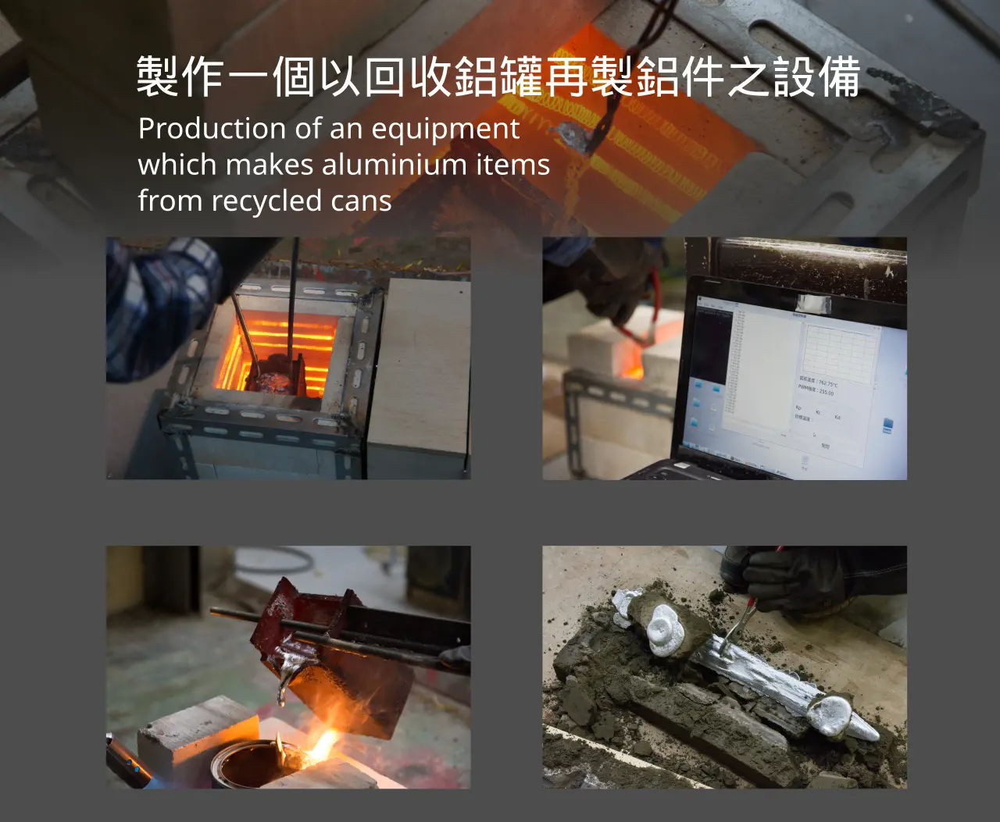
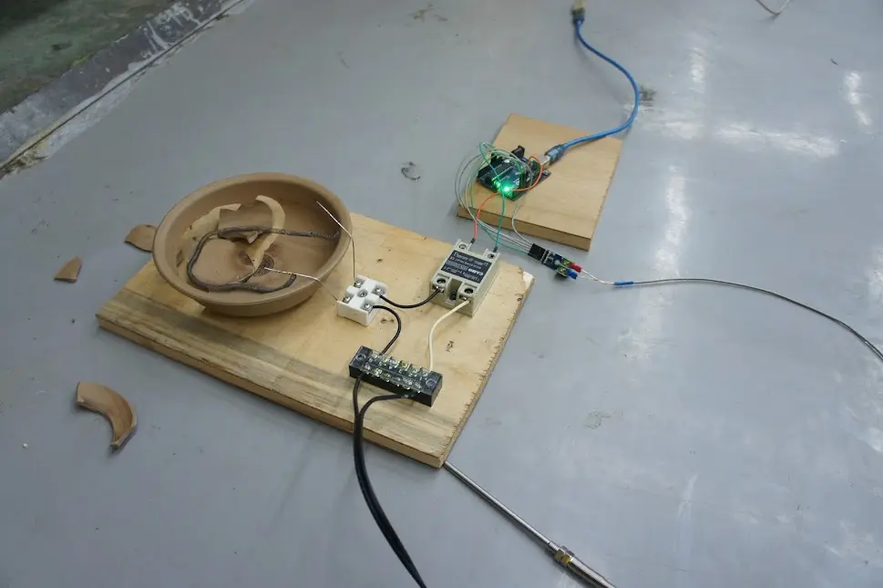
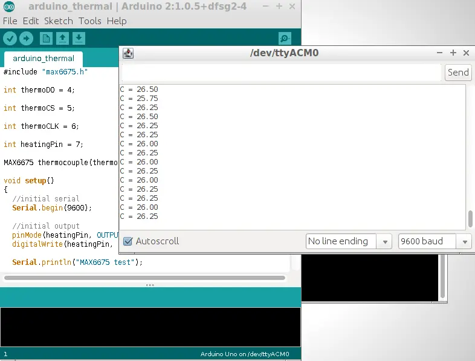
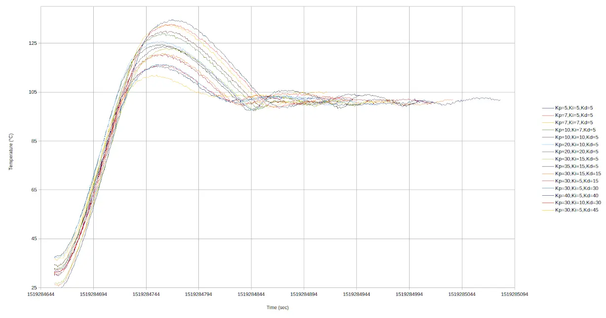
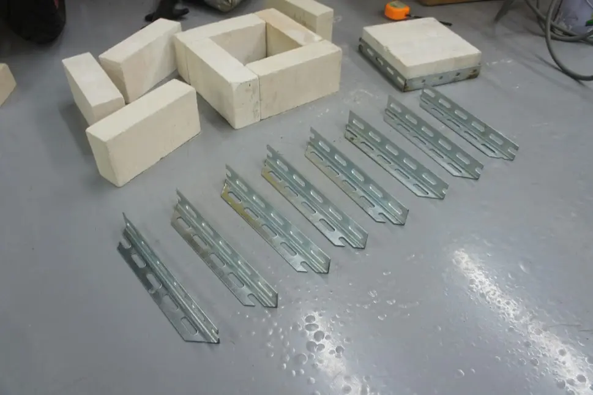
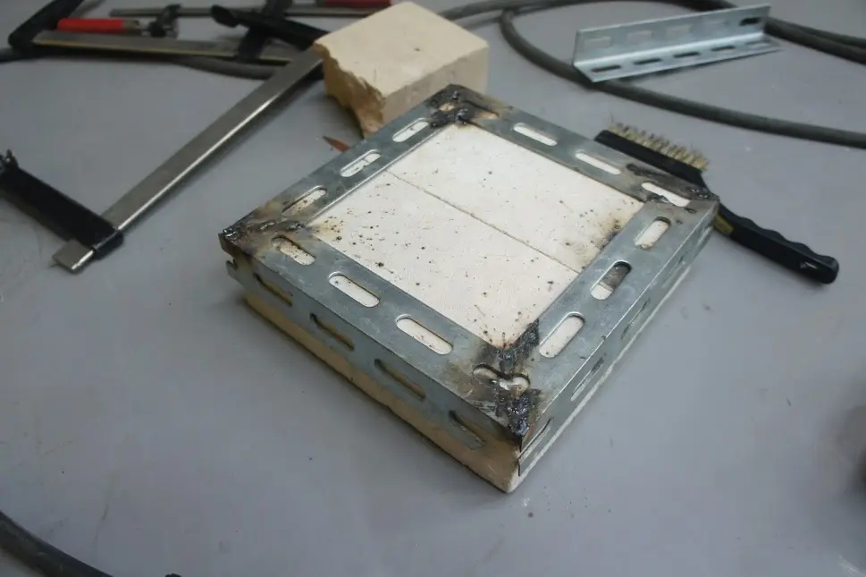
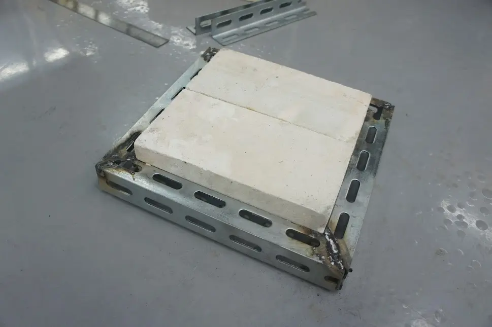
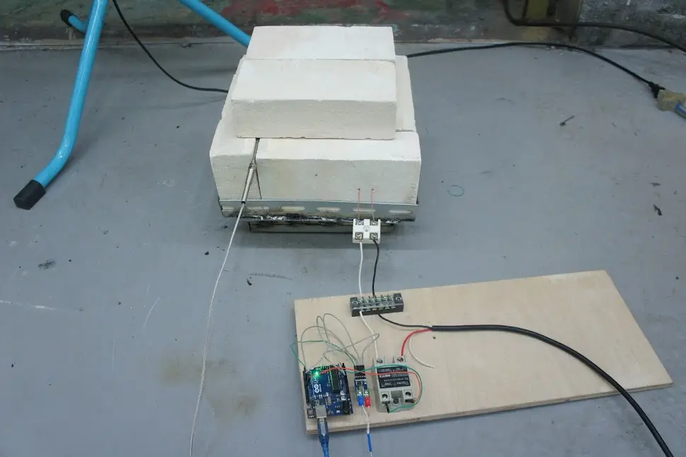
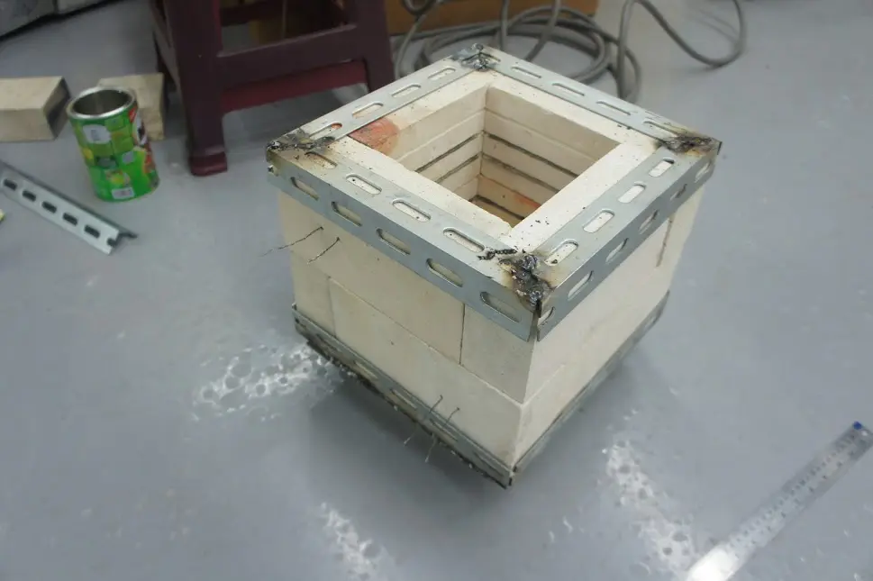
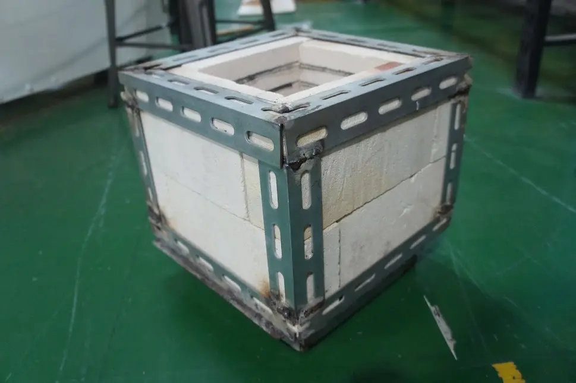

# 大學專題：移動熔爐（重發）

:::info
這篇是 2019 年我在大學時做的畢業專題，原本發在網際網路上[奇怪的地方](https://www.erepublik.com/en/article/-flypie-s-school-time--2688865)做封閉測試（？），簡單整理之後重新發一次。沒有做太多修改，整體結構跟圖文保留。
:::

## 電路 POC

這次我決定製作一個電阻式的加熱爐，

並且能夠控制溫度，所以需要用到熱電偶和加熱線，

以下是我在測試固態繼電器、熱電偶這些我第一次使用的電子零件。

為了調整溫度控制器(PID控制器)，所以在嘗試各種常數

## 加熱爐爐體

接著是爐體，用耐火磚+水電角鋼焊接而成，先是用鋸床裁切原料

在完全銲死之前先確認加熱效果如何～

噹啷～完成啦！

然後在測試的時候發生：固態繼電器缺乏散熱的問題。畢竟沒用過得電子零件，一開始沒買散熱麒片，接著就發生了慘劇...它熱崩潰啦((( °Д°)))

即使把開關訊號中斷，加熱器仍然無法斷電。後來拿電阻檔去量，隨著繼電器的冷卻，電阻值慢慢上升（恢復斷路）。

很巧的，這時我手邊有一個一體式水冷...

## 一體式水冷

♪我有一個水冷排，我有一個缺乏冷卻的固態繼電器♪

於是...我就試著自己改裝了一個一體式水冷XDD

第一件事當然是CAD啦～（痾...後面很多開發因為我無法讓材料去適應設計，而是設計去適應材料，就略過了CAD的步驟，主要是預算不夠充沛的關係），這是要貼在固態繼電器上面的散熱器。

側面的洞洞單純是前人留下來的，這塊鋁是廢料orz

接著為了管線的規格統一，所以把水泵的外殼魔改了（基本上...自己造一個新的）

先用銑床弄出長方體，再靠製具進行車削，畢竟手邊沒有四爪夾頭

Code:

¯\_(ツ)_/¯\

原本想用止付螺絲把散熱器加工痕跡鎖起來，之後就可以拆開來維護，不過卻乏密閉性，還是會漏水，最後很可惜的只能用一團膠封起來Q_Q

## 配電盤 V1

然後是電箱（版本一，後來改版惹）

接上線～

當時有拿著這張圖去請教做水電的網民（？），於是就去買了符合安培大小的電線重配

## 實驗性質的氣壓式壓罐器

當時其實是抱著「做產線設備」的心情去實做的，所以想說壓易開罐這個動作是不是能順便自動化，就做了一個氣壓式的壓罐器，可惜壓力不夠，罐子要先捏過才壓的扁

## 簡易坩堝

800度的環境畢竟蠻惡劣的

如果照著Youtube上的方式用奶粉罐裝鋁湯，其實蠻危險的，\
看，~~車諾比前後~~

於是我去跟我的指導教授要了鐵板，而且是令一組專題生用剩的邊角料XD\

...焊了一個坩堝

還順便做了夾具，其中勾勾的部份是我鍛打出來的

## 鋁錠鑄造（子系統整合測試）

然後我就很開心的拿著我的~~鑄造套裝~~去玩鑄造了

是鋁錠！比我高職做的還大顆耶(๑-̀ω-́)و✧

好了，驗證加熱爐可以勝任鑄造的工作之後，開始準備砂模鑄造

## 砂模鑄造

去挖來的沙土因為夾雜很多小石子，會讓砂模的連結性不好，所以要篩掉

然後我做了砂箱

接著就是澆鑄啦

最後得到兩個成品，一大一小的劍，大劍的充滿了失敗orz。這個鑄造的過程我算是跟社團（？）活動綁在一起，要感謝過程協助的其他社群夥伴，不然大劍的成品無法完成。因為坩堝不夠大，所以需要先倒出來一鍋鋁湯到其他容器，然後用噴燈保溫。

在這之前的鑄造都只是用一些廢棄鋁料拿去融，到這裡為止算是我整個專題完成度最高的部份。但是我原本的題目包含了回收易開罐，所以其實還有一個空氣淨化系統orz，老實說最後功能沒完全實現，畢竟是最後幾個月瘋狂趕工的產物（？）

## 骨架與空氣過濾器

因為易開罐上面其實有塑膠塗層，丟進加熱爐這些塗層會燃燒產生煙霧，所以我打算製作一個裝置能夠淨化這些空氣。原始概念是用水幕去打這些空氣，把污物吸收進水裡變成廢液，最後比較好處理，畢竟比起廢氣和粉塵，液體比較好封存跟運輸。

那個三角錐是我打算用來製作旋風分離器的部份

旋風分離器是什麼呢？一言以敝之---「Dyson 吸塵器集塵原理」，就是靠離心力把顆粒跟空氣甩開。

然後我的專題就多了一個750w的離心式風扇，然後還多了一個60w 0.8MPa的水泵。

恩？水+鋁湯應該會發生水蒸氣爆炸，然後我的專題把這兩個東西放這麼近，旁邊還有一個高速轉動具有高動能的風扇！？(╯°Д°)╯︵ ノ(｡ー｡)ヽ

於是我的電箱第二版就出現了，為了解決這個風險，我加入了緊急停止按鈕。

登登～按下按鈕後會把大部分電源切電的電盤就產生了

然後為了更降低風險，我要把爐體、電箱、水管三個東西確實的分離，於是我的框架就必須做成完全封閉式的。

我還弄了補土來把間隙填掉...

原本的水冷制動電路則封裝成模組

總之，把外框上補土、噴漆、挖洞，然後把該放的東西塞進去，之後再蓋起來...就是成品啦

