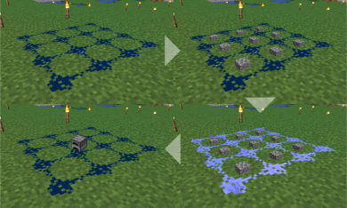
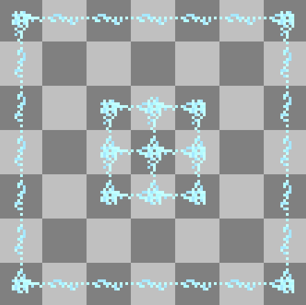

# 一種應用於素體世界之合成系統構想

## 鍊成粉末

- 作為遊戲中最容易獲得的物品之一，比如能從植物獲得或是破壞土壤方塊後會掉落。
- 鍊成粉末能夠像 Minecraft 中的紅石一般放在地面上連接成圖形。

## 鍊成陣 (Transmutation Circle)

- 使用鍊成粉末繪製 2x2 或 3x3 的網格，構成鍊成陣。
- 網格中間能夠放入物品，就像 Minecraft 的物品展示框一樣。
- 依照配方放入物品後對鍊成陣按右鍵啟動鍊成。
- 消耗生命值作為鍊成代價。

## 鍊成現象（事件、效果）

- 鍊成陣除了能夠製作物品外，還能引發「現象」。
- 當鍊成陣使用引發現象的配方時，不會鍊成物品而是引發現象。
- 現象包含但不限：
  - 引雷
  - 降溫（周圍結冰）
  - 附加狀態，如：中毒、治療...等。

## 攜帶型鍊成陣

- 使用鍊成粉末間隔一格包圍鍊成陣，可構成二級鍊成陣。
- 在一級鍊成陣內放入物品後啟動二級鍊成陣，會將一級鍊成陣轉換成攜帶型鍊成陣，物品則會原地掉落。
- 攜帶型鍊成陣能夠記憶配方。
- 可以手持並使用攜帶型鍊成陣。

## 複合型鍊成陣

- 使用攜帶型鍊成陣作為合成原料。
- 透過組合複合型鍊成陣能夠將多重手續的合成過程壓成單一鍊成陣。
- 例如：使用`原木→木板`的配方製作攜帶型鍊成陣，再用攜帶型鍊成陣依照`木板→木箱`的配方排列合成複合型鍊成陣，其攜帶型鍊成陣能夠直接將原木鍊成木箱。

---

  
Wei Ji以[創用CC 姓名標示-相同方式分享 4.0 國際 授權條款](http://creativecommons.org/licenses/by-sa/4.0/)釋出。