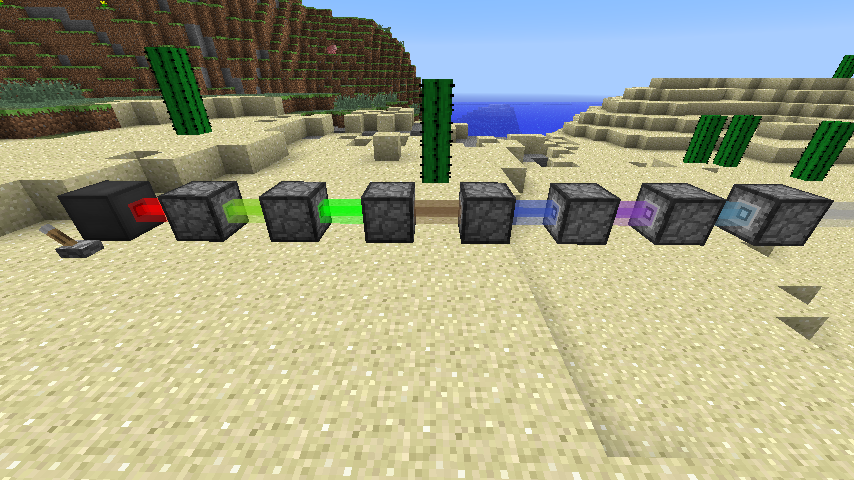

# 一種應用於體素世界中之自動機構想

> A Kind of Automata in Voxel World

在原生的 Minecraft 環境中要實現工業化必須仰賴紅石電路，但是紅石作為 Minecraft 標誌性的遊戲機制，單純「參考」的話很容易被看出原始出處而帶來不必要的爭議，為了能在自製的 Voxel 世界中再現工業化的遊戲機制，必須尋找另外一種類似於紅石但是不同的遊戲機制。

## 圖靈完備

「類似於紅石電路的遊戲機制」這樣的描述似乎不夠精確，準確的來說應該是創造一個圖靈完備的邏輯系統並存在於 Voxel 世界中，但是這就必須先介紹什麼是圖靈完備。

要解釋圖靈完備就要先介紹「圖靈機」，它是一台抽象化的計算機，就像薛丁格的貓一樣是思考層面的上的東西並不具有實體，它的描述是這樣的[^turing-machine]：

> 1. 一條無限長的紙帶（tape），紙帶被分成一個個相鄰的格子（square），每個格子都可以寫上至多一個字符（symbol）。
> 2. 一個字符表（alphabet），即字符的集合，它包含紙帶上可能出現的所有字符。其中包含一個特殊的空白字符（blank），意思是此格子沒有任何字符。
> 3. 一個讀寫頭（head），可理解為指向其中一個格子的指針。它可以讀取/擦除/寫入當前格子的內容，此外也可以每次向左/右移動一個格子。
> 4. 一個狀態寄存器（state register），它追蹤著每一步運算過程中，整個機器所處的狀態（運行/終止）。當這個狀態從運行變為終止，則運算結束，機器停機並交回控制權。如果你瞭解有限狀態機，它便對應著有限狀態機里的狀態。
> 5. 一個有限的指令集（instructions table），它記錄著讀寫頭在特定情況下應該執行的行為。可以想象讀寫頭隨身有一本操作指南，裡面記錄著很多條類似於「當你身處編號53的格子並看到其內容為0時，擦除，改寫為1，並向右移一格。此外，令下一狀態為運行。」這樣的命令。其實某種意義上，這個指令集就對應著程序員所寫下的程序了。

而如果一個系統能夠模擬圖靈機的運作，那它就是圖靈完備的。

[^turing-machine]: https://mille.in/turing-completeness/

## 規則

這個遊戲機制必須遵守幾個規則：

1. 它是圖靈完備的。
2. 它能夠在 Voxel 世界中被建造出來。
3. 它能夠與 Voxel 世界產生互動。

## RGB 運算邏輯系統 ~~（電競運算邏輯系統）~~

要找出符合上述規則確迥異於紅石電路的遊戲機制實屬困難，畢竟現代半導體與電腦程式的基礎就是布林 (Boolean) 運算，綜觀各種遊戲內出現類似的機制都脫離不了紅石電路的影子，不然就是它們並不是圖靈完備的。

直到晚上 (2021-12-28) 我突然有了個靈感，來自解迷遊戲經常使用的元素：光學，其一是色彩合成的特性；其二是雷射的射線。

### 概念

首先是色彩的合成，在電腦圖學中使用 RGB 來代表一個顏色，基本上就三個線性獨立的向量，而色彩的疊加或遮色則可以代表加法和減法運算。再來射線的行為則是能夠讓色彩值在 Voxel 世界中移動。

於是建立一組能夠將光學行為類比成數學運算的關係：

- 光的合成
  - 向量加法
  - e.g. (255,0,0)+(0,255,0)=(255,255,0) 紅+綠=黃
- 光的吸收
  - 向量減法
  - e.g. (255,255,255)-(0,255,0)=(255,0,255) 白-綠=紫
- 折射/反射
  - 修改資料的移動狀態
  - e.g. (0,1,0)->(0,-1,0)
- 螢光/散射
  - 入射光與散射光波長不一致的種種現象
  - 簡化為線性變換
  - e.g. (0,0,255)->(255,0,0) 藍->紅

### 光學方塊

- 雷射方塊
  - 製造光線
  - 需要消耗資源作為製造光線的代價
- 反射方塊
  - 修改光線行徑方向 90 度
- 折射方塊
  - 修改部份光線的行徑方向 90 度
- 螢光方塊
  - 轉換光線顏色
- 遮色方塊
  - 減少特定顏色的光線
- 光致__方塊
  - 從一個方向接受光線後改變其在其他方向對光線的行為
  - e.g. 光致遮色方塊，從 `[100]` 接受 x 量的 Red 光線會使通過 `[010]` 或 `[001]` 方向的光線被減去 x 量的 Red 光線。（方向用米勒指標表示）

上述幾種基本模式就能組合創造出不少衍生方塊。

### 數學模型

對任意 Voxel 其光線值可以用一個矩陣描述：

$$
A=
\left[
\begin{array}{cc}
  r_{[001]} & g_{[001]} & b_{[001]} \\
  r_{[00\bar{1}]} & g_{[00\bar{1}]} & b_{[00\bar{1}]} \\
  r_{[010]} & g_{[010]} & b_{[001]} \\
  r_{[0\bar{1}0]} & g_{[0\bar{1}0]} & b_{[0\bar{1}0]} \\
  r_{[100]} & g_{[100]} & b_{[100]} \\
  r_{[\bar{1}00]} & g_{[\bar{1}00]} & b_{[\bar{1}00]} 
\end{array}
\right] 
$$

而運算遮罩則可描述為：

$$
M_{[001]}=
\left[
\begin{array}{cc}
 1 & 1 & 1 \\
 0 & 0 & 0 \\
 0 & 0 & 0 \\
 0 & 0 & 0 \\
 0 & 0 & 0 \\
 0 & 0 & 0 
\end{array}
\right],
M_{[00\bar{1}]}=
\left[
\begin{array}{cc}
 0 & 0 & 0 \\
 1 & 1 & 1 \\
 0 & 0 & 0 \\
 0 & 0 & 0 \\
 0 & 0 & 0 \\
 0 & 0 & 0 
\end{array}
\right] ,...,
M_{[\bar{1}00]}=
\left[
\begin{array}{cc}
 0 & 0 & 0 \\
 0 & 0 & 0 \\
 0 & 0 & 0 \\
 0 & 0 & 0 \\
 0 & 0 & 0 \\
 1 & 1 & 1
\end{array}
\right]
$$

光線值的變化與周遭6個方向相鄰的光線值有關：

$$
\begin{align}
A'= f(A) & = A_{[001]} \circ M_{[00\bar{1}]}+
    A_{[00\bar{1}]} \circ M_{[001]}  \\
& + A_{[010]} \circ M_{[0\bar{1}0]}+
    A_{[0\bar{1}0]} \circ M_{[010]}  \\
& + A_{[100]} \circ M_{[\bar{1}00]}+
   A_{[\bar{1}00]} \circ M_{[100]}
\end{align}
$$

上述 $f$ 為一般空氣方塊傳遞的方式，而特殊的光學方塊即是調整該函數使光線的值的傳遞方式不同。

### 其他特性

如果不考慮溢位之類的極端條件，並且設定光線不能為負值，意味著在該線性運算系統內引入了 ReLU 非線性函數。恩...線性運算加上非線性函數（激勵函數），聽起來怎麼有點耳熟？

沒錯 `(σﾟ∀ﾟ)σ`，類神經網路 (Artificial Neural Network)！雖然只是整數域版本的。

## Credits

- Cover Image: http://modsforminecraft.com/add-lasers-to-the-game-with-this-mod-1-6-4/

---

  
Wei Ji以[創用CC 姓名標示-相同方式分享 4.0 國際 授權條款](http://creativecommons.org/licenses/by-sa/4.0/)釋出。