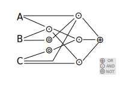

# 環驅之鑰 (The Key Of Huanche)

## 簡介

為本人專案導向學習的主要專案之一，旨在建立：
> 以布林類神經網路為基礎之人工智慧，在 Minecraft-like (Voxel) 世界具有建立具有組織、文字、文化等文明特性之群落。

起於 *SyntheticEmpire* 專案，後發展為 *大地人* 專案，又因涉及多種不同層面的應用、技術與系統，與其他專案整併後建立的超集合型專案。

## 子專案

本專案由四大子專案構成，分別是：
- Hakoniwa
    - 目的在於開發一個系統用於運行 Minecraft-like (Voxel) 世界。
- Monkey
    - 目的在於開發一個系統用於運行基於布林類神經網路的人工智慧。
- Primordial Soup
    - 目的在於建立布林類神經網路的相關理論與工程規格，並開發一個系統用於儲存布林類神經網路的。
- Anima
    - 目的在於實現編輯布林類神經網路使其依照特定的目的運行。

## 專案名稱由來

一個簡單的邏輯映射關係可以用 DNF (Disjunctive normal form) 表示，這樣的映射邏輯其輸出只跟當下的輸入有關；換句話說它沒有記憶能力。

這個映射邏輯也可以用 DAG (Directed Acyclic Graph) 描述，

為了讓它有記憶的能力，我們把它加上遞歸 (Recurrent) 的連結，

此時這個映射邏輯部份的邏輯便受到這個環 (Directed cycle graph) 的支配，因此一個有學習能力的智能體其表現出「學習」的行為是受到這些環所支配的，「環驅」就是「受到圖環驅動」的意思。

---

  
Wei Ji以[創用CC 姓名標示-相同方式分享 4.0 國際 授權條款](http://creativecommons.org/licenses/by-sa/4.0/)釋出。