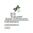

# BNN Tools

目的在於建立資料規格以及用於操作資料的小型工具可供其他程式使用。

## 染色體編碼

布林類神經網路數位染色體 (Boolean Neural Network Digital Chromosome)，於本專案皆簡稱為染色體。

## 對象

| 1 | 2 | 3 |
| :---------------------------------------------------: | :-------------------------------------------------: | :----------------------------------------: |
|  |  |  |

## 工具

## 行為

| 1 | 2 | 3 |
| :---------------------------------------------------: | :-------------------------------------------------: | :----------------------------------------: |
|  |  |  |

---

  
Wei Ji以[創用CC 姓名標示-相同方式分享 4.0 國際 授權條款](http://creativecommons.org/licenses/by-sa/4.0/)釋出。