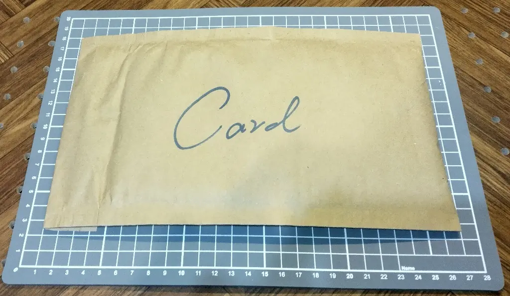
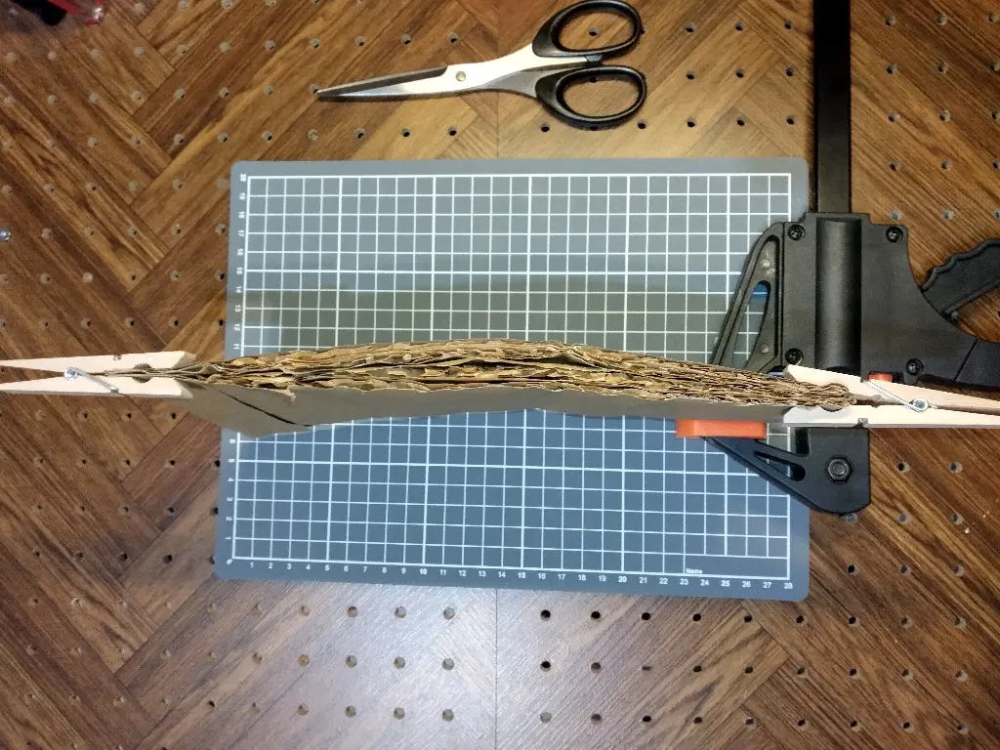
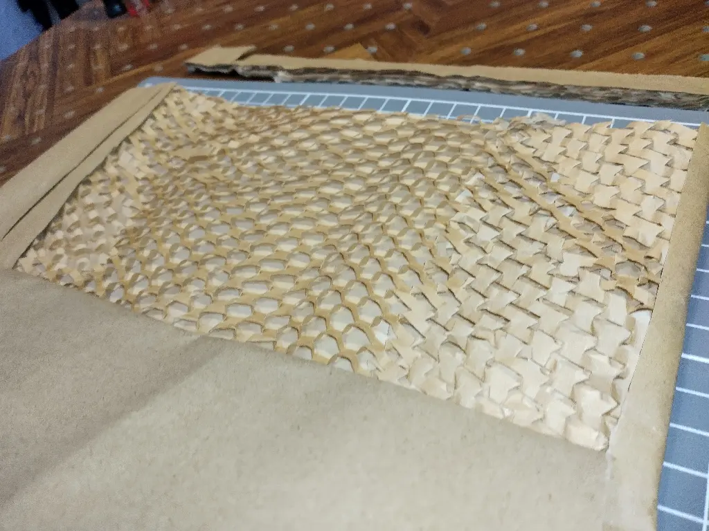
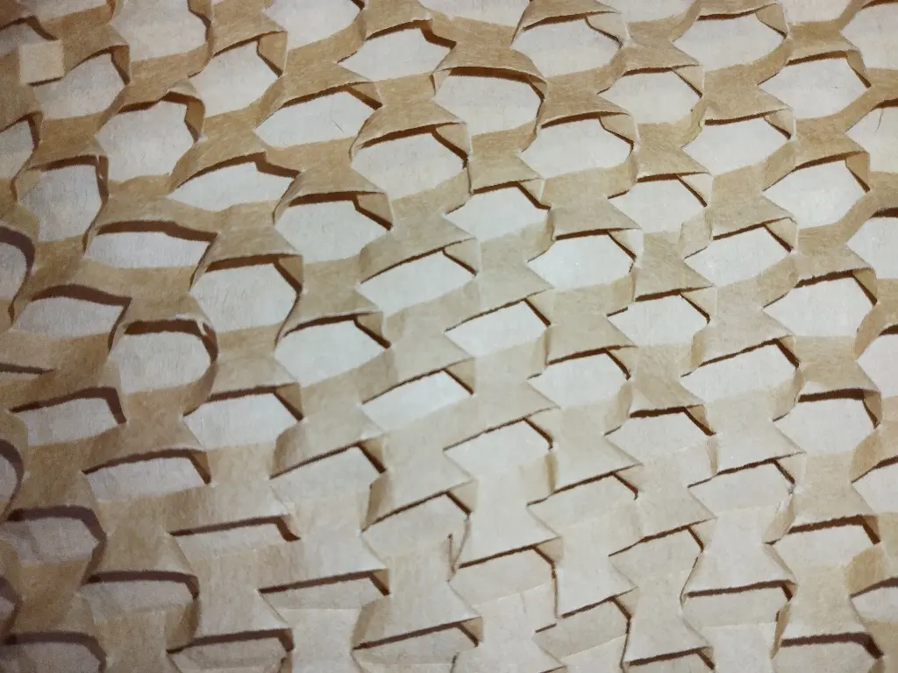

---
slug: 2024-07-17_paper-pack
authors: [weiji,]
tags: []
--- 

# 開箱 Framework 氣泡紙袋

<head>
  <meta property="og:image" content="https://raw.githubusercontent.com/FlySkyPie/flyskypie.github.io/main/post/2024-07-17_paper-pack/00.webp" />
</head>

幾個禮拜前補充了一下 Framework 筆電的插槽配件跟鍵盤的備料，包裝裡面有個紙袋讓我很在意，明明是紙袋但是確做出防撞氣泡紙袋的感覺。

側面

內部構造

特寫

