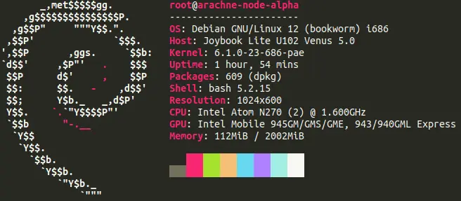

---
slug: 2024-07-21_server
authors: [weiji,]
tags: []
--- 

# Server Dayo!

<head>
  <meta property="og:image" content="https://raw.githubusercontent.com/FlySkyPie/flyskypie.github.io/main/post/2024-07-21_server/00.webp" />
</head>

雖然是 10 年前的小筆電，但是看起來是被人整頓過了，原本應該內裝 Windows XP 的換成 Windows 8.1、原本應該是 HDD 硬碟換成一顆 256GB 的 SSD。

話說回來安裝速度是各種慢，從裝系統、 `apt install` 一些工具還有編譯 Python 都覺得很花時間，拿來跑 X Window 應該會慢到想殺人。←_←
