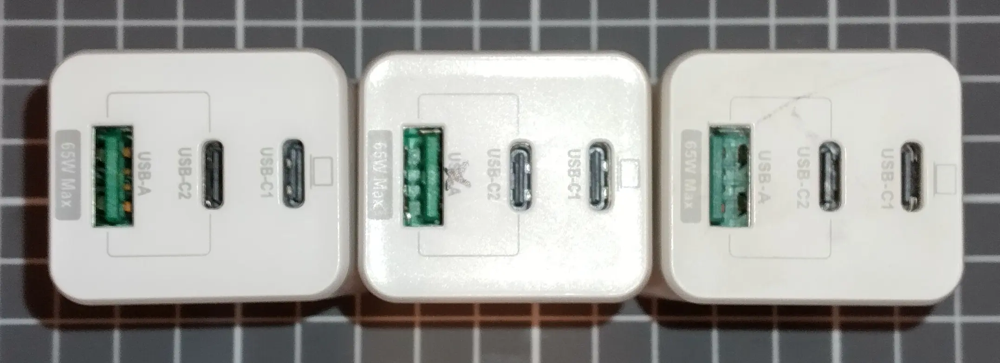
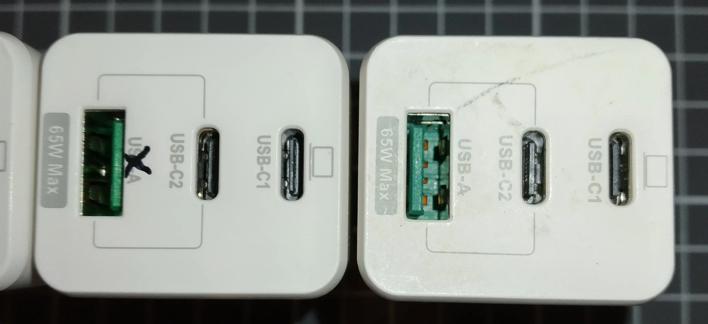

---
slug: 2024-10-25_pd-charger
authors: [weiji,]
tags: []
--- 

# YADI 的 PD 充電器

<head>
  <meta property="og:image" content="https://raw.githubusercontent.com/FlySkyPie/flyskypie.github.io/main/post/2024-10-25_pd-charger/YADI_02.webp" />
</head>

別的不說，我買三顆就買到一個 Type-A 接反的。

怒貼產品資訊

> YADI
> 
> 65W 氮化鎵快充
> 
> GaN Fast Charger
> 
> 電源供應器
> 
> 認證型號：WB-20TW65GAN 型號：CG4GA-65W2C1A
> 
> 輸入/Input： 100~240V~50/60Hz
> 
> 輸出 Output：
> 
> USB-C1 or C2: 3.3V~11V~5A (PPS)
> 
> （省略）
> 
> 製造商：深圳市創世達實業股份有限公司
> 
> 委製商：亞第科技股份有限公司
> 
> 地址：新北市板橋區信義路一巷28號
> 