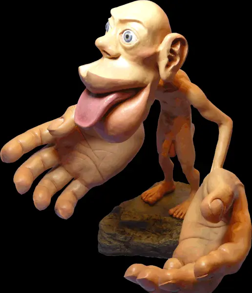
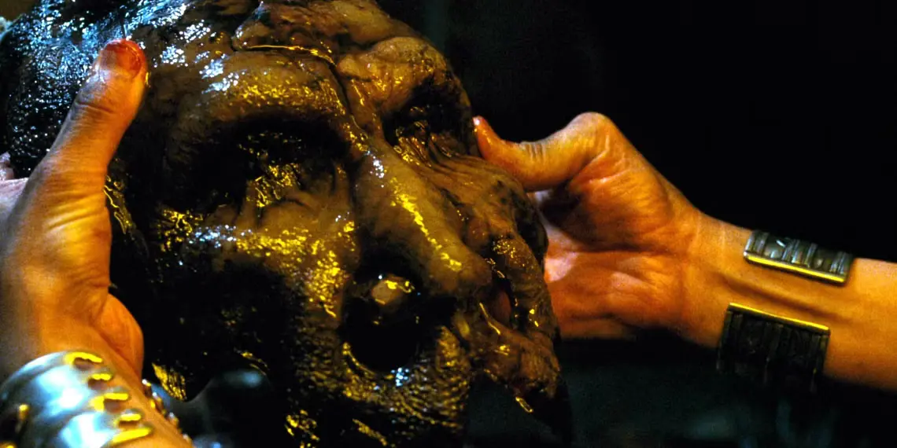

---
slug: 2024-11-03_talk-about-diy-gynoid
authors: [weiji,]
tags: []
--- 

# 潛談我對自製人形機器人的看法

<head>
  <meta property="og:image" content="https://raw.githubusercontent.com/FlySkyPie/flyskypie.github.io/main/post/2024-11-03_talk-about-diy-gynoid/03_mr-bean-meme.webp" />
</head>

說到人形機器人，不少人或許會想到[波士頓動力](https://en.wikipedia.org/wiki/Boston_Dynamics)或是 Tesla 的 [Optimus](https://en.wikipedia.org/wiki/Optimus_(robot))，不過我這邊想聚焦在「自製」這一個範疇。想要自製人形機器人的人，我不是第一個，也不會是最後一個，例如：
- [メカニカルガール@第0研究室[足立レイ]](https://www.youtube.com/@メカニカルガール第0研究室足)
- [MaSiRo Project](https://www.youtube.com/@MaSiRoProject)
- [David Browne](https://www.youtube.com/@DaveMakes)

這些創作者往往較著重於頭部與手部，或是由外而內的方式去模仿人類的外貌，不過對此我有不一樣的看法，分別從幾個角度切入。

## 皮質小人 (Cortical Homunculus)

.gif)

皮質小人是以大腦皮質層功能區對應的比例來繪製的人類，並且分成運動小人（motor homunculus）與感官小人（sensory homunculus）兩種。 

私以為這是一種對於「實做人類複雜度」的暗示與視覺化，在皮質小人中比重越大的器官代表需要更多、更複雜的運算能力，因此在有限的預算內，應該優先迴避這些可能需要高研發成本的部位，又或是對這些部位做謹慎的預算控制。

## 秘密客 (Mimic 1997)

Mimic 是一部 1997 年上映的科幻驚悚電影。

:::warning
下方可能有劇透，請讀者斟酌瀏覽。
下方可能有劇透，請讀者斟酌瀏覽。
下方可能有劇透，請讀者斟酌瀏覽。
下方可能有劇透，請讀者斟酌瀏覽。
下方可能有劇透，請讀者斟酌瀏覽。
下方可能有劇透，請讀者斟酌瀏覽。
下方可能有劇透，請讀者斟酌瀏覽。
下方可能有劇透，請讀者斟酌瀏覽。
下方可能有劇透，請讀者斟酌瀏覽。
下方可能有劇透，請讀者斟酌瀏覽。
下方可能有劇透，請讀者斟酌瀏覽。
下方可能有劇透，請讀者斟酌瀏覽。
下方可能有劇透，請讀者斟酌瀏覽。
下方可能有劇透，請讀者斟酌瀏覽。
下方可能有劇透，請讀者斟酌瀏覽。
:::

在這部電影中，基因改造的蟑螂發生了變異，可以長到 2 公尺高，並且成為了人類的狩獵者，而且演化出透過外殼模仿人臉的擬態能力：

對我而言使用硬質材料作為外殼（框架）的人形機器人，都像是模仿人類外型的外骨骼偽物。

## 競品

作為工程師，想要建造一個東西的時候第一件事情是什麼？絕對不是閉門造車，而是先看看競品長怎樣，~~然後能抄多少就抄多少。~~

那麼人形機器人的競品是什麼？當然就是人類本身。畢竟這個「設計」可是經過萬年迭代演化而來的，每一吋規格都得有個幾分道理。

所以我認為「研究人形機器人的競品」這一件事情應該是走向醫學系學生走過得路：學習解剖學。接著才考慮「在不丟失現有 Feature 的情況把設計從有機的 techstack 遷移到基於電機的 techstack 去」。
