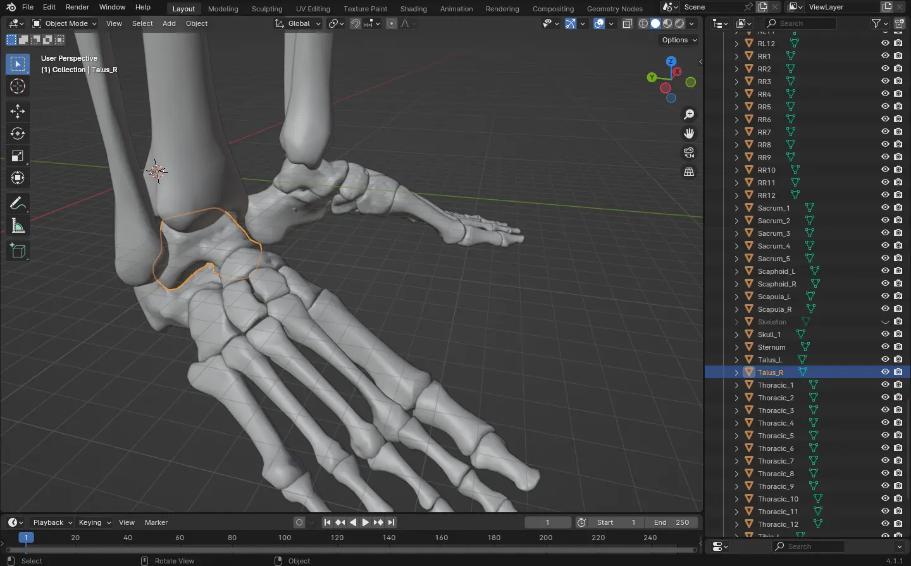

---
slug: 2024-11-03_textbook-and-context
authors: [weiji,]
tags: []
--- 

# 教科書 (Textbook) 與上下文 (Context)

<head>
  <meta property="og:image" content="https://raw.githubusercontent.com/FlySkyPie/flyskypie.github.io/main/post/2024-11-03_textbook-and-context/blender-and-skeleton.webp" />
</head>

上下文 (Context) 在軟體工程是一個很常見的概念，它所代表的是：

> 某個詞（變數）在當下在當下的語境（區塊）代表什麼意思？
>

比如說，當我們在日常對話提到「蘋果」，可能指的水果的蘋果，也可能是科技公司的那個蘋果。電腦的呆板促成程式碼的嚴謹性造成我們在程式碼使用某個變數的時候，必須明確的告訴電腦這個詞對應的是什麼具體的東西，沒有模糊空間。

然而自然語言對話卻不是這樣運作的，兩個工學院學生談論「傑森」的時候，可能是指 JSON (JavaScript Object Notation) 也可能是指 NVIDIA Jetson，對話有時候能奇妙的繼續下去，直到有人察覺哪裡怪怪的。

又或是雙方對於同一個詞有不同的見解，讓對話陷入鬼打牆，因為每個人都想用自己的詮釋描述，這種情況我認為最好的解決方式是向程式語言取經：建立命名空間，用「小明::蘋果」和「小美::蘋果」分離兩種定義，在不否定任何人的「蘋果」的前提下，讓對話繼續下去。

接著來到我昨天 (2024-11-02) 花了一天溫吞的學習骨骼名稱的過程，讓我想到我們在義務教育的歷程中，有著不少的「背科」。以我正在學習的解剖學來說，每一個骨頭都有自己麼名字：

如果每個人能夠以自己的方式理解每一個物件，其實根本不需要背這些東西，但是事實是在社會之中人與人需要互相合作，就需要透過語言或文字來傳達概念，而這些被定義的名稱能夠在溝通的時候精準定位特定的物件。

工程師在面對問題的時候往往也沒有太多的模糊空間，M4 螺絲就是 M4 螺絲，CLK 跟 VCC 就是不同的接腳；在這一點上，醫學和工程或許沒有太多差別。而這些教科書 (Textbook) 本質上的作用就是幫人們同步上下文 (Context)。

（看著西方的 Woke 運動）當一個社會的 Context 沒辦法達到一定程度的共識，那又是另外一個話題了。
