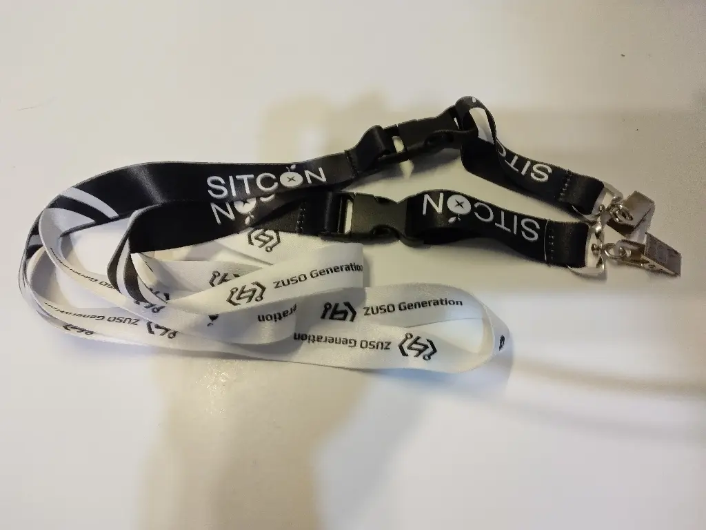
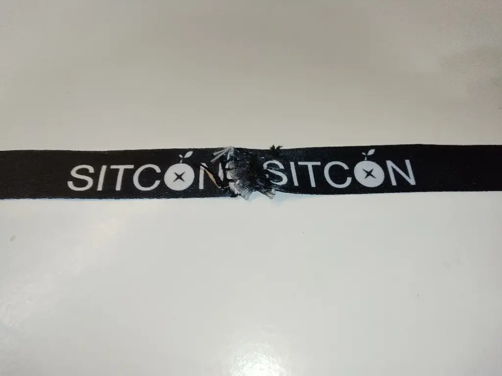
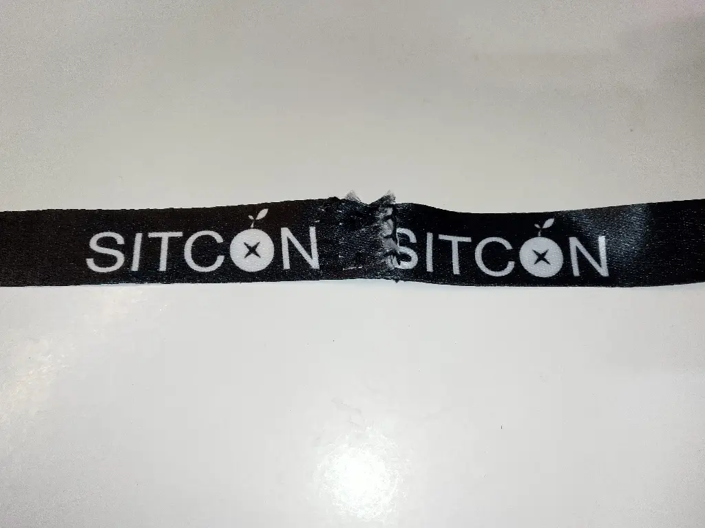
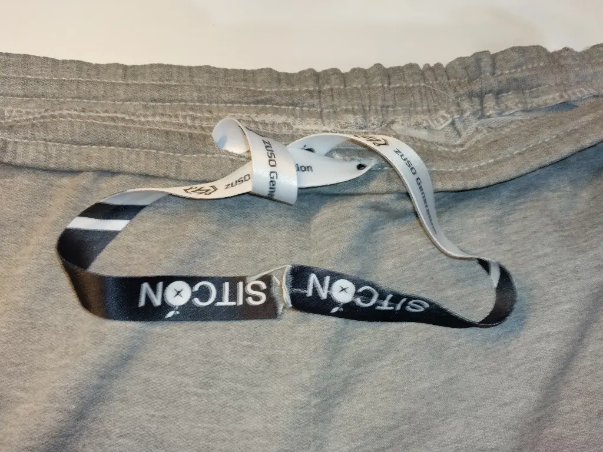

# 每次 Conf 都會多一條掛繩，所以我把它當成褲帶

<head>
  <meta property="og:image" content="https://raw.githubusercontent.com/FlySkyPie/flyskypie.github.io/main/post/2025-04-13/00.webp" />
</head>

今年 SITCON 之後又多了兩條掛繩：

突然想到我的睡褲前一陣子洗衣機幫我打死結只好剪掉，所以剛好少一條繩子，心動不如馬上行動。

因為一條的長度不夠，只好把兩條接在一起當一條用：

畢竟很少縫東西，縫得很爛：

噹啷～多出來的繩子困擾跟少一條繩子的需求互相湮滅了～

