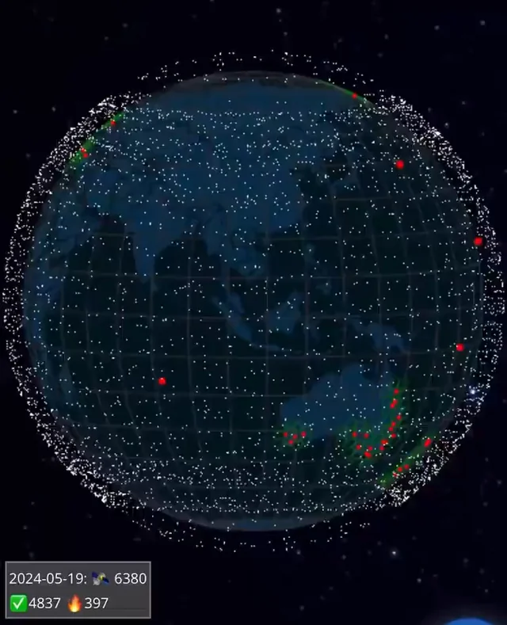

# Dyson Swarm is so cool

<head>
  <meta property="og:image" content="https://raw.githubusercontent.com/FlySkyPie/flyskypie.github.io/main/post/2025-05-26_dyson-swarm/00.webp" />
</head>

:::info
這是一個從我的專案管理系統 (Vikunja) 抽出的 Ticket，並附上一些補充。
:::

> 
> As Engineer, I want to know how to build Dyson Swarm, so that humanity can get unlimited energy.
>

## 背景

[戴森球](https://zh.wikipedia.org/zh-tw/戴森球)的概念就是假設當文明發展到一個程度，為了最大限度的使用恆星的能源，就會建構一個包覆恆星非自然造物來使用所有能源，白話文來說就是造一堆太陽能板把太陽包起來。

而在 [Kurzgesagt 的影片](https://www.youtube.com/watch?v=pP44EPBMb8A)中，討論了一些戴森球模型，並從中挑出戴森雲 (Dyson swarm) 作為最有可能的方案。

## Starlink

目前人類文明尚未有建造戴森球的能力，它僅出現在科幻作品中；但是從比較務實的角度考慮，現代其實已經有相對類似的東西了，那就是 SpaceX 的
[星鏈 (Starlink)](https://zh.wikipedia.org/zh-tw/星鏈)：

兩者其實分享了一些共同點：

- 大規模生產
- 大規模軌道佈署
- 大規模軌道管理
