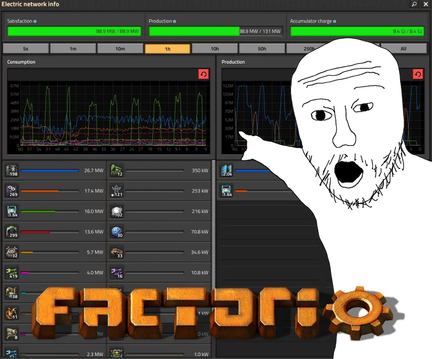
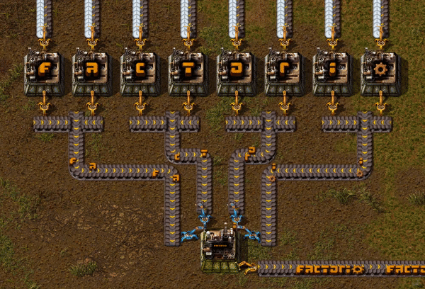
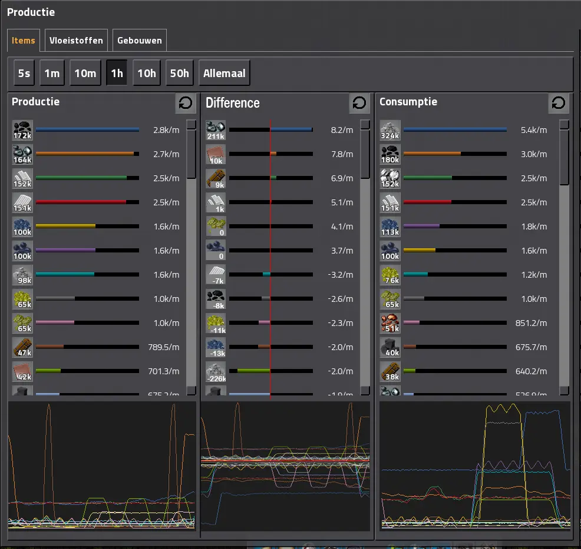
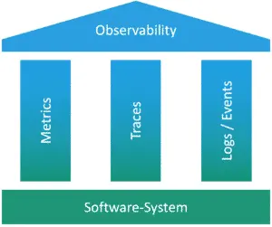
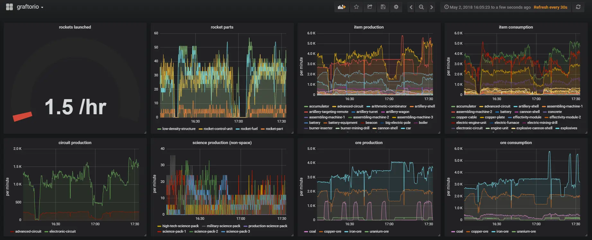

# Monitor metrics like Factorio

<head>
  <meta property="og:image" content="https://raw.githubusercontent.com/FlySkyPie/flyskypie.github.io/main/post/2025-05-26_factorio/00.webp" />
</head>

:::info
這是一個從我的專案管理系統 (Vikunja) 抽出的 Ticket，並附上一些補充。
:::

> 
> As Factorio Player, I want to monitor metrics from physical world, so that I can feel part of Factorio in real life.
> 

## 背景

[異星工廠 (Factorio)](https://zh.wikipedia.org/wiki/異星工廠)是一個產線經營建造遊戲，背景設定為玩家的太空船墜落在一個未知的行星上，必須採集資源、建造產線、最後發射火箭重拾回到軌道的能力，同時面對來自園生物種的騷擾。

使用輸送帶來自動化生產線是遊戲的主要機制之一：

因為其自動化的特性，除了產量，玩家更需要考量產率，這個遊戲甚至能列出像這樣的數據與圖表：

## 討論

資料流、物質流，一直是很令我著迷的東西，不過作為市井小民除了在遊戲中創造並感受這種流動以外，很難在現實中實際體驗。

直到最近我接觸了資訊維運領域中的可觀測性 (Observability)：

只要有伺服器的存在其實就很容易創造、收集、儲存、管理、消費資料，而這個過程必定存在資料流。

甚至有這麼一個專案：

[graftorio](https://github.com/afex/graftorio) 它能夠在異星工廠採集數據，並且輸送到 [Grafana](https://zh.wikipedia.org/wiki/Grafana) 中儲存以及視覺化，而 Grafana 是資訊維運領域中很知名且常見的一個平台/工具。
