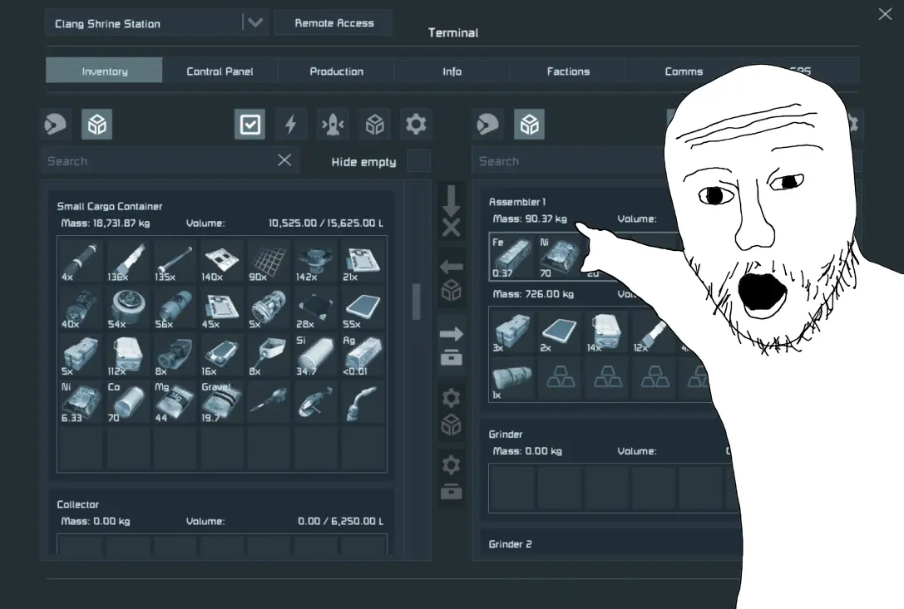
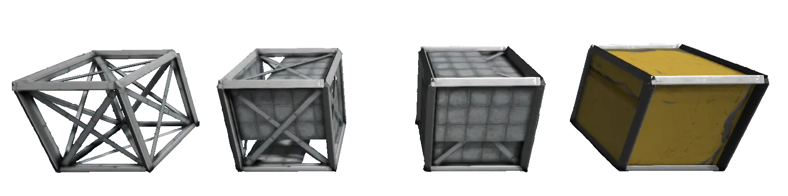
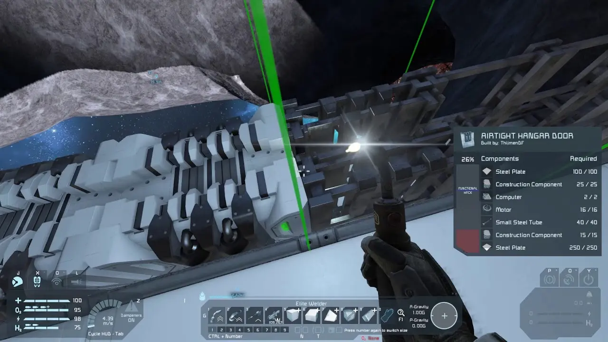
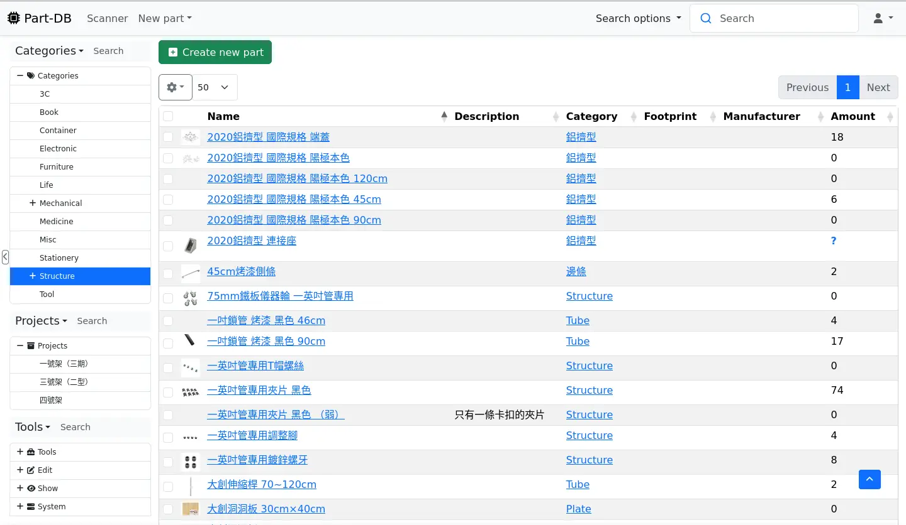

# Monitor inventory like Space Engineers

<head>
  <meta property="og:image" content="https://raw.githubusercontent.com/FlySkyPie/flyskypie.github.io/main/post/2025-05-26_space-engineer/00.webp" />
</head>

:::info
這是一個從我的專案管理系統 (Vikunja) 抽出的 Ticket，並附上一些補充。
:::

> 
> As Space Engineer Player, I want to monitor inventory from physical world, so that I can feel part of Space Engineer in real life.
> 

## 背景

[太空工程師 (Space Engineers)](https://en.wikipedia.org/wiki/Space_Engineers) 是一個太空生存建造遊戲，使用一種很有趣的建造機制，整體而言依然是基於方塊或網格化 (Gird) 的系統，但是每個方塊分成多個階段：

方塊放置後會得到一個骨架（上圖左一），需要經過玩家的焊接（修復）動作：

方塊的耐久度與狀態才會漸趨完整，同時玩家身上的原料會隨之消耗，拆除方塊的作業則是整個流程反過來。

## 討論

Minecraft 算是基於方塊的生存建造遊戲類型中最有名的，但是太空工程師的遊戲機制在設計上更貼近現實一點，目前我自架的倉儲管理系統也正朝著目標前進之中：

順帶一提，太空工程師的氣氛很接近我最喜歡的影集：[The Expanse (太空無垠)](https://zh.wikipedia.org/zh-tw/太空無垠)。
