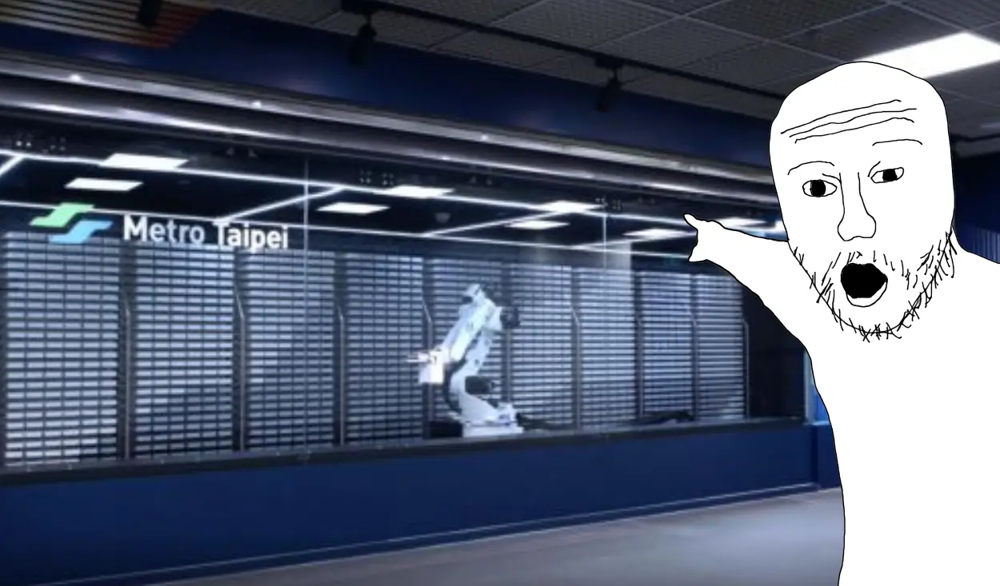

# Personal ASRS

<head>
  <meta property="og:image" content="https://raw.githubusercontent.com/FlySkyPie/flyskypie.github.io/main/post/2025-05-27_personal-asrs/00.webp" />
</head>

:::info
這是一個從我的專案管理系統 (Vikunja) 抽出的 Ticket，並附上一些補充。
:::

> 
> As engineer I want a personal ASRS (Automated Storage Retrieval System), so that I can tracking my components and assets.
>

## 背景

從我的一系列廢文中：

- [純粹喝零件櫃](/posts/2018-02-03_inventory)
- [太空工程師庫存](/posts/2025-05-26_space-engineers)
- [異星工廠產線](/posts/2025-05-26_factorio)

應該不難發現我對倉儲、庫存、自動化很有興趣，甚至早在 2018 年建造純粹喝零件櫃的時候我就有將其建構成自動倉儲的願景。

這裡放一些影片給對自動倉儲系統比較沒有概念的朋友當作參考：

<iframe width="560" height="315" src="https://www.youtube.com/embed/Zj_ZuqVZpcA?si=6q7FbRiaHKeJ492q" title="YouTube video player" frameborder="0" allow="accelerometer; autoplay; clipboard-write; encrypted-media; gyroscope; picture-in-picture; web-share" referrerpolicy="strict-origin-when-cross-origin" allowfullscreen></iframe>

<iframe width="560" height="315" src="https://www.youtube.com/embed/5SegEbE_QhM?si=u8vbWvoSu94xA6_X" title="YouTube video player" frameborder="0" allow="accelerometer; autoplay; clipboard-write; encrypted-media; gyroscope; picture-in-picture; web-share" referrerpolicy="strict-origin-when-cross-origin" allowfullscreen></iframe>

## 討論

收納電子零件的經典選擇應該是像這樣的抽屜櫃：

相較之下純粹喝的罐子有不少缺點，早期的罐子是不透明的，因此不能直接看到裡面有什麼，拿取也不如抽屜方便。

然而它也有其他抽屜櫃所沒有的優勢：

- 隔離
  - 塑膠瓶對外部有很高的隔離性，可以阻隔濕氣、小型生物...等等不利於保存物品的因素，更極端諸如泡水之類的情況仍然有很高的機率可以保護被儲存的物品免於天災的威脅。
- 解偶與原子性
  - 抽屜櫃的一個痛點就是不同型號的櫃子之間抽屜不能替換使用，反觀每一個零件罐都可以單獨使用。
- 水平拓展
  - 在該產品不停產的前提下，可以不斷補充相同規格的罐子，而且粒度很低；不需要一次買進一整個櫃子、可以一個一個罐子慢慢的擴展整個庫存。
- 漂亮的尺寸
  - 直徑 5 公分與大約 17 公分的尺寸是一個很容易跟其他產品搭配的尺寸。
- 最密堆積
  - 圓柱體的形狀讓它能夠以蜂巢狀堆放。

另外，有倒角的圓柱體其實是一種未來感很強的形狀。

### 人-櫃界面

儲藏櫃除了消耗自身儲存能力的空間以外，還會隱性消耗人類訪問櫃子所需要的空間，我姑且稱為「人-櫃界面」，也可以理解成必要的走道，如果是抽屜櫃的話更是保留能夠抽出的空間。

一般家用布局通常會把人-櫃界面和室內空間融合，對空間的使用者而言便不會感到壓迫：

但是如果追求效率與儲存空間利用率，這種設計很快就會面臨問題，不只無法有效利用空間，還很容易對使用者造成壓迫感：

事實上，密集書架就是為了高效的利用儲存空間的產物[^compact-shelving]：

使用機械設備代替人類在狹長的空間中取（置）物，便可以在空間利用率和人類舒適度之間取得最大效益：

[^compact-shelving]: 圖書館設備 - 密集式移動櫃. (日盛圖書館設備有限公司). Retrieved 2025-05-30 from https://www.z-sun.com.tw/service.php?c1=1&c2=16
