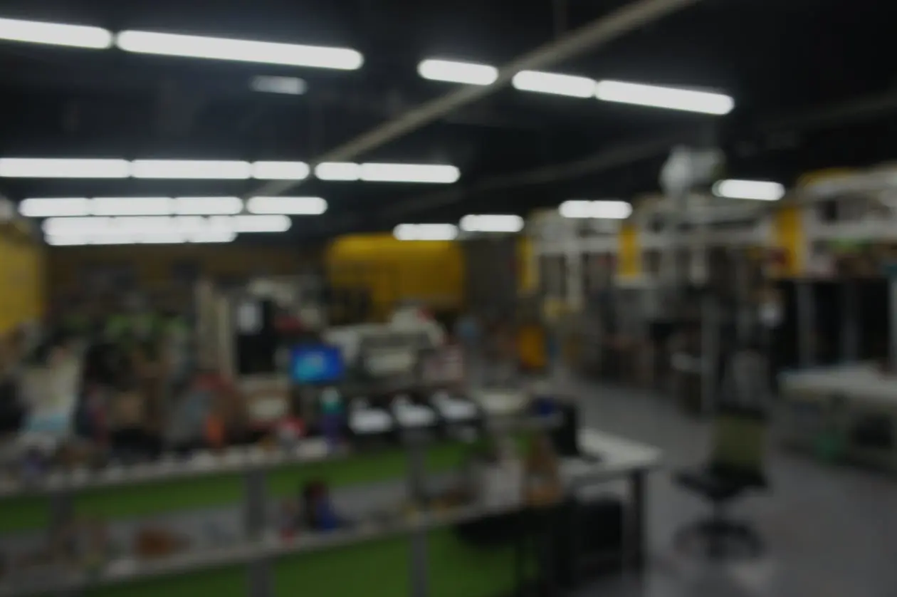
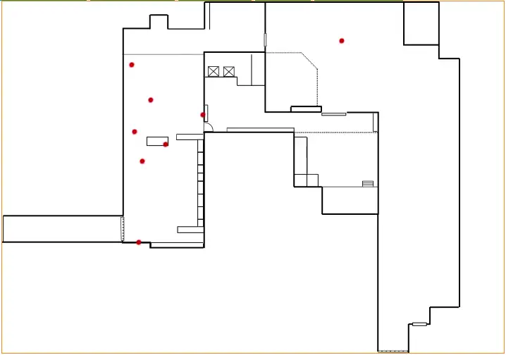

# 來自 2017 年的 prototype

<head>
  <meta property="og:image" content="https://raw.githubusercontent.com/FlySkyPie/flyskypie.github.io/main/post/2025-05-30_2017-prototype/00.webp" />
</head>

中部創新自造教育基地 (2015~2023) 是一個座落於虎尾科技大學綜二館地下室的自造空間 (Maker space)。

因為空間寬廣、設備與零件種類繁多、管理人力有限，因此當時我有個構想：

> 如果路過得人可以隨意對任意物件打卡，讓數位空間有一個實體空間的虛擬映射那就好了。

於是當時用 HTML 和 jQuery 東拼西湊做了個 prototype：

