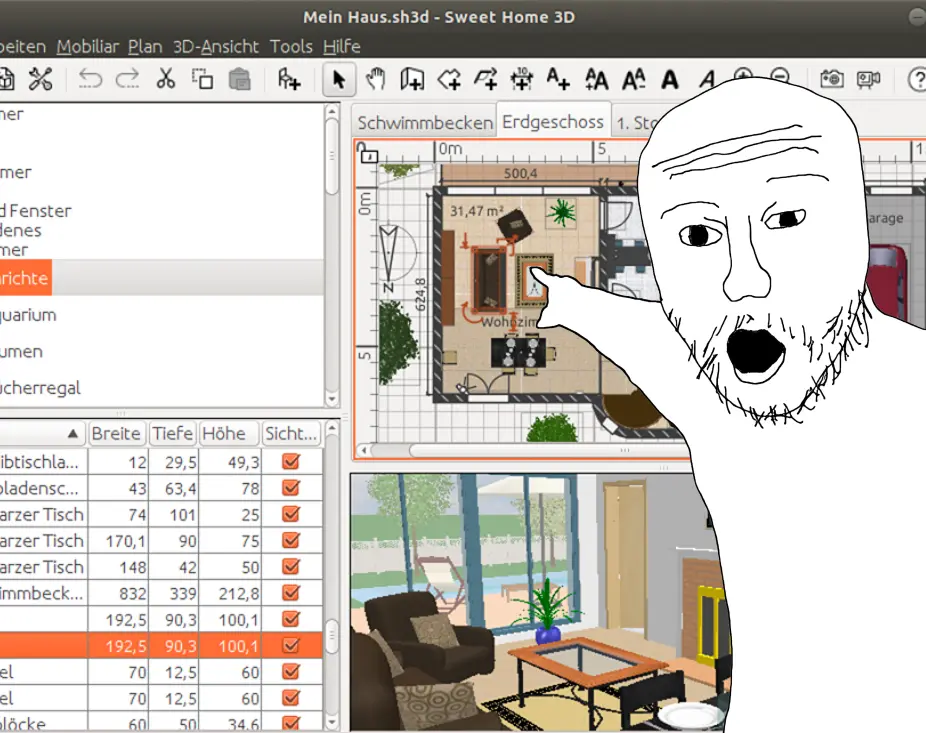

# Using Sweet Home 3D Modeling Bedroom

<head>
  <meta property="og:image" content="https://raw.githubusercontent.com/FlySkyPie/flyskypie.github.io/main/post/2025-05-27_personal-asrs/00.webp" />
</head>

:::info
這是一個從我的專案管理系統 (Vikunja) 抽出的 Ticket，並附上一些補充。
:::

> 
> As Engineer, I want using Sweet Home 3D create a digital twin of my living room, so that I can more do planning more precisely on physical world.
>

## 背景

[Sweet Home 3D](https://www.sweethome3d.com/) 是開源的室內設計軟體，它可以幫助使用者把傢俱放在2D平面圖上作業，同時顯示3D透視圖。我是在一次和其他人聊天的對話中得知這個專案的存在，並且在書籤內放上了幾個禮拜。直到最近才因為擴建 Homelab 的需求覺得應該先好好研究這個軟體。

## 討論

整個擴建計畫稱不上單純，內容包含：

- 購置不斷電系統 (UPS)
  - 伺服器跟 3D 列印機都是不太能承受斷電/跳電風險的設備。
- 移動 Homelab 伺服器
  - 目前的配置算是臨時擺放，還沒有正式的鎖在架子上。
- 拘束閒置床墊自由度
  - 前一陣子把房東的雙人床收起來改用單人床來節省空間，但是雙人床會自然傾倒，目前是先用重物（冰箱）抵著。
- 額外強制對流裝置（電風扇）
  - 夏季將至，需要做好準備。
- 考慮建置熱泵系統（冷氣）
  - 夏季將至，需要做好準備。

加上房間空間利用率的提高，施工的容錯空間就越來越低，事前計畫的審密程度必須提高。

另外，我想搞數位孿生也不是一天兩天的事情了，早在 2017 年就有[類似的構想](/posts/2025-05-30_2017-prototype)，對我而言 Sweet Home 3D 作為開源軟體充滿了潛力，比如透過理解它的資料儲存格式，可以透過其他軟體自動更新並匯入。

