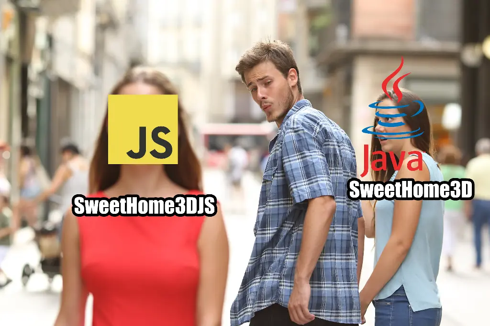

# Refactoring SweetHome3DJS

<head>
  <meta property="og:image" content="https://raw.githubusercontent.com/FlySkyPie/flyskypie.github.io/main/post/2025-05-30_sweethome3djs/00.webp" />
</head>

:::info
這是一個從我的專案管理系統 (Vikunja) 抽出的 Ticket，並附上一些補充。
:::

> 
> As Frontend Developer, I want using Javascript version of SweetHome, so that I can customize it easily.
>

## 背景

[Sweet Home 3D](https://www.sweethome3d.com/) 是開源的室內設計軟體，它可以幫助使用者把傢俱放在2D平面圖上作業，同時顯示3D透視圖。

一開始我下載 SweetHome3D-7.5.jar 來使用但是發現異常的卡頓。（我在官方網站看到 "It's not the preferred option to run Sweet Home 3D because you won't get association with Sweet Home 3D files, and depending on the Java version you use, it could use 96 MB of memory at maximum, which is too small to create middle sized homes." 已經是之後的事情了）

下載普通的 Java 版也不能正常執行。（事後都可以正常打開，我也不知道當下到底發生什麼事了）

接著看到有網頁版 (Sweet Home 3D)下載下來之後很快的就跑起來了。
