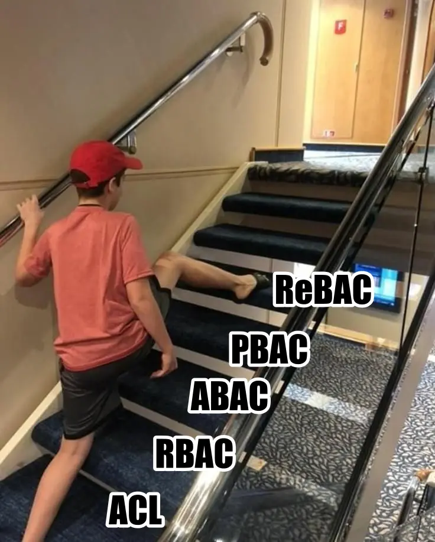

# 最近在學習 ACM (Access Control Model)

<head>
  <meta property="og:image" content="https://raw.githubusercontent.com/FlySkyPie/flyskypie.github.io/main/post/2025-07-20_acm-learning/00.webp" />
</head>

最近在開發公司產品的 IAM，然後我覺得就像：

ReBAC 這個 ACM 似乎算是相對新興的模型，中文資料沒有很多。

## 名詞解釋

- ACM (Access Control Model)
- RBAC (Role-Based Access Control)
- ABAC (Attribute-Based Access Control)
- PBAC (Policy-Based Access Control)
- ReBAC (Relationship-Based Access Control)
- ACL (Access Control List)
- IAM (Identity and Access Management)
