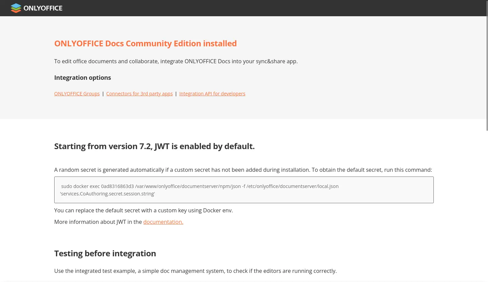

# 2025-09-27 （技術性）折騰的週末

<head>
  <meta property="og:image" content="https://raw.githubusercontent.com/FlySkyPie/flyskypie.github.io/main/post/2025-10-01_note/00_cover.webp" />
</head>

:::info
本篇廢文沒什麼敘事結構，單純把週末的一些體驗記下來。
:::

## 技能樹/科技樹

最近看了一個關於 Factorio 的影片[^factorio]：


但是因為「開源制約」的關係我不能直接玩 Factorio。

<details>
標題：開源制約（誓約）
字號：願字 00014 號
級別：動作級願景

主文：
我希望只用開源軟體。

描述：
正如馬克思所批評的，當土地被地主持有、生產要素被企業主持有，就會造成人與人的不平等，從而產生特權階級。然而物質世界的特性就是如此，每個產品背後的生產成本，生產的人或是計畫生產的人期望報酬是天經地義的，但是當我們看向「人類智慧」的時候，走得是另外一種模式；當我們在基本教育中學到「牛頓第二定律」的時候，課本裡面寫的可不是「牛頓 © 第二定律™」，這是因為這些智慧被視為公共財，並且知識傳遞的成本相對於產品要低得多並沒有「這裡有 100 份牛頓第二定律，只有 100 個人可以使用牛頓第二定律」這種事。

軟體公司僱用勞工生產軟體，然後銷售軟體，並且處心積慮的透過各種設計與算計企圖榜定消費者，這是資本主義架構下的常態，無力研發軟體的弱勢經濟體在國際貿易的秩序下只能淪為被壓榨的一方，因為他們為了提高產能的關鍵生產要素只能來自第一世界。

開源軟體在這個架構下開啟新的規則，把「軟體商品」轉換成「人類智慧」，它跟企圖綁架使用者的企業的「惡意」（商用軟體）不同，它是來自第一世界的「善意」、它是第一世界自願獻給全體人類的過剩的產能，開源軟體能夠舒緩人與人的不平等、國際貿易造成的不平等。

我自認生於一個不算富裕的原生家庭，也使用過盜版軟體，但是自從抓住開源的橄欖枝，我認為這是一個即便貧窮也能活得公平、光明磊落的道路。

級別計算：

- 投入規模：執行開源制約，動作級。
- 影響規模：影響個人，動作級。
- 綜合級數：動作級。
</details>

那...我把我的 HomeLab 的關聯性做成 Factorio 風格的科技樹好了！找一找還真的有人做過類似的東西：

- https://github.com/andrico1234/beautiful-skill-tree
  - 383 ⭐

不過安裝之後沒辦法用 Vite 正常 import，大概是 `package.json` 格式不支援的關係，畢竟這個專案的主要程式碼已經五年沒更新了。

後來 clone 下來試著自己打一些補丁，跑起來之後發現效果沒有到很好。

[^factorio]: E X P A N D I N G to THE STARS in Factorio - YouTube.  Retrieved 2025-10-01, from https://youtu.be/hYcAsNCH7Zc?si=y-izHtLKDbKaoEqk

## 前情提要

最近因為工作需求開始玩 LLM，但是有時候 Agent 犯蠢我也不清楚到底是 Model 能力極限還是提示詞工程的鍋，因此我認為有必要來點可觀測性。


後來我只找了 [Langfuse](https://github.com/langfuse/langfuse) ，它確實能夠紀錄 request 和 response，但是它仰賴使用 SDK 作為呼叫其他 LLM  API 的封裝。在諸如 Clien 之類的 Agent 工具是沒辦法輕易把 Langfuse SDK 注入進去的，我需要的是能夠作為 Proxy 伺服器擋在工具和 LLM API 之間。

接著我找到了 [LiteLLM](https://github.com/BerriAI/litellm) ，它確實能作為 Proxy 擋在工具和 LLM API 之間，並且支援 OpenAI Compatible 界面（目前 LLM API 的實質產業標準），不過問題是它不能紀錄詳細的 request 資訊，因此我無法得知

## LiteLLM x Langfuse

後來我發現可以在 LiteLLM 設定 callback 來整合 Langfuse[^litellm-langfuse]，於是週末我就想說來試試看。

但是 LiteLLM 卻一直跟我抱怨：

```
Error decrypting value for key: LANGFUSE_SECRET_KEY, Did your master_key/salt key change recently? 
```

但是我甚至沒有設定任何的持久化，`LANGFUSE_SECRET_KEY` 也是第一次新增，怎麼會有「salt 變動」的問題？

後來我才知道這是某種 bug，LiteLLM 以明碼將資料寫入資料庫後卻試圖用 salt 將資料解密[^litellm-bug]，在這之前已經花了好幾個好時進行故障排除以及跟 LLM 對話的鬼打牆，十分高血壓。

LLM 會耍蠢 → 試著建立 LLM API 可觀測性 → 遇到問題 → 試著用 LLM 故障排除 → LLM 繼續耍蠢，啊啊啊啊啊 `(#╯O皿O)╯┻━┻`

[^litellm-langfuse]: Open Source Observability for LiteLLM Proxy - Langfuse. Retrieved 2025-10-01, from https://langfuse.com/integrations/gateways/litellm

[^litellm-bug]: [Bug]: LangFuse callback failed to config in the LiteLLM Proxy Admin UI Panel · Issue #14854 · BerriAI/litellm. Retrieved 2025-10-01, from https://github.com/BerriAI/litellm/issues/14854

## 替代方案

好，此路不通，換條路總可以了吧？於是我陸續嘗試了這些方案：

- https://github.com/Helicone/helicone
  - 4.5k ⭐
- https://github.com/langwatch/langwatch
  - 2.5k ⭐
- https://github.com/theopenco/llmgateway
  - 504 ⭐
- https://github.com/lunary-ai/lunary
  - 1.4k ⭐
- https://github.com/comet-ml/opik
  - 14.2k ⭐
- https://github.com/Arize-ai/phoenix
  - 7.1k ⭐
- https://github.com/tensorzero/tensorzero
  - 10.4k ⭐

## Helicone

它有一個「All in one」 Docker 映像檔[^helicone-all-in-one]：

```shell
docker pull helicone/helicone-all-in-one:v2025.08.08
```

然而問題是我的對外網路是無線（行動）網路，Registry 限流機制加上拉取大型映像檔，這種錯誤訊息對我而言是家常便飯：

```
Error: copying system image from manifest list: writing blob: storing blob to file "/var/tmp/container_images_storage2694550315/6": happened during read: Digest did not match, expected sha256:ceaab54d6be3e54965b66b4b01da68ebc45a6f4efeebb16cad2270a35281db35, got sha256:8aa0a595a4e118e8633d634f1b061f8824856dfbfdef65801198a647dfc00ab1
```

雖然我還是有方法可以拉取，但是資料進不了我的本地鏡像站，不過那是另外一個故事，總之映像檔過於肥大的方案對我而言不是一個可行方案。

官方文件上除了「All in one」沒有其他資訊了，於是我試著在它的 GitHub 上閒逛找到了：

```yaml
  migrations:
    build:
      context: ../
      dockerfile: docker/dockerfiles/dockerfile_migrations
  jawn:
    container_name: helicone-jawn
    build:
      context: ../
      dockerfile: valhalla/dockerfile
  web:
    container_name: helicone-web
    build:
      context: ../
      dockerfile: docker/dockerfiles/dockerfile_web
  worker-openai-proxy:
    image: worker-local
    build:
      context: ../worker
      dockerfile: docker/dockerfiles/dockerfile_worker
  worker-helicone-api:
    image: worker-local
    build:
      context: ../worker
      dockerfile: docker/dockerfiles/dockerfile_worker
```

**沒有預編 image!?** `(#╯O皿O)╯┻━┻`

※[DockerHub 下的帳號](https://hub.docker.com/u/helicone)跟[給 K8s 用的 Helm](https://github.com/Helicone/helicone-helm-v3) 其實有線索，只是當下我沒想到。


[^helicone-all-in-one]: Docker - Helicone OSS LLM Observability. Retrieved 2025-10-01, from https://docs.helicone.ai/getting-started/self-host/docker

## LangWatch

四個映像檔平均 1 GB 多，最大的有 2 GB，下載幾次沒成功就放棄了。

## LLM Gateway

下載之後有成功執行，不過問題蠻多的：

- 沒有內建 OpenRouter
- 雖然可以透過 Custom Providers 加入，但是 UI 上只能加一個（不確定是不是 bug）
- 加入、刪除後再加入會撞 ID 而發生錯誤，這應該是 bug
- 確認可以 Proxy 把 request 打出去，但是沒有留下任何紀錄
  - 設定有 `POSTHOG_HOST` 之類的參數
  - Logging 有 Google Log API 的資訊
  - 推測可觀測日誌的持久化可能根本不在它的實做之中，需要仰賴外部（非 OSS 商業）服務完成。

## Lunary

> The Docker setup is available only with Lunary Enterprise Edition[^lunary]

好喔。

[^lunary]: Docker - Lunary API Reference. Retrieved 2025-10-01, from https://docs.lunary.ai/docs/more/self-hosting/docker

## Opik

因為 `ghcr.io/comet-ml/opik/opik-guardrails-backend` 太肥了，我一直拉不下來就放棄了。

## Phoenix

官方文件有謎之 `frontend` 和 `backend`[^phoenix]：

```yaml
  backend:
    build:
      context: ./backend
      dockerfile: Dockerfile
  frontend:
    build: frontend
```

這次我有先檢查 [Docker Hub 的帳號](https://hub.docker.com/u/arizephoenix)，沒看到對應的映像檔就先跳過了。

[^phoenix]: Docker | Arize Phoenix. Retrieved 2025-10-01, from https://arize.com/docs/phoenix/self-hosting/deployment-options/docker

## TensorZero

它的設定方式不是很直覺：

```toml
# A function defines the task we're tackling (e.g. generating a haiku)...
[functions.generate_haiku]
type = "chat"

# ... and a variant is one of many implementations we can use to tackle it (a choice of prompt, model, etc.).
# Since we only have one variant for this function, the gateway will always use it.
[functions.generate_haiku.variants.gpt_4o_mini]
type = "chat_completion"
model = "openai::gpt-4o-mini"
```

而且還有不遵守 OpenAI 的奇怪 API：

```shell
curl -X POST "http://localhost:3000/inference" \
  -H "Content-Type: application/json" \
  -d '{
    "function_name": "generate_haiku",
    "input": {
      "messages": [
        {
          "role": "user",
          "content": "Write a haiku about artificial intelligence."
        }
      ]
    }
  }'
```

## Johnny Decimal

映像檔下載的等待時間，利用時間做點什麼好了。之前已經考慮使用 [Johnny Decimal](https://johnnydecimal.com/) 來結構化硬碟上的資料很久了，來研究一下吧！

於是一邊下載映像檔，一邊跟 LLM 聊，最後生出了這個：

```
00-09	治理與策略 (Governance & Strategy)	高階決策、目標設定、公司文化與法規遵從。
00	公司治理與章程 (Governance & Charter)	公司章程、股東協議、組織架構文件
01	董事會與會議 (Board & Meetings)	董事會成員名單、會議議程與紀錄、決議事項
02	高階策略與規劃 (Executive Strategy)	年度/長期策略目標、年度業務規劃、執行報告
03	企業風險管理	企業風險管理框架、內部審查報告（非財會專屬）。所有非財會的合規文件應移到 64 法規遵循 (Finance & Legal)。04 應專注於宏觀風險框架（如自然災害、重大系統性風險）。
10-19	核心營運與交付 (Core Operations & Delivery)	產品/服務的生產、交付與維護（含硬體）。
10	標準作業流程 (SOPs & Work Instructions)	各部門的標準作業流程文件、工作指南
11	生產管理 (Production Management)	生產排程、物料需求計畫 (MRP)、產量報告
12	品管與品質保證 (Quality Control & QA)	產品/服務檢驗標準、不合格品報告、ISO認證文件
13	物流與倉儲 (Logistics & Warehousing)	成品出貨單、庫存管理、運輸安排文件
14	設備維護與校準 (Equipment Maint. & Calib.)	廠房或主要生產設備的定期維護紀錄、校準報告
20-29	市場與客戶獲取 (Market & Customer Acquisition)	外部溝通、品牌建立、收入產生、銷售。
20	行銷策略與計畫 (Marketing Strategy & Plans)	年度行銷計畫、預算、品牌指南
21	市場研究與分析 (Market Research & Analysis)	競爭者分析、消費者調研報告、市場趨勢報告
22	內容與素材 (Content & Collateral)	產品型錄、宣傳手冊、網站內容、廣告素材庫
23	銷售營運 (Sales Operations)	銷售預測、績效報告、佣金計畫、銷售工具
24	客戶關係管理 (CRM)	主要客戶檔案、客戶滿意度調查、銷售流程文件
30-39	系統與基礎設施 (IT & Infrastructure)	數位與物理支撐系統、網路、資料庫。
30	基礎設施 (Infrastructure)	伺服器、網路設備、機房配置
31	系統與應用 (Systems & Applications)	內部軟體、ERP、CRM 系統資料
32	服務台與支援 (Helpdesk & Support)	服務請求、故障排除文件、SLA
33	資訊安全 (Information Security)	資安政策、入侵偵測報告、備份計畫
34	IT 專案 (IT Projects)	進行中的重大系統升級、新系統導入文件
40-49	創新與開發 (Innovation & Development)	未來產品/服務的創造與研發。
40	研發策略與專案 (R&D Strategy & Projects)	研發預算、長期技術路線圖、專案啟動文件
41	概念與規格 (Concepts & Specifications)	產品需求文件 (PRD)、設計規範、功能藍圖
42	原型與測試 (Prototypes & Testing)	測試計畫、實驗結果、原型機設計文件
43	智慧財產權 (Intellectual Property - IP)	專利申請文件、商標文件、技術文件保護
44	產品發布與生命週期 (Launch & Lifecycle)	上市計畫、發布後評估、產品退役文件
50-59	供應鏈與外部資源 (Supply Chain & External Resources)	原料採購、供應商關係、庫存管理。
50	供應鏈策略與管理 (SCM Strategy & Mgt)	供應鏈風險評估、長期供應策略
51	供應商管理 (Supplier Management)	供應商合約、績效評估、合格供應商名單
52	直接物料採購 (Direct Material Procurement)	採購訂單 (PO)、詢價文件 (RFQ)、物料規格
53	間接物料採購 (Indirect Material Procurement)	非生產相關耗材、服務採購文件 (如顧問服務)
54	進出口與關務 (Import/Export & Customs)	報關文件、貿易法規、原產地證明
60-69	財務、會計與法務 (Finance, Accounting & Legal)	金流管理、預算、資產、合規性。
60	會計與總帳 (Accounting & General Ledger)	日常交易、科目表、會計政策
61	預算與規劃 (Budgeting & Planning)	年度預算文件、預測模型
62	稅務與審計 (Taxation & Audit)	稅務申報文件、內部/外部審計報告
63	法務與合約 (Legal & Contracts)	法律顧問文件、標準合約模板
64	法規遵循 (Compliance)	產業法規、隱私權政策、政府報告
65	資產與固定資本	
70-79	人力資本 (Human Capital)	員工健康、培訓、福利、情感支持。
70	招募與入職 (Recruitment & Onboarding)	職位描述、面試指南、入職文件
71	薪酬與福利 (Payroll & Benefits)	薪資計算、健保/勞保文件、福利計畫
72	員工發展與培訓 (L&D)	培訓課程資料、績效評估文件
73	員工政策與手冊 (Policies & Manuals)	員工手冊、行為準則、請假規則
80-89	衡量與績效 (Measurement & Performance)	績效指標 (KPI) 追蹤、數據分析、反饋機制。
90-99	通用與個人化 (General & Personal)	無法分類的通用文件、個人專屬資料。
```

還有這個：

```
10	標準作業流程 (SOPs)	家務 SOP 與規範 (如：洗碗SOP、洗衣指南、緊急處理清單)
11	生產排程 (Production Mgt)	日常排程與執行 (如：每日/週家務排班表、任務追蹤)
12	品管與品質保證 (QC & QA)	服務品質檢查與標準 (如：清潔檢查表、用餐滿意度回饋)
13	物流與倉儲 (Logistics)	庫存與儲存管理 (如：食物、耗材庫存、儲物空間地圖)
14	設備維護與校準 (Equipment Maint.)	硬體維護紀錄 (如：電器保固卡、房屋定期檢查、維修紀錄)
60	會計與總帳 (Accounting & General Ledger)	家庭總帳、月度/年度收支表、交易紀錄。
61	預算與規劃 (Budgeting & Planning)	年度預算、突發基金目標、大額支出規劃。
62	投資組合與計畫	投資帳戶、投資策略、績效紀錄。
63	保險與風險保障	醫療、人壽、財產保險單、理賠文件。
64	稅務與法務文件	年度報稅文件、法律合約、遺囑、授權書。
65	房產與不動產資產	房屋所有權文件、房貸紀錄、物業稅單、租賃合約。
66	動產與淨值計算	車輛、貴重收藏、主要家具清單、家庭淨值計算表。
67	債務與貸款管理	房貸、車貸、其他借款、還款紀錄。
70	成員招募與入職	結婚證書、生育文件、新成員入家（入職）SOP、背景資料。
71	基礎健康管理	家庭病史、預防接種紀錄、體檢報告。
72	情感與心理支持	情感回饋機制 (問卷)、衝突處理SOP、諮詢紀錄。
73	教育與個人發展	學習計畫、課程報名、技能樹追蹤、履歷文件。
74	成員生命週期與檔案	身分證明文件、個人職責總綱、成員離家/離職（如成年獨立、過世）文件。
75	福利與休閒計畫	旅遊規劃、休閒活動清單、年度休假安排。
76	危機與應急準備	急救包清單、緊急聯絡人名單、災害應對計畫。
```

好像有奇怪的東西混進去了？喔，那又是另外一個關於「公司化家庭」的故事了。

弄著弄覺得我應該要用個表格來處理它，啊，該來在我的 Homelab 上安裝 Office 了。

## Web Office

我之前已經試著架設 [Collabora Online](https://github.com/CollaboraOnline/online) 了，但是因為它是無頭的伺服器，需要跟 Nextcloud 之類的東西做整合，但是我其實對於這種「All in One」 NAS 類的服務沒有很有興趣，於是就擱置了。

這次來試試 [ONLYOFFICE](https://github.com/ONLYOFFICE/DocumentServer) 好了，於是又多了一個肥肥的映像檔要下載。

下載完後發現：



你也沒有頭啊！？`(#╯O皿O)╯┻━┻`
