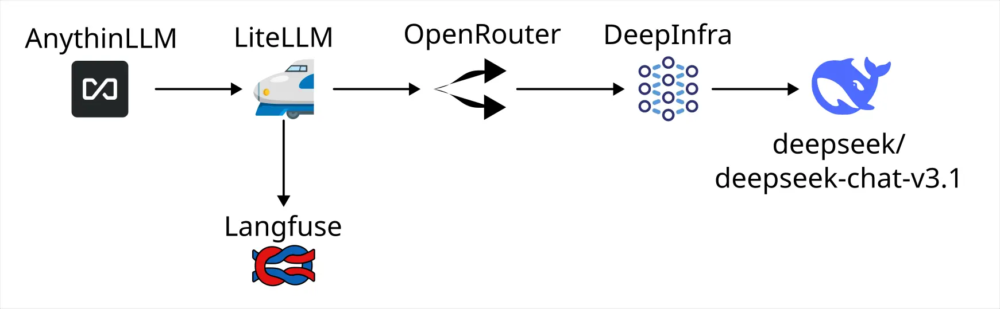

# 花式打 LLM

<head>
  <meta property="og:image" content="https://raw.githubusercontent.com/FlySkyPie/flyskypie.github.io/main/post/2025-10-05_llm-api-chain/00_cover.webp" />
</head>

## 前情提要

> 後來我才知道這是某種 bug，LiteLLM 以明碼將資料寫入資料庫後卻試圖用 salt 將資料解密[^litellm-bug]，在這之前已經花了好幾個好時進行故障排除以及跟 LLM 對話的鬼打牆，十分高血壓。
>

上週(2025-09-28)折騰了一番還是沒能把 LiteLLM 跟 LangFuse 整合在一起。

[^litellm-bug]: [Bug]: LangFuse callback failed to config in the LiteLLM Proxy Admin UI Panel · Issue #14854 · BerriAI/litellm. Retrieved 2025-10-01, from https://github.com/BerriAI/litellm/issues/14854

## 本文

透過純參數的方式配置而不是在 GUI 設定 callback，我成功將 LiteLLM 和 LangFuse 整合在一起並且佈署到我的 Homelab 去，並且試著跑了一下 AnythingLLM 觀察一下攔截提示詞的效果，現在整個 LLM 的呼叫鏈如下：



應用程式 →
LiteLLM →
LangFuse | OpenRouter →
DeepInfra →
DeepSeek:DeepSeek V3.1 模型

### 應用程式 (Application)

- https://github.com/Mintplex-Labs/anything-llm
  - 48.7k ⭐

一般作為 Client 呼叫 OpenAI Compatibility API 的應用程式，雖然我使用 AnythingLLM 實驗，但是也可以是非常簡單的 HTTP Call，例如：

```typescript
const url = "http://web.litellm.arachne/v1/chat/completions"
const headers = { "Authorization": `Bearer ${env.LLM_GATEWAY_API_KEY}`, "Content-Type": "application/json" }
const payload = {
  "model": "deepseek/deepseek-chat-v3.1:free",
  "messages": [
    { "role": "system", "content": "You are a helpful assistant." },
    { "role": "user", "content": "Hello!" }
  ],
  "modalities": ["text"],
}

const response = await fetch(url, {
  method: "POST",
  headers,
  body: JSON.stringify(payload),
});
```

### LLM Gateway

- https://github.com/BerriAI/litellm
  - 28.6k ⭐

我使用 LiteLLM 作為 LLM Gateway 方案，它的作用是作為一個代理伺服器，隔在應用程式和真正的 LLM API 之間。

有什麼作用？它可以儲存真實的、由第三方服務（例如：OpenAI、Google）提供的 API Key，然後對組織或團隊的其他人分發 Gateway 產生的 API Key，就能分別管理與控制每個人的流量與額度；還有將多個不同的 LLM 來源其中與統一到一個地方管理...等等的好處。

不過就我的目的單純是為了側錄上下文與提示詞，用來分析到底是應用程式的提示詞工程有問題還是 LLM 本身的性能問題。

### LLM Observability

- https://github.com/langfuse/langfuse
  - 15.9k ⭐

就像 Grafana Loki 能夠儲存 Log 並提供可觀測性一樣，不過 LLM Observability 更注重 LLM API 的輸入和輸出，這些紀錄將作為調整 RAG 或微調參數的重要依據。那些「免費使用的 LLM」多數也是在幹這件事，讓哪些免費仔作為幫忙生產資料的工具，所以何不自己在本地就先存一份呢？

### OpenRouter

OpenRouter 本身也有 Gateway 的作用，除了它能夠在多個 Provider 之間平衡負載來提高可用性之外，作為一個 LLM API 代理，隔在你和 Provider 之間，發揮類似 VPN 的作用，讓 Provider 更難對使用者進行鎖定。

### LLM Provider

OpenAI、Google、Claude 都是所謂的 LLM 供應商，也就是你可以付錢給它們，它們給你 LLM 服務。

DeepInfra 比較不一樣的地方是它只把自己定位在「LLM 基礎設施」。舉例來說，DeepSeek:DeepSeek V3.1 是一個有開放權重的 LLM，你有設備的話大可以下載模型後自己讓 GPU 運行 LLM，只是這樣做的成本可能太高，於是你選擇外包，DeepInfra 就是這樣的存在。

## 結論

一個 LLM Provider 背後可能有很多模型，而一個 Gateway 背後也可以代理很多 LLM Provider，
模型不應該閉源成為不可取代的存在；LLM Provider 也不應該是獨一無二不可取代的存在，這樣的話會產生供應商鎖定，
多樣性是生命的出路，更是自由的道路，即便這可能是一個花式砸自己腳的道路。

至於那些閉源工具？只要它支援第三方 LLM API，我就用可觀測工具把它的提示詞挖出來瞧瞧。
