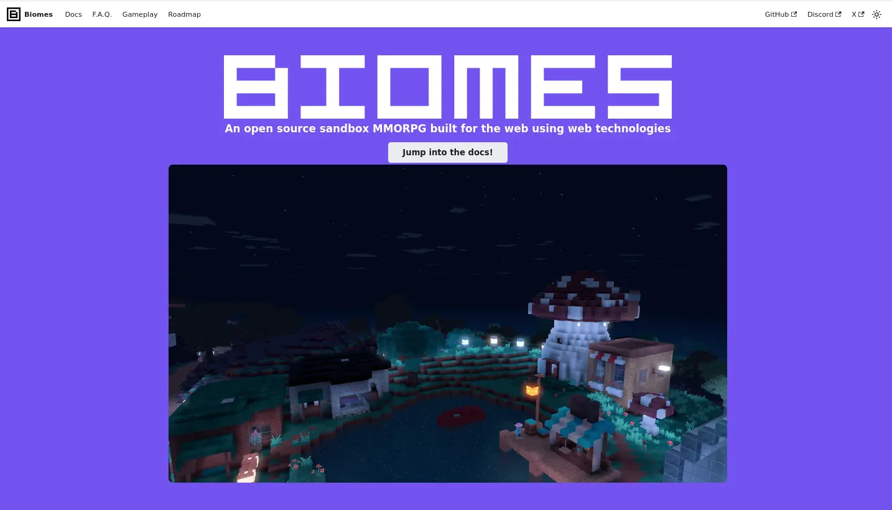
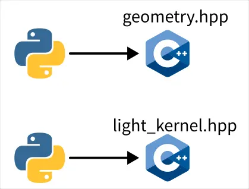
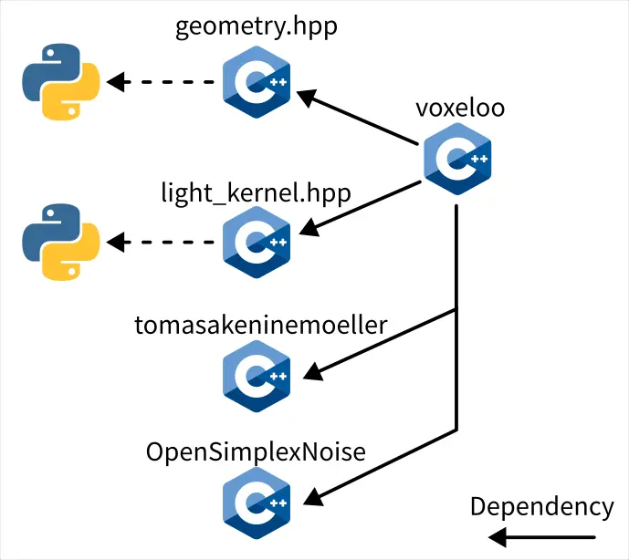
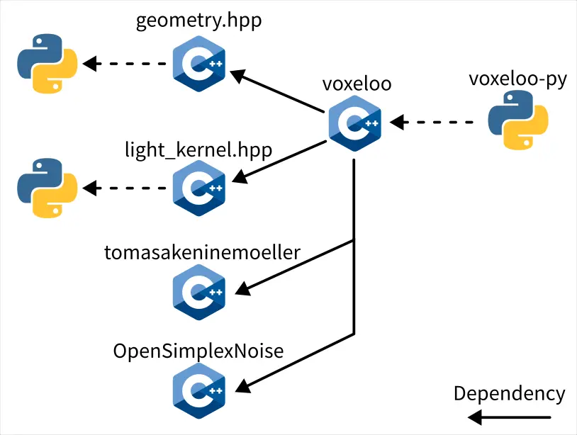

# Biomes 研究筆記 1

<head>
  <meta property="og:image" content="https://raw.githubusercontent.com/FlySkyPie/flyskypie.github.io/main/post/2025-11-02_biomes/00_cover.webp" />
</head>

前一陣子在 GitHub 上找到有興趣的專案，放到口袋清單之後，終於在上週 (2025-10-22) 忍不住把它拿出來玩了，這裡紀錄一下到目前為止 (2025-11-02) 的進度。

## 來自 Global Illumination, Inc. 的 Biomes


Biomes 是一個（理論上）能夠在瀏覽器執行的開源方塊沙盒多人連線角色扮演遊戲 (MMORPG)。

為什麼我說「理論上」呢？因為這個專案已經葛屁兩年了，在親眼看到以前說不準它的實際情況。

並且專案停滯的時間點剛好是 OpenAI 收購 Global Illumination （Biomes 背後的公司團隊） 的時間點[^openai-acquisition]。

## 動機

不熟悉我的讀者可能不理解我沒事幹麻去撿一個死兩年專案的屍體，這些是我曾經寫過相關的文章：

- [我喜歡 Minecraft，不過可能不是一般人認知的那種](https://flyskypie.github.io/blog/2024-05-29_I-like-minecraft-but-its-might-no-the-way-you-think/)
- [關於我想用 ECS 實作 Minecraft 以分散式架構運行並在其中用增強式學習訓練完全視覺化之遞迴布林類神經網路以產出二維條碼人造語言那檔事](https://flyskypie.github.io/blog/about-ecs-distributed-minecraft-rl-rbnn-bar-code-language/)
- [從 Goxel 到 Blender (Voxel art → 綁人物模型骨架)](https://flyskypie.github.io/blog/2021-12-04_from-goxel-to-blender/)
- [Project Malmo 簡介](https://flyskypie.github.io/blog/2021-07-18-Project_Malmo_Intro/)
- [MineRL 挑戰 2021 - 競賽流程（翻譯）](https://flyskypie.github.io/blog/2021-06-11_minerl-competition-structure/)
- [MineRL 挑戰 2021 - 比賽規則（翻譯）](https://flyskypie.github.io/blog/2021-06-10_minerl-challenge_rules/)
- [一種利用資訊熵獎勵智能體構建方塊世界(Minecraft)的方法](https://flyskypie.github.io/blog/2020-05-23-A_Way_to_Reward_Agent_Which_Constructed_Voxel_World_Minecraft_by_Shannon_Entropy/)

作為一個開源 Minecraft 愛好者（？），我一直都有在關注開源軟體圈中與 Minecraft 的發展，特別是物色一個適合的目標 fork 它改成我想要的樣子。

Biomes 乍看之下完成度很高：

<iframe width="560" height="315" src="https://www.youtube.com/embed/vPHEtewFm3M?si=W_73CRz42ZFpddc1" title="YouTube video player" frameborder="0" allow="accelerometer; autoplay; clipboard-write; encrypted-media; gyroscope; picture-in-picture; web-share" referrerpolicy="strict-origin-when-cross-origin" allowfullscreen></iframe>

而且是使用貼近 Web 的技術（Typescript, WASM...）實做，對我而言理解的門檻會低得多（比起 C++ 實做的 Minetest）。

[^openai-acquisition]: OpenAI收購AI設計公司Global Illumination | iThome. Retrieved 2025-10-06 from https://www.ithome.com.tw/news/158307

## 專案的第一印象

- https://github.com/ill-inc/biomes-game
  - 2.6k ⭐

該專案使用異構單體庫結構，也就是：

- 單庫([Monorepo](https://en.wikipedia.org/wiki/Monorepo))：使用一個 Git 庫存放所有模組與程式碼。
- 異構([Polyglot](https://en.wikipedia.org/wiki/Polyglot_(computing)))：多個模組涉及不同的程式語言與技術棧(Techstack)。
- 單體([Monolithic](https://en.wikipedia.org/wiki/Monolithic_application))：所有程式碼會組裝成單一的 Web 服務。

:::info
「異構單體庫」並不是一個正式用語，但是我試著用中文組裝成一個最簡要能表達多個複雜的概念的詞彙。
:::

並且透過 [Bazel](https://github.com/bazelbuild/bazel) 這個工具來處理複雜的仰賴鏈，接著在外面套一層 Python 腳本，所有操作都需要透過 [b.py](https://github.com/ill-inc/biomes-game/blob/main/scripts/b/b.py) 完成。

雖然試著用 Bazel 把專案跑起來，但是似乎是工具版本不符的原因，整個過程並不順利。加上個人不是很喜歡這種「全家桶」結構，因此下一步就是開始拆專案。

## 拆拆拆

一些比較大型模組會有自己獨立的 `README.md`：

```shell
find . -name README.md
./README.md
./voxeloo/README.md
./docs/README.md
./src/client/README.md
./src/shared/README.md
./src/server/README.md
./src/server/bob/README.md
./src/server/shared/README.md
./src/benchmarks/README.md
./src/galois/README.md
./src/galois/js/README.md
./.githooks/README.md
./scripts/tsconfig-replace-paths/README.md
./.devcontainer/README.md
```

接著是找到外部仰賴最少，即仰賴鏈最上游的模組。

## `docs`

[](https://flyskypie.github.io/biomes-docs/)

第一個抽出的模組是網頁文件：

https://github.com/FlySkyPie/biomes-docs

它不仰賴別人的模組也沒有被仰賴，並且有自己獨立的 `package.json`，很容易抽出。

從 `yarn` 轉換成 `pnpm`、修復幽靈仰賴；並且處理的圖片都儲存在 git LFS 的問題之後就能正常運作了。

## `geometry.hpp` 和 `light_kernel.hpp`



接下來的兩個模組則是用 Python 生成 `.hpp` 函式庫：

- https://github.com/FlySkyPie/biomes-voxeloo-geometry
- https://github.com/FlySkyPie/biomes-voxeloo-light-kernelry

其中一個還使用了 Jinja2 — 基於 Python 的樣板引擎/函式庫。

## `voxeloo`



- https://github.com/FlySkyPie/biomes-voxeloo

接著是名為 `voxeloo` 的組件，使用了前述程序化生成的 `.hpp`。

在原本使用 Bazel 處理的仰賴鏈中，還包含了一些指向 GitHub 的外部函式庫，例如：`catch2`、`eigen`、`robin-hood-hashing`、`zstd`...。

在這方面我使用 [CPM.cmake](https://github.com/cpm-cmake/CPM.cmake) 來處理仰賴關係，只要目標有撰寫良好的 `CMakeLists.txt`，就可以把 C++ 專案當成套件拉進專案使用。

### 第三方函式庫

- https://github.com/FlySkyPie/OpenSimplexNoise

OpenSimplexNoise 原本的 Git Repo 沒有 `CMakeLists.txt`，所以我 fork 之後加上 `CMakeLists.txt`。


- https://github.com/FlySkyPie/tomasakeninemoeller

`opttritri.h` 和 `tribox3.h` 這兩個檔案原本是直接放在專案內的，我就稍微朔源了一下然後一樣加上 `CMakeLists.txt`。

## `voxeloo` Python 綁定



- https://github.com/FlySkyPie/biomes-voxeloo-py

Biomes 對 `voxeloo` 實做了兩種綁定/交叉編譯，將其從 C++ 專案轉換成其他語言的函式庫，其中一個是 Python，並且透過 pybind11 實現。

我使用 scikit-build 作為 Python 的建置後端 (Build Backend) 將奇打包成一個 Python 庫 (Python Wheel)，並且補上型別資訊 (Stub)。
