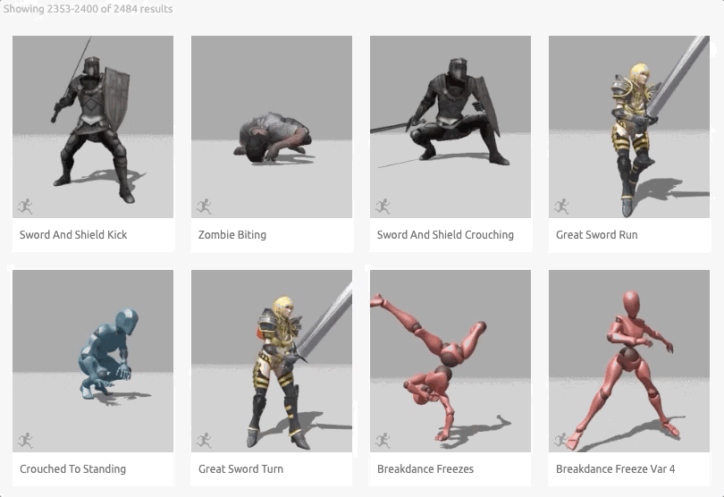

# 「演出」

<head>
  <meta property="og:image" content="https://raw.githubusercontent.com/FlySkyPie/flyskypie.github.io/main/post/2025-11-02_perform/00_cover.webp" />
</head>

我曾經有一個同事，是動畫師之類的，雖然不同部門、不算熟、也沒什麼深入聊過，但是我認為我從他身上學到一個很重要的概念—「演出」。

他經常會用「演出」來形容一段角色動畫，也經常在做動畫前先自己用肢體表現一次，呈現多種角色動作的形式。當下我其實沒有太多想法，直到後來我才隱約知道他說的「演出」是什麼意思。

這是當下我知道的「演出」：

後來我看到了：

<iframe width="560" height="315" src="https://www.youtube.com/embed/G9qzPEviH5g?si=5HmVPm6CXI_i7Stn" title="YouTube video player" frameborder="0" allow="accelerometer; autoplay; clipboard-write; encrypted-media; gyroscope; picture-in-picture; web-share" referrerpolicy="strict-origin-when-cross-origin" allowfullscreen></iframe>

這是透過動作捕捉器，直接將人類演員的肢體動作錄製成能在遊戲內使用的動畫影格，動作更自然也不用讓動畫師手工調整。

接著我看到了：

<iframe width="560" height="315" src="https://www.youtube.com/embed/SmTNegGiv9M?si=_fFgU8zTF6ZHHUVz" title="YouTube video player" frameborder="0" allow="accelerometer; autoplay; clipboard-write; encrypted-media; gyroscope; picture-in-picture; web-share" referrerpolicy="strict-origin-when-cross-origin" allowfullscreen></iframe>

很多短影音往往包含了有趣的上下文與故事，但是仔細觀察會發現這個影片中的角色的動作跟前一個動作捕捉演員有著接近的神韻：一些明顯且誇大的神情或肢體「演出」。

---

岔開一下話題，這是一個我很享受的 Factorio 影片：

<iframe width="560" height="315" src="https://www.youtube.com/embed/hYcAsNCH7Zc?si=nSgaZ0DnV3W7TsJh" title="YouTube video player" frameborder="0" allow="accelerometer; autoplay; clipboard-write; encrypted-media; gyroscope; picture-in-picture; web-share" referrerpolicy="strict-origin-when-cross-origin" allowfullscreen></iframe>

然後這是那個 Factorio 影片的幕後花絮：

<iframe width="560" height="315" src="https://www.youtube.com/embed/HNocVPYDLo8?si=ZIgi2BAL160cWI8d" title="YouTube video player" frameborder="0" allow="accelerometer; autoplay; clipboard-write; encrypted-media; gyroscope; picture-in-picture; web-share" referrerpolicy="strict-origin-when-cross-origin" allowfullscreen></iframe>

可以發現影片的整體節奏並不像正片一樣緊湊，作者的情緒起伏也沒這麼浮誇。

作者也表示，劇本是模仿 3Blue1Brown 的緒事風格「事情可能怎麼被發現」，而刻意營造出「他自己發現」的氛圍。

---

簡單來說，「演出」一種精細設計的虛假呈現；是一種謊言，如果任何戲劇作品出現不現實的情節，那十之八九是一種「演出」。
