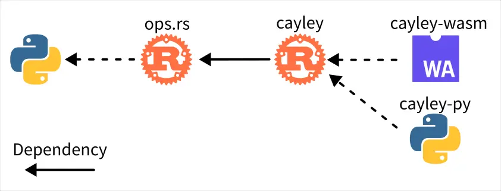

# Biomes 研究筆記 2

<head>
  <meta property="og:image" content="https://raw.githubusercontent.com/FlySkyPie/flyskypie.github.io/main/post/2025-11-16_biomes/00_cover.webp" />
</head>

## `voxeloo` WASM 綁定


- https://github.com/FlySkyPie/biomes-voxeloo-wasm
- https://www.npmjs.com/package/@flyskypie/biomes-voxeloo-wasm

Biomes 對 `voxeloo` 實做了兩種綁定/交叉編譯，將其從 C++ 專案轉換成其他語言的函式庫，其中一個是 Python，並且透過 pybind11 實現；另外一個則是 WASM 並且透過 Emscripten 實現。要注意的是編譯結果有分成一般跟 SIMD (Single Instruction Multiple Data) 兩種。

考量 Biomes 有自己分別在 client 和 server 端實做自己的 WASM 載入函式：

[`src/server/shared/voxeloo.ts`](https://github.com/ill-inc/biomes-game/blob/main/src/server/shared/voxeloo.ts#L21):

```typescript
export async function loadVoxeloo(): Promise<VoxelooModule> {
    //...
}
```

[`src/client/game/webasm.ts`](https://github.com/ill-inc/biomes-game/blob/main/src/client/game/webasm.ts#L22):

```typescript
export async function loadVoxeloo(
  clientConfig: WasmConfig
): Promise<VoxelooModule> {
    //...
}
```

我就不在 WASM binding 這一層做其他處理了，直接將 Emscripten 編譯的結果發布到 NPN 上。

順道一提，我有試著讓編譯過程執行在 Docker 內，但是並沒有成功，換句話說當前編譯過程可能仰賴我的 host 安裝的某些東西，但是現階段我不打算處理這個問題，等有機會再回來看要怎麼解決，確保「能成功編譯的環境」不會失傳。

## `cayley` 



- https://github.com/FlySkyPie/biomes-cayley-rs

`cayley` 看起來是另外一個運算吃重的模組，以 Rust 撰寫。

### WASM 綁定

- https://www.npmjs.com/package/@flyskypie/biomes-cayley-wasm

這裡遇到一個小插曲：

- `cayley`  專案使用 Rust `1.70.0`
  - `WORKSPACE.bazel` 內有寫： `RUST_VERSION = "1.70.0"`。
- 專案的 `wasm-bindgen` 是 `0.2.83`
  - `Cargo.lock` 內有寫。
- `wasm-bindgen` 要求 `wasm-bindgen-cli` `0.2.83`
- `wasm-bindgen-cli` `0.2.83` 要求 Rust 1.82+
  - `wasm-bindgen-cli` `0.2.83` 有一個仰賴要求 1.82+

我不知道這個相依性地獄 (dependency hell) 是怎麼產生的，也不打算深究，直接包進 Docker 裡面分階段在不同的 Rust 版本編譯。

Biomes 原本只有發布 `bundler` 和 `nodejs` 兩種版本，後者是給 CommonJS 用的，前者則是直接 `import` WASM 檔案，需要專案有使用 Webpack 或是 Loader 之類的自動翻譯模組，因此我額外加上了 `web` 當作 ESM 的預設包，顧名思義是給瀏覽器用的。

`wasm-bindgen-cli` 工具蠻完整的，除了 WASM 載入器的 Javascript 有準備好，用來給 Typescript 的 `.d.ts` 也有生成，該說不愧是網頁前端友善（？）的 Rust 嗎？

### Python 綁定

- https://pypi.org/project/biomes-cayley-py/

Python 這邊是使用 pyo3/maturin 的工具完成，並且這次我試著發布到 PyPI 去，有點意外 Rust 的部份也一併被上傳，從 Python 安裝的時候似乎會在本地跑編譯。
